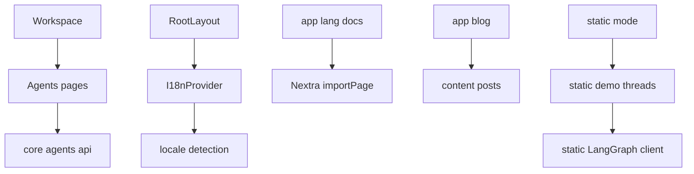
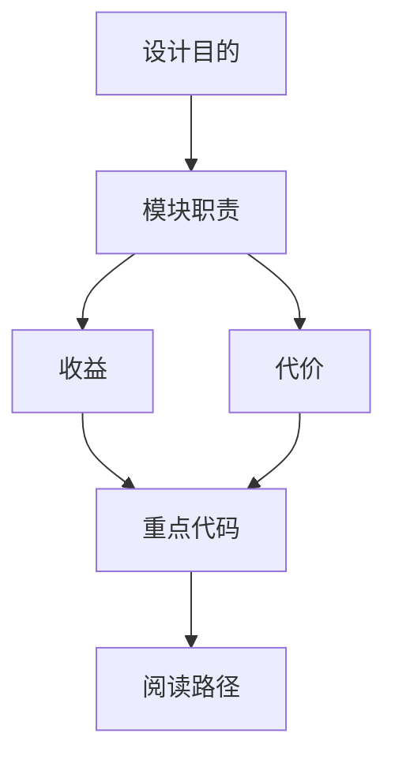

<title>67｜Frontend Agents、Blog、I18n、Static Mode 模块详解</title>

<callout emoji="✅">
**本章目标：**补齐前端非 chat 主链路模块：agents、文档/博客、国际化、静态 mock。
</callout>

# 1. 模块职责

| 对象 | 说明 |
|-|-|
| `core/agents/*` | custom agents API 和 hooks。 |
| `app/workspace/agents/*` | agent gallery/new agent 创建流程。 |
| `core/i18n/*` | 语言检测、上下文、翻译 hooks。 |
| `app/[lang]/docs` | Nextra docs 路由。 |
| `core/static-mode.ts` | 静态演示模式和 mock thread。 |

# 2. 运行逻辑图

# 3. 排障与修改建议

- 先确认调用方和数据源，再改 schema。
- 涉及用户数据必须确认鉴权和 owner check。
- 涉及缓存需要同步 invalidate 或 reset。

---

# 补充：设计取舍、重点代码与阅读路径

<callout emoji="💡">
**设计目的：**这个模块单独成章，是为了把职责边界、运行逻辑和维护入口从大系统里抽出来。
</callout>

| 维度 | 说明 |
|-|-|
| 收益 | 收益是查找和学习更快，职责更聚焦。 |
| 代价 | 代价是章节数量增加，需要依赖目录和索引维护。 |
| 重点代码 | 重点代码见本章表格列出的源码路径。 |
| 阅读路径 | 阅读路径：先确认它在系统链路中的上游和下游，再看关键函数。 |

