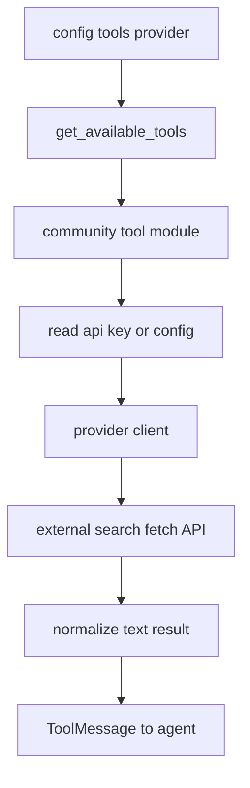
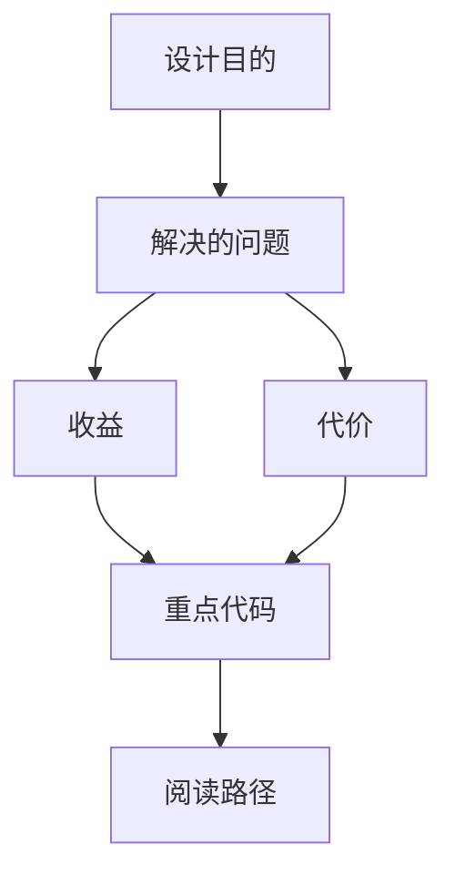

<title>70｜Community Search/Fetch/Image Tools 详解</title>

<callout emoji="✅">
**本章目标：**讲清 Tavily、Firecrawl、Exa、Jina、DDG、InfoQuest、Serper 等社区工具如何接入。
</callout>

# 1. 模块职责

| 模块 | 说明 |
|-|-|
| Tavily | web_search/web_fetch，TAVILY_API_KEY。 |
| Firecrawl | web_search/web_fetch，FirecrawlApp。 |
| Exa | 搜索和抓取网页。 |
| Jina AI | 异步 web_fetch，支持 proxy/timeout。 |
| DDG Search | 文本搜索，区域和 Wikipedia 后端推断。 |
| InfoQuest | search/fetch/image_search。 |
| Serper | Google Serper search。 |

# 2. 运行逻辑图

---

# 补充：设计取舍、重点代码与阅读路径

<callout emoji="💡">
**设计目的：**该文档用于把模块职责、运行逻辑、关键代码和阅读路径固定下来，帮助读者从源码验证行为。
</callout>

| 维度 | 说明 |
|-|-|
| 收益 | 读者可以按文档快速定位模块入口和上下游关系。 |
| 代价 | 文档需要随源码变更持续校准，避免模板化描述掩盖真实行为。 |
| 重点代码 | 标题对应的源码、测试或文档入口。 |
| 阅读路径 | 先看上游输入，再看核心函数，最后看下游输出和测试验证。 |

