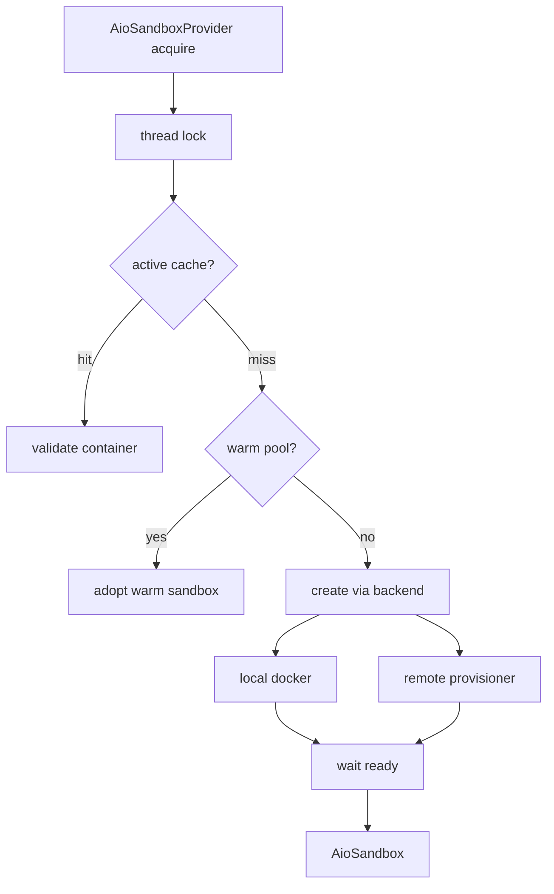
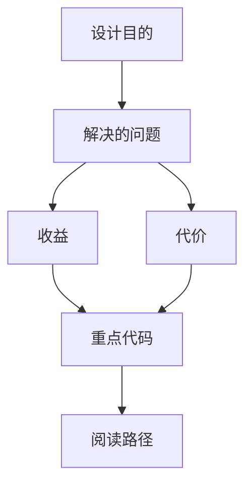
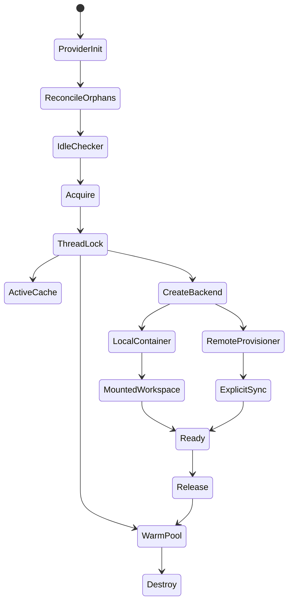

<title>71｜AioSandbox Community Backend 详解</title>

<callout emoji="✅">
**本章目标：**深入容器化 sandbox backend、local docker backend、remote provisioner backend。
</callout>

# 1. 模块职责

| 模块 | 说明 |
|-|-|
| `aio_sandbox_provider.py` | Provider 缓存、warm pool、thread lock、acquire/release。 |
| `aio_sandbox.py` | AioSandbox 实现 execute/read/write/list。 |
| `local_backend.py` | Docker container 创建、端口、mount、健康检查。 |
| `remote_backend.py` | 通过 provisioner 远程创建 sandbox。 |
| `backend.py` | 抽象 backend 和 readiness polling。 |

# 2. 运行逻辑图

---

# 补充：设计取舍、重点代码与阅读路径

<callout emoji="💡">
**设计目的：**AioSandboxProvider 把 sandbox 生命周期从工具调用中抽离出来，通过 backend 抽象同时支持本地容器和远程 provisioner。
</callout>

| 维度 | 说明 |
|-|-|
| 收益 | 同一 `Sandbox` 接口可复用 execute/read/write/list；本地容器可 bind-mount thread data，远程 backend 可由 provisioner 管理生命周期。 |
| 代价 | Provider 需要维护 thread lock、active cache、warm pool、idle checker 和启动时 orphan reconciliation；文件可见性还取决于 local/remote backend。 |
| 重点代码 | `backend/packages/harness/deerflow/community/aio_sandbox/aio_sandbox_provider.py`、`backend.py`、`local_backend.py`、`remote_backend.py`、`aio_sandbox.py`。 |
| 阅读路径 | 先看 `_create_backend` 的 local/remote 选择，再看 `acquire` 的 cache/warm-pool/lock，最后看 `uses_thread_data_mounts` 与 idle/orphan 清理。 |

