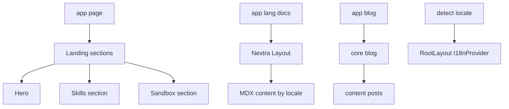
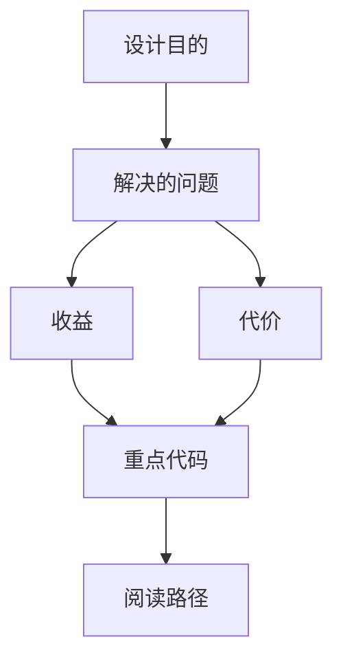

<title>72｜Frontend Landing、Docs、Blog 页面详解</title>

<callout emoji="✅">
**本章目标：**补齐官网 landing、Nextra docs、blog/content 模块。
</callout>

# 1. 模块职责

| 模块 | 说明 |
|-|-|
| Landing | `components/landing/*` 和 `app/page.tsx` 组成首页。 |
| Docs | `app/[lang]/docs` 使用 Nextra importPage 渲染 MDX。 |
| Blog | `app/blog` 读取 content posts/tags。 |
| Content | `frontend/src/content/en\|zh` 存放文档内容。 |
| I18n | `frontend/src/core/i18n` 提供 locale detection 和 provider。 |

# 2. 运行逻辑图

---

# 补充：设计取舍、重点代码与阅读路径

<callout emoji="💡">
**设计目的：**这个模块以 API/边界层拆分，是为了隔离 HTTP 协议、认证鉴权、请求模型和内部业务。
</callout>

| 维度 | 说明 |
|-|-|
| 收益 | 收益是前后端契约清晰，接口可独立演进。 |
| 代价 | 代价是一次功能可能跨 router、service、repository 和前端 hook。 |
| 重点代码 | 重点代码在 `backend/app/gateway/routers/`、`backend/app/gateway/auth/*` 或对应前端 `frontend/src/core/*/api.ts`。 |
| 阅读路径 | 阅读路径：从 URL/API 入口往内追 service，再看数据落到哪里。 |

