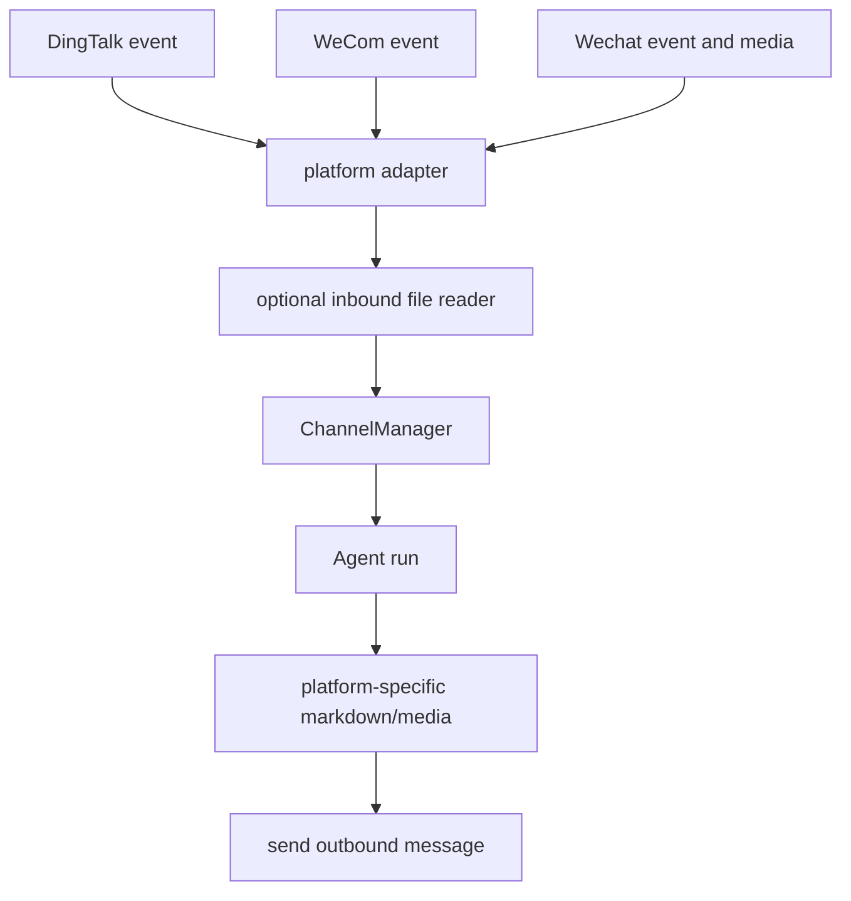
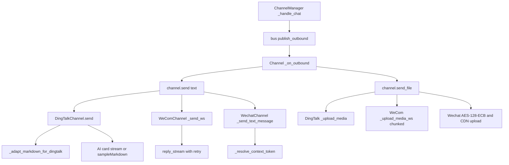

<title>77｜DingTalk、WeCom、Wechat Channel 详解</title>

<callout emoji="✅">
**本章目标：**讲清企业 IM 渠道的消息适配、富文本/媒体处理和出站格式。
</callout>

| 模块点 | 说明 |
|-|-|
| DingTalk | Stream Push、conversation type、Markdown 表格适配。 |
| WeCom | 企业微信智能机器人。 |
| Wechat | iLink 客户端、媒体 AES 加解密、CDN 上传。 |
| 共同点 | 平台事件 -> InboundMessage -> ChannelManager -> OutboundMessage。 |

---

# 补充：设计取舍、重点代码与阅读路径

<callout emoji="💡">
**设计目的：**该文档用于把模块职责、运行逻辑、关键代码和阅读路径固定下来，帮助读者从源码验证行为。
</callout>

| 维度 | 说明 |
|-|-|
| 收益 | 读者可以按文档快速定位模块入口和上下游关系。 |
| 代价 | 文档需要随源码变更持续校准，避免模板化描述掩盖真实行为。 |
| 重点代码 | 标题对应的源码、测试或文档入口。 |
| 阅读路径 | 先看上游输入，再看核心函数，最后看下游输出和测试验证。 |

