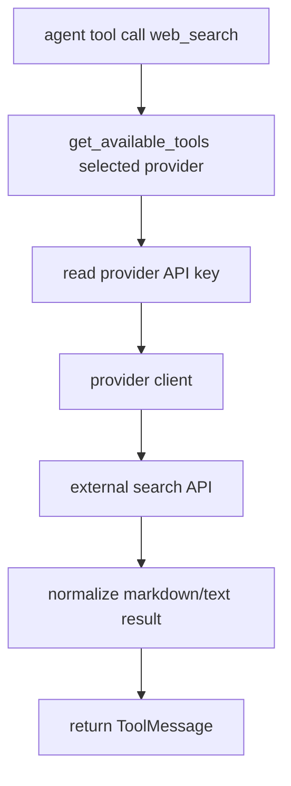
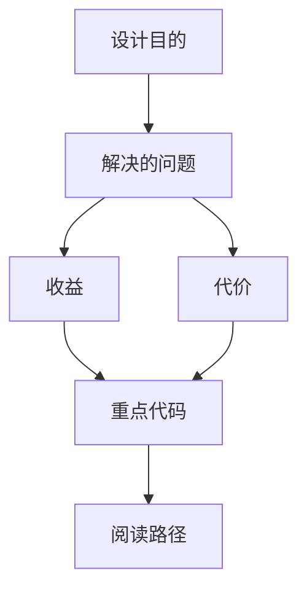

<title>78｜Tavily、Firecrawl、Exa、Serper Web Search Provider 详解</title>

<callout emoji="✅">
**本章目标：**单独讲清各 web_search/web_fetch provider 的接入方式。
</callout>

| 模块点 | 说明 |
|-|-|
| Tavily | TavilyClient，web_search 和 web_fetch。 |
| Firecrawl | FirecrawlApp，搜索和页面抓取。 |
| Exa | Exa SDK，搜索结果和页面内容。 |
| Serper | Google Serper API，max_results。 |
| 接入点 | 配置工具组后进入 get_available_tools。 |

---

# 补充：设计取舍、重点代码与阅读路径

<callout emoji="💡">
**设计目的：**该文档用于把模块职责、运行逻辑、关键代码和阅读路径固定下来，帮助读者从源码验证行为。
</callout>

| 维度 | 说明 |
|-|-|
| 收益 | 读者可以按文档快速定位模块入口和上下游关系。 |
| 代价 | 文档需要随源码变更持续校准，避免模板化描述掩盖真实行为。 |
| 重点代码 | 标题对应的源码、测试或文档入口。 |
| 阅读路径 | 先看上游输入，再看核心函数，最后看下游输出和测试验证。 |

