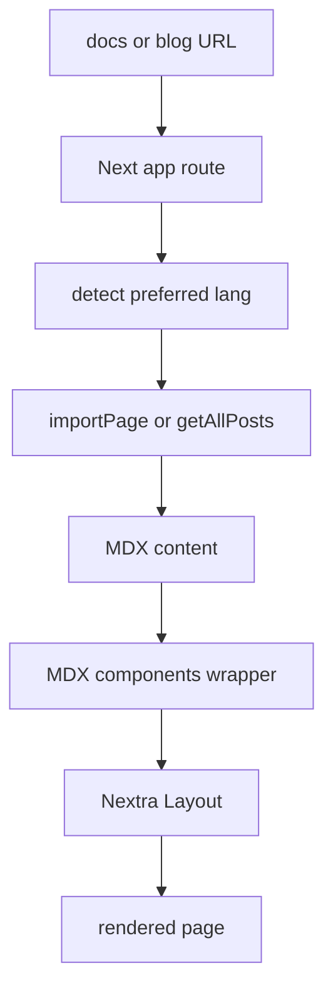
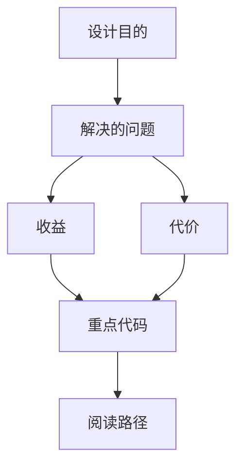

<title>81｜Nextra Docs、Content 与 Blog 渲染详解</title>

<callout emoji="✅">
**本章目标：**讲清文档站、博客、content 多语言内容如何被路由加载。
</callout>

| 模块点 | 说明 |
|-|-|
| Docs route | `app/[lang]/docs/[[...mdxPath]]` 调 importPage。 |
| Docs layout | Nextra Layout + pageMap + i18n。 |
| Blog route | `app/blog` 读取 posts/tags。 |
| Content | `src/content/en\|zh` 存放 MDX。 |
| MDX components | 统一 wrapper 和组件。 |

---

# 补充：设计取舍、重点代码与阅读路径

<callout emoji="💡">
**设计目的：**该文档用于把模块职责、运行逻辑、关键代码和阅读路径固定下来，帮助读者从源码验证行为。
</callout>

| 维度 | 说明 |
|-|-|
| 收益 | 读者可以按文档快速定位模块入口和上下游关系。 |
| 代价 | 文档需要随源码变更持续校准，避免模板化描述掩盖真实行为。 |
| 重点代码 | 标题对应的源码、测试或文档入口。 |
| 阅读路径 | 先看上游输入，再看核心函数，最后看下游输出和测试验证。 |

