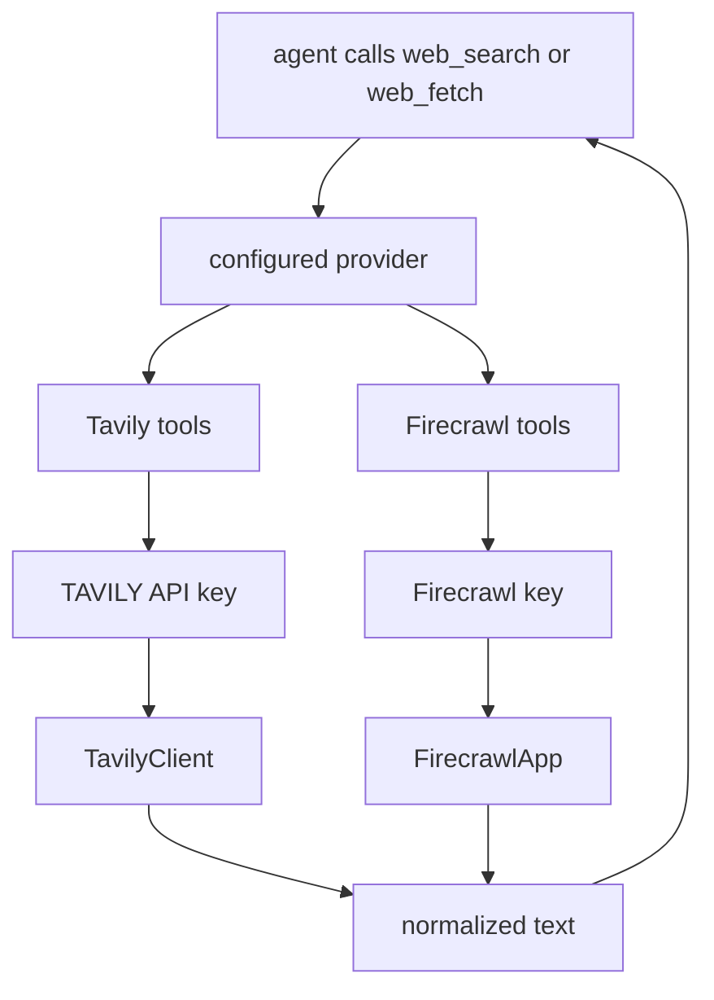
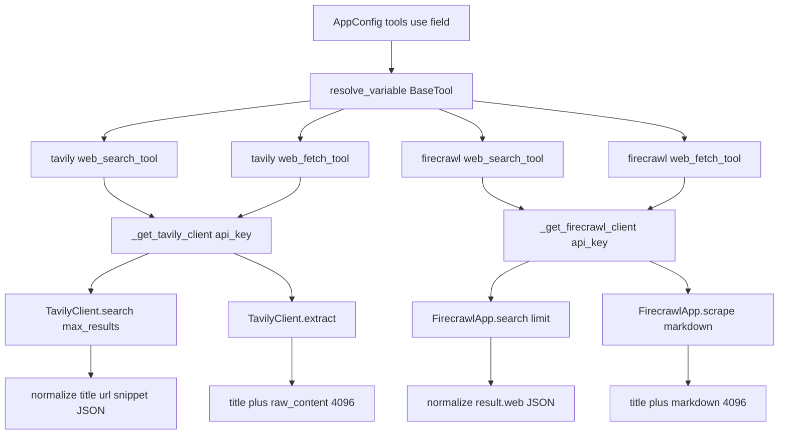

<title>82｜Tavily 与 Firecrawl Provider 单模块详解</title>

<callout emoji="✅">
**本章目标：**细化两个常用 web_search/web_fetch provider 的运行逻辑。
</callout>

| 模块点 | 说明 |
|-|-|
| Tavily | `_get_tavily_client` 读取 key，web_search/web_fetch 返回文本结果。 |
| Firecrawl | `FirecrawlApp` 创建 client，search/fetch 页面内容。 |
| 共同点 | 都是 community tool module，最终作为 BaseTool 进入 agent。 |
| 差异 | Firecrawl 更偏网页抓取，Tavily 更偏搜索 API。 |

---

# 补充：设计取舍、重点代码与阅读路径

<callout emoji="💡">
**设计目的：**该文档用于把模块职责、运行逻辑、关键代码和阅读路径固定下来，帮助读者从源码验证行为。
</callout>

| 维度 | 说明 |
|-|-|
| 收益 | 读者可以按文档快速定位模块入口和上下游关系。 |
| 代价 | 文档需要随源码变更持续校准，避免模板化描述掩盖真实行为。 |
| 重点代码 | 标题对应的源码、测试或文档入口。 |
| 阅读路径 | 先看上游输入，再看核心函数，最后看下游输出和测试验证。 |

