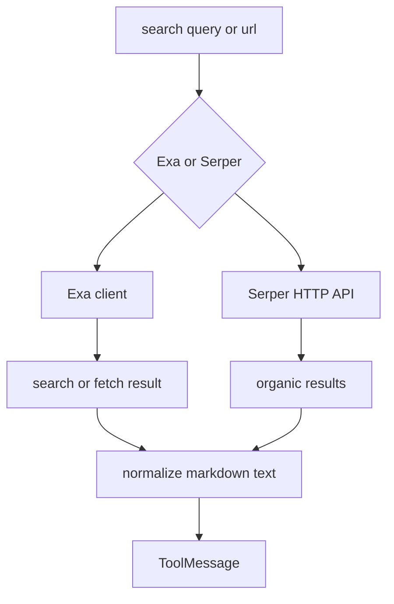
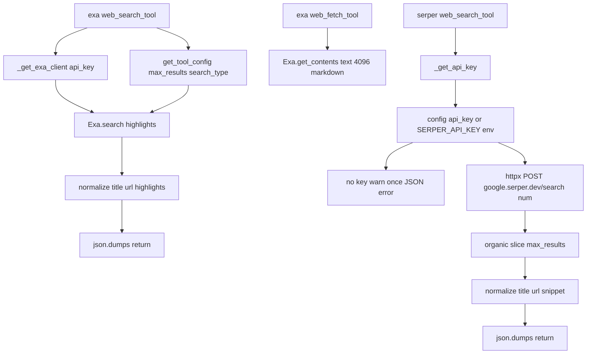

<title>83｜Exa 与 Serper Provider 单模块详解</title>

<callout emoji="✅">
**本章目标：**细化 Exa 和 Serper 搜索 provider。
</callout>

| 模块点 | 说明 |
|-|-|
| Exa | `_get_exa_client` 创建 Exa SDK client。 |
| Exa search/fetch | 支持 web_search_tool 和 web_fetch_tool。 |
| Serper | 读取 Serper API key，调用 Google Serper 搜索。 |
| max_results | Serper 支持 max_results 控制。 |

---

# 补充：设计取舍、重点代码与阅读路径

<callout emoji="💡">
**设计目的：**该文档用于把模块职责、运行逻辑、关键代码和阅读路径固定下来，帮助读者从源码验证行为。
</callout>

| 维度 | 说明 |
|-|-|
| 收益 | 读者可以按文档快速定位模块入口和上下游关系。 |
| 代价 | 文档需要随源码变更持续校准，避免模板化描述掩盖真实行为。 |
| 重点代码 | 标题对应的源码、测试或文档入口。 |
| 阅读路径 | 先看上游输入，再看核心函数，最后看下游输出和测试验证。 |

