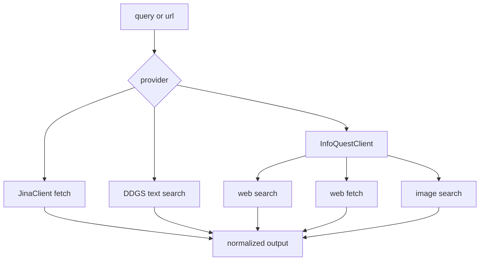

<title>84｜Jina、DDG、InfoQuest Provider 单模块详解</title>

<callout emoji="✅">
**本章目标：**细化 Jina fetch、DDG search、InfoQuest 多能力 provider。
</callout>

| 模块点 | 说明 |
|-|-|
| Jina | 异步 web_fetch，支持 timeout/proxy 参数清洗。 |
| DDG | DuckDuckGo 文本搜索，自动推断 region 和 Wikipedia 后端。 |
| InfoQuest | web_search/web_fetch/image_search 三合一。 |
| Image Search | 图片搜索结果用于多媒体任务。 |

