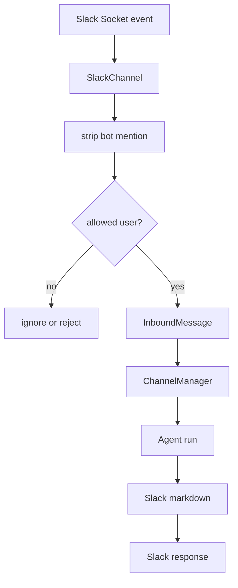

<title>86｜Slack Channel 深入运行逻辑</title>

<callout emoji="✅">
**本章目标：**进一步细化 Slack Socket Mode、mention 剥离、allowed users 和回复逻辑。
</callout>

| 模块点 | 说明 |
|-|-|
| Socket Mode | 通过 Slack SDK 接收事件。 |
| mention 处理 | 剥离 leading bot mention。 |
| allowed users | 限制可调用用户集合。 |
| 消息归一 | 转为 InboundMessage。 |
| 输出 | 把 agent 最终响应发送回 Slack。 |

