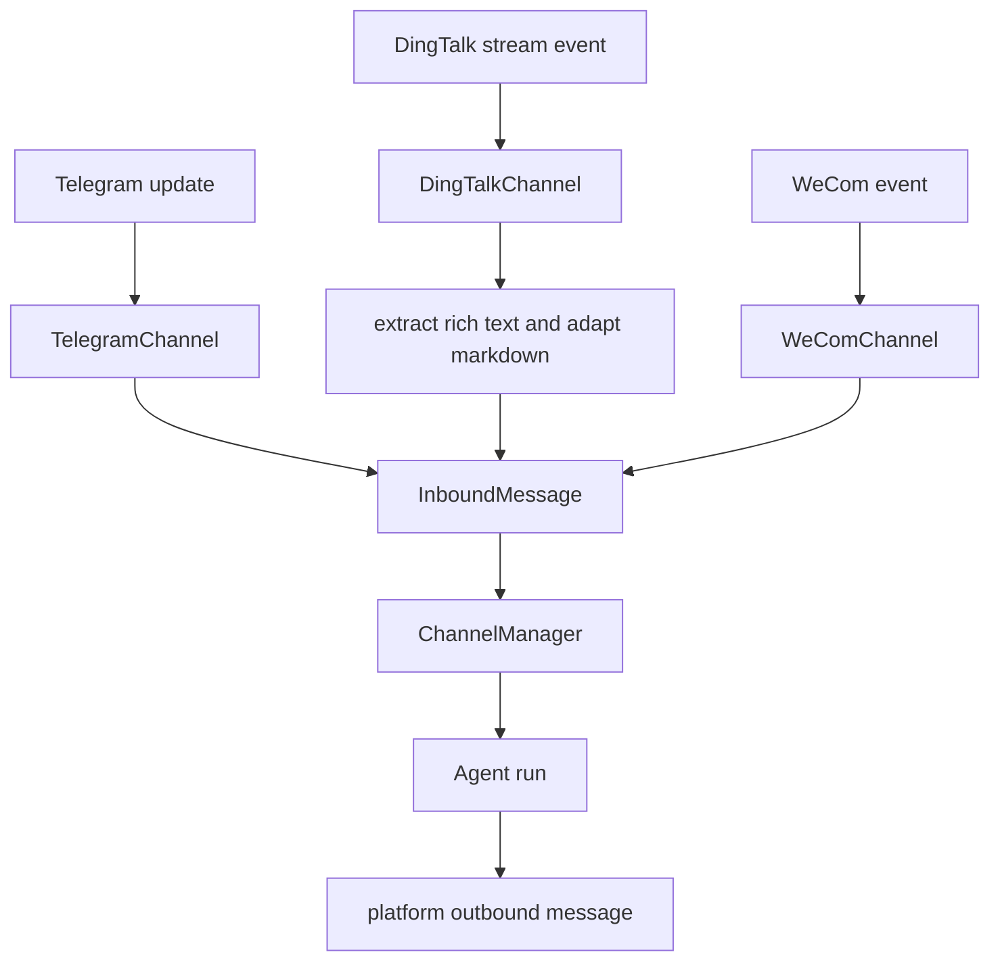
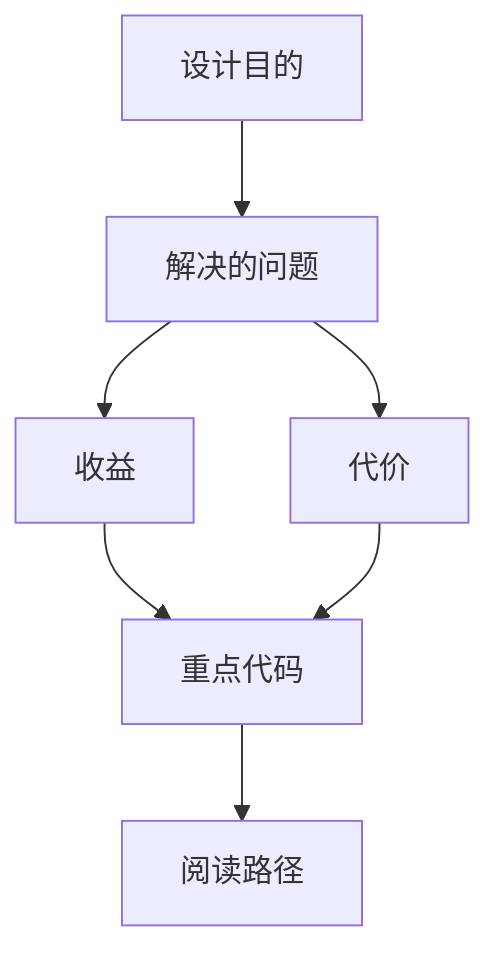

<title>87｜Telegram、DingTalk、WeCom Channel 深入运行逻辑</title>

<callout emoji="✅">
**本章目标：**进一步细化三个常用外部 IM channel。
</callout>

| 模块点 | 说明 |
|-|-|
| Telegram | Bot API update -> TelegramChannel -> send message。 |
| DingTalk | Stream push，rich text 提取，Markdown 表格转换。 |
| WeCom | 企业微信智能机器人 SDK/接口。 |
| 共同抽象 | 继承 Channel，统一 start/stop/send。 |

---

# 补充：设计取舍、重点代码与阅读路径

<callout emoji="💡">
**设计目的：**该文档用于把模块职责、运行逻辑、关键代码和阅读路径固定下来，帮助读者从源码验证行为。
</callout>

| 维度 | 说明 |
|-|-|
| 收益 | 读者可以按文档快速定位模块入口和上下游关系。 |
| 代价 | 文档需要随源码变更持续校准，避免模板化描述掩盖真实行为。 |
| 重点代码 | 标题对应的源码、测试或文档入口。 |
| 阅读路径 | 先看上游输入，再看核心函数，最后看下游输出和测试验证。 |

