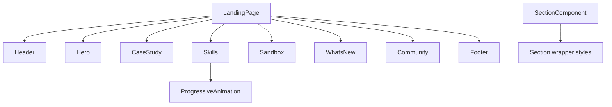

<title>89｜Landing Sections 深入组件逻辑</title>

<callout emoji="✅">
**本章目标：**进一步拆首页每个 section 的组织方式和职责。
</callout>

| 模块点 | 说明 |
|-|-|
| hero.tsx | 主视觉、品牌口号、CTA。 |
| case-study-section.tsx | 案例展示区。 |
| skills-section.tsx | skills 能力和动画展示。 |
| sandbox-section.tsx | sandbox 隔离执行能力展示。 |
| whats-new-section.tsx | 版本亮点。 |
| community-section.tsx | 社区和参与入口。 |

