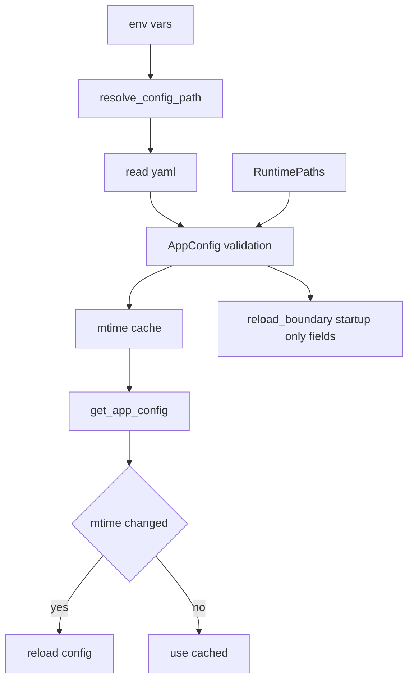

<title>90｜AppConfig、Runtime Paths、Reload Boundary 单文件详解</title>

<callout emoji="✅">
**本章目标：**把 AppConfig 聚合、runtime_paths 与 startup-only 边界单独讲清。
</callout>

## 本轮源码校准补充：AppConfig 热加载与 startup 边界

| 类型 | 是否请求级生效 | 说明 |
|-|-|-|
| `get_config()` / `get_app_config()` 读取的普通 run 配置 | 通常下一次请求生效 | model、thinking、skills、memory、tools 等 run-time 配置会在请求/agent 装配阶段读取。 |
| StreamBridge / DB / checkpointer / store / RunManager | 通常 startup-bound | Gateway lifespan 创建的基础设施资源通常需要重启服务才完整切换。 |
| 前端 env | 构建/运行时边界不同 | `NEXT_PUBLIC_*` 影响浏览器端 base URL；改动后需确认 dev/prod 模式。 |

| 模块点 | 说明 |
|-|-|
| AppConfig | 主配置聚合、resolve_config_path、get_app_config mtime 缓存。 |
| runtime_paths | project_root、runtime_home、existing_project_file。 |
| reload_boundary | 标记 startup-only 字段，提醒用户哪些需要重启。 |
| ContextVar override | push/pop current app config 支持测试或请求上下文。 |

