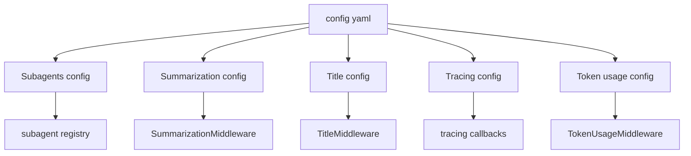
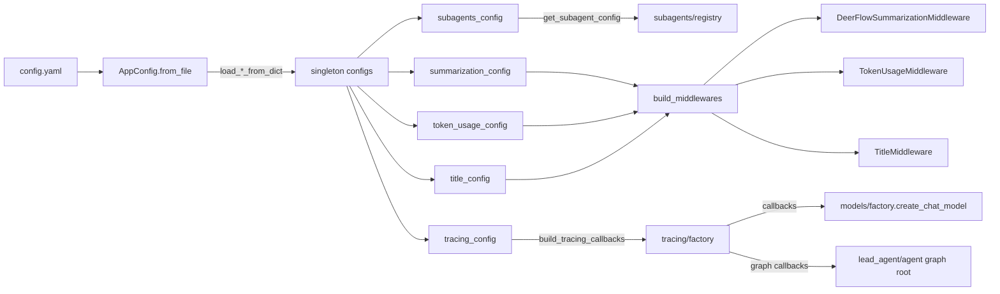

<title>92｜Subagents、Summarization、Title、Tracing Config 详解</title>

<callout emoji="✅">
**本章目标：**拆 agent 行为增强相关配置。
</callout>

| 模块点 | 说明 |
|-|-|
| SubagentsAppConfig | 内置 subagent override 和 custom subagent。 |
| SummarizationConfig | 摘要触发、保留策略、技能保留。 |
| TitleConfig | 标题生成开关、模型、prompt、长度。 |
| TracingConfig | LangSmith/Langfuse 开关和环境变量。 |
| TokenUsageConfig | token usage 展示和统计开关。 |

---

# 补充：设计取舍、重点代码与阅读路径

<callout emoji="💡">
**设计目的：**Subagents、Summarization、Title、Tracing 和 TokenUsage 配置分别控制 agent 的协作、上下文压缩、标题生成、观测性和用量记录。
</callout>

| 维度 | 说明 |
|-|-|
| 收益 | 行为增强能力集中配置，便于按部署环境打开/关闭或调参。 |
| 代价 | 配置会落到不同执行点：subagent registry、middleware、model factory callbacks 和运行事件统计，排查时不能只看一个文件。 |
| 重点代码 | `subagents_config.py`、`summarization_config.py`、`title_config.py`、`tracing_config.py`、`token_usage_config.py`，以及对应 middleware/model factory。 |
| 阅读路径 | 先看配置默认值，再看它在哪个 middleware 或 factory 被消费，最后用 run events/token usage/tracing 后端验证实际效果。 |

