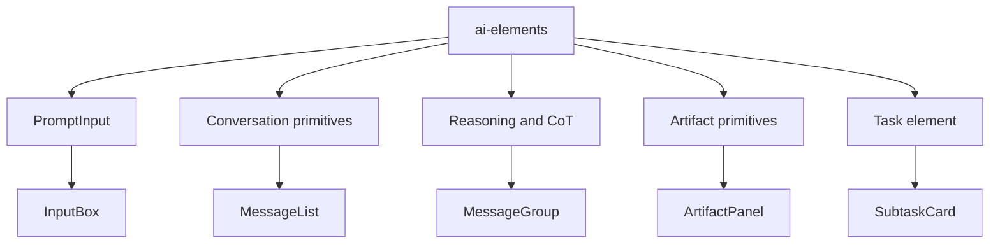
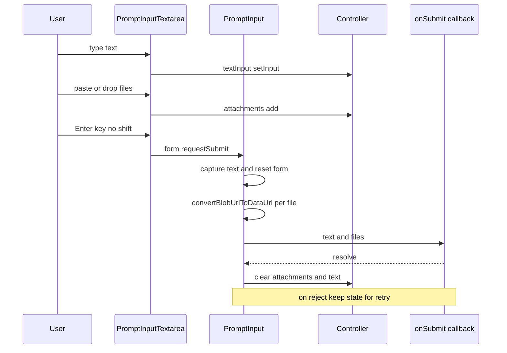

<title>94｜Frontend AI Elements Primitives 详解</title>

<callout emoji="✅">
**本章目标：**讲清 components/ai-elements 对聊天消息、prompt、artifact、reasoning 的支撑。
</callout>

| 模块点 | 说明 |
|-|-|
| prompt-input | 输入框、footer、submit、textarea。 |
| conversation/message | 会话容器和基础消息布局。 |
| reasoning/chain-of-thought | reasoning 和工具过程展示。 |
| artifact/canvas/image/web-preview | 产物、多媒体和网页预览。 |
| task/sources/suggestion | 任务、来源、建议问题。 |

---

# 补充：设计取舍、重点代码与阅读路径

<callout emoji="💡">
**设计目的：**AI Elements 提供可复用的聊天、输入、reasoning、artifact 和 task UI primitive，让 workspace 业务组件不用重复实现基础交互和布局。
</callout>

| 维度 | 说明 |
|-|-|
| 收益 | 消息展示、输入控制、reasoning 展开、artifact 预览等能力可在 workspace 内复用。 |
| 代价 | primitive 本身不应持有过多业务状态；实际数据仍来自 workspace messages、threads hooks 和 chat box。 |
| 重点代码 | `frontend/src/components/ai-elements/message.tsx`、`conversation.tsx`、`prompt-input.tsx`、`reasoning.tsx`、`artifact.tsx`、`task.tsx`。 |
| 阅读路径 | 先看 primitive props，再看 workspace 组件如何把 thread/message/task/artifact 状态传入。 |

