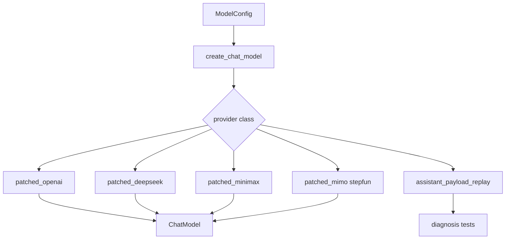

<title>95｜Patched Model Providers 深入详解</title>

<callout emoji="✅">
**本章目标：**继续拆 patched providers，说明不同模型兼容处理的必要性。
</callout>

## 本轮源码校准补充：Patched Model Providers

| Provider 类型 | 关注点 |
|-|-|
| OpenAI-compatible / Responses | base_url、api_key、output_version、tool calling、vision/reasoning 支持。 |
| Codex / Claude CLI-backed | 依赖本机 CLI auth/config，适合本地开发或受控环境。 |
| vLLM / MindIE / DeepSeek / MiniMax 等 patched provider | 重点关注非标准 thinking/reasoning 字段、tool-call 兼容和 streaming 差异。 |
| Replay / seed provider | 用于测试和回放，不应误认为真实线上模型能力。 |

<callout emoji="⚠️">
模型配置调试时不要只看前端下拉框；要同时检查 `config.yaml`、provider factory、模型能力标记、后端错误处理 middleware 和前端提交 context。
</callout>

| 模块点 | 说明 |
|-|-|
| patched_openai | OpenAI 兼容 API 参数、responses API 等适配。 |
| patched_deepseek | DeepSeek 特殊输出或参数兼容。 |
| patched_minimax | MiniMax think block/reasoning 兼容。 |
| patched_mimo/stepfun | 其他 provider 兼容层。 |
| assistant_payload_replay | 回放模型 payload 用于测试/诊断。 |

