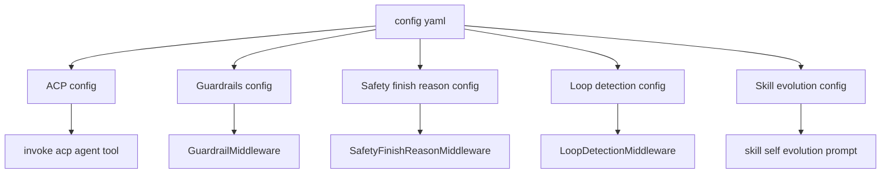
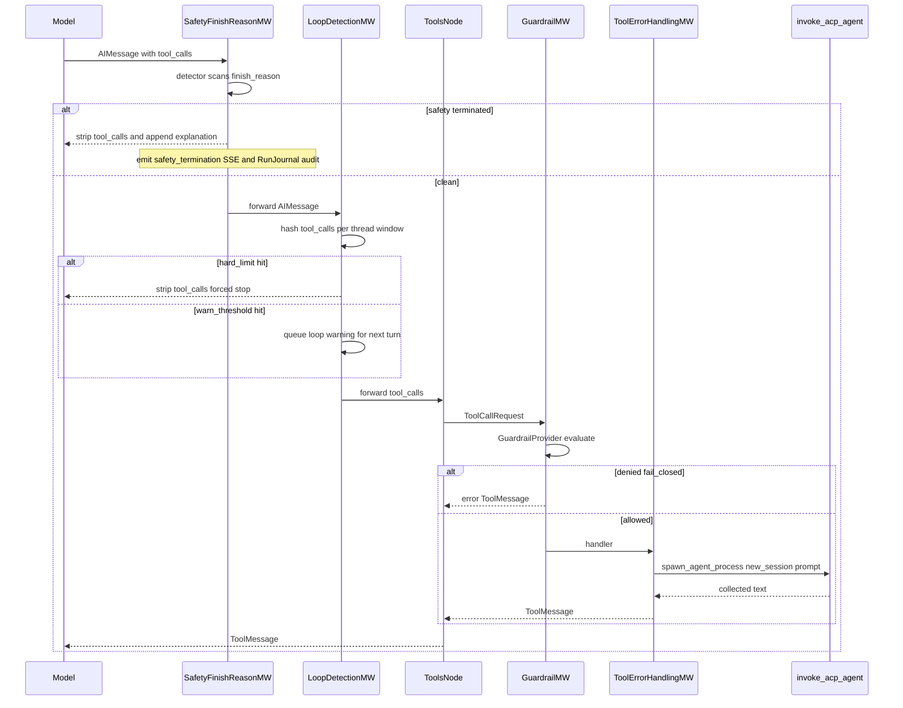

<title>96｜ACP、Guardrails、Safety Config 详解</title>

<callout emoji="✅">
**本章目标：**补齐 ACP agent、guardrails、safety finish reason 等配置模块。
</callout>

| 模块点 | 说明 |
|-|-|
| ACPAgentConfig | 外部 ACP agent 配置。 |
| GuardrailsConfig | 工具调用 guardrail provider 配置。 |
| SafetyFinishReasonConfig | 安全终止 detector 配置。 |
| LoopDetectionConfig | 循环检测阈值和工具频率 override。 |
| SkillEvolutionConfig | agent 自演化 skill 开关。 |

---

# 补充：设计取舍、重点代码与阅读路径

<callout emoji="💡">
**设计目的：**该文档用于把模块职责、运行逻辑、关键代码和阅读路径固定下来，帮助读者从源码验证行为。
</callout>

| 维度 | 说明 |
|-|-|
| 收益 | 读者可以按文档快速定位模块入口和上下游关系。 |
| 代价 | 文档需要随源码变更持续校准，避免模板化描述掩盖真实行为。 |
| 重点代码 | 标题对应的源码、测试或文档入口。 |
| 阅读路径 | 先看上游输入，再看核心函数，最后看下游输出和测试验证。 |

