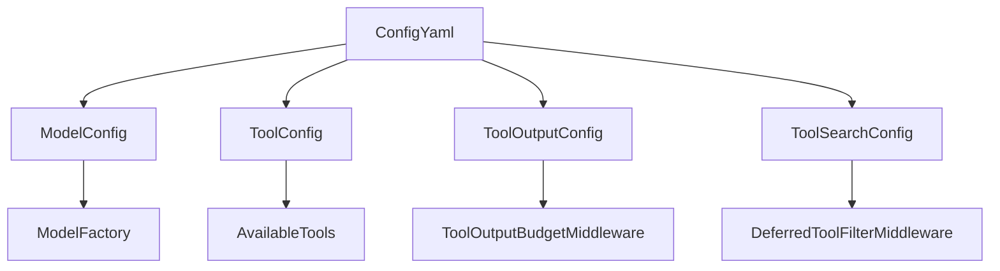
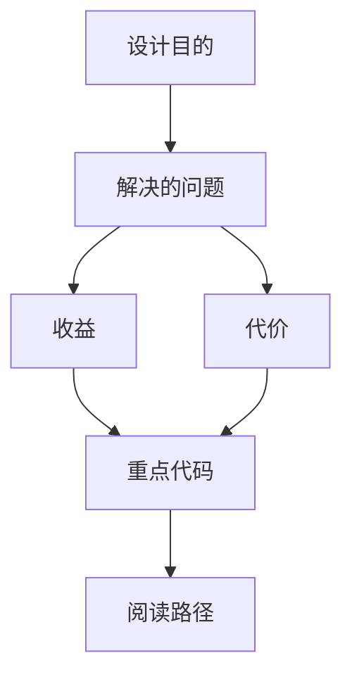

<title>97｜model_config、tool_config、tool_output_config、tool_search_config 单文件详解</title>

<callout emoji="✅">
**本章目标：**单独讲解该模块职责、输入输出和运行逻辑。
</callout>

| 模块点 | 说明 |
|-|-|
| model_config | 定义模型 provider、model name、API 参数和能力开关。 |
| tool_config | 定义工具组和启用策略。 |
| tool_output_config | 定义工具输出预算阈值和外置策略。 |
| tool_search_config | 控制 deferred tool search。 |

---

# 补充：设计取舍、重点代码与阅读路径

<callout emoji="💡">
**设计目的：**该文档用于把模块职责、运行逻辑、关键代码和阅读路径固定下来，帮助读者从源码验证行为。
</callout>

| 维度 | 说明 |
|-|-|
| 收益 | 读者可以按文档快速定位模块入口和上下游关系。 |
| 代价 | 文档需要随源码变更持续校准，避免模板化描述掩盖真实行为。 |
| 重点代码 | 标题对应的源码、测试或文档入口。 |
| 阅读路径 | 先看上游输入，再看核心函数，最后看下游输出和测试验证。 |

