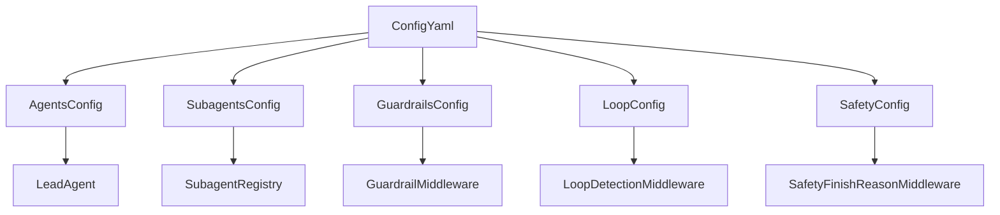
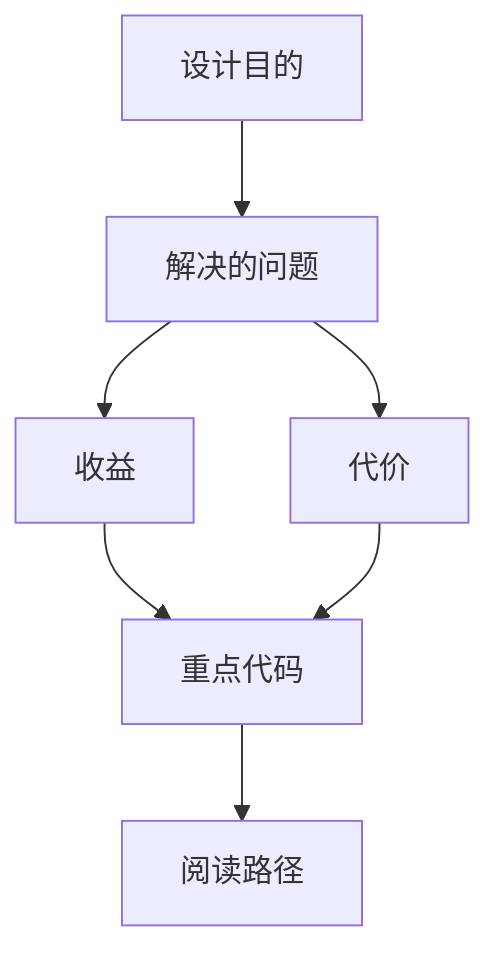

<title>99｜agents/subagents/guardrails/loop/safety 配置文件详解</title>

<callout emoji="✅">
**本章目标：**单独讲解该模块职责、输入输出和运行逻辑。
</callout>

| 模块点 | 说明 |
|-|-|
| agents_config | custom agent config/SOUL 路径解析。 |
| subagents_config | subagent override/custom subagent。 |
| guardrails_config | guardrail provider。 |
| loop_detection_config | 循环检测阈值。 |
| safety_finish_reason_config | 安全终止 detector 配置。 |

---

# 补充：设计取舍、重点代码与阅读路径

<callout emoji="💡">
**设计目的：**这些配置文件控制 agent 身份、subagent 覆盖、工具调用授权、循环保护和安全终止处理，是运行时行为边界而不是前端展示层。
</callout>

| 维度 | 说明 |
|-|-|
| 收益 | custom agent、subagent、guardrail、loop detection 和 safety detector 可以独立配置和测试。 |
| 代价 | agent 配置存在 per-user 与 legacy fallback；`skills: None`、`skills: []`、指定列表含义不同，误配会直接改变 prompt 能力注入。 |
| 重点代码 | `agents_config.py`、`subagents_config.py`、`guardrails_config.py`、`loop_detection_config.py`、`safety_finish_reason_config.py`。 |
| 阅读路径 | 先看配置字段默认值，再追踪到 lead agent/subagent registry/middleware，最后用 run 行为验证 tool allow/deny、loop warning/hard stop、安全 tool-call suppression。 |

