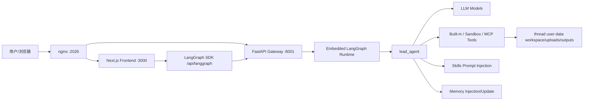
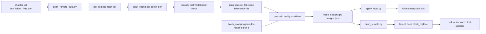

<title>DeerFlow 2.0 源码分层详解：章节目录</title>

<callout emoji="✅">
**本文件夹说明：** 本文件夹按“每一章一篇飞书文档”组织 DeerFlow 2.0 源码走读。每篇文档都包含模块职责、关键文件、运行逻辑图、源码阅读顺序和排障提示。
</callout>

# 章节目录

| 章节 | 内容 | 验收标准 |
|-|-|-|
| **01-整体架构与分层总览** | 从部署入口、前后端、Gateway、Agent Runtime 到扩展系统建立全局地图。 | 读完后能讲清该层如何运行、入口在哪里、改动时先看哪里。 |
| **02-Gateway与运行时** | 详细走读 FastAPI Gateway、LangGraph-compatible API、RunManager、StreamBridge、checkpointer/store。 | 读完后能讲清该层如何运行、入口在哪里、改动时先看哪里。 |
| **03-Lead-Agent与Middleware** | 详细讲解 lead_agent 创建、工具组装、prompt、middleware 顺序和状态流。 | 读完后能讲清该层如何运行、入口在哪里、改动时先看哪里。 |
| **04-Tools-Sandbox-Uploads-Artifacts** | 详细讲解工具系统、sandbox 路径映射、文件上传、产物展示与安全边界。 | 读完后能讲清该层如何运行、入口在哪里、改动时先看哪里。 |
| **05-Skills-MCP-Memory** | 详细讲解 skills、MCP 工具发现、长期记忆和 prompt 注入。 | 读完后能讲清该层如何运行、入口在哪里、改动时先看哪里。 |
| **06-Frontend-Workspace-Chat** | 详细讲解 Next.js workspace、/new thread 生命周期、useThreadStream、消息 UI。 | 读完后能讲清该层如何运行、入口在哪里、改动时先看哪里。 |
| **07-Frontend-Settings-Artifacts** | 详细讲解 Settings、Models、MCP、Skills、Memory、Artifacts 前端数据流。 | 读完后能讲清该层如何运行、入口在哪里、改动时先看哪里。 |
| **08-配置部署测试排障** | 详细讲解 config、env、Makefile、Docker、测试、日志和排障路线。 | 读完后能讲清该层如何运行、入口在哪里、改动时先看哪里。 |
| **355-只会 JS 的前端学习路线图** | 用 JavaScript/React 前端心智理解 DeerFlow：先读前端工作台和 streaming，再读 Gateway/BFF，最后读 Agent Runtime。 | 读完后能从输入框追踪到 lead_agent 并解释 stream 如何回到 MessageList。 |

# 总览运行图

# 推荐阅读顺序

1. 先读 01 和 02，建立服务入口和运行时模型。
2. 再读 03 到 05，理解 agent 能力如何组装出来。
3. 然后读 06 和 07，把前端交互和后端状态流对上。
4. 如果你只熟悉 JavaScript/React，穿插阅读 355，把前端心智迁移到 Gateway 和 Agent Runtime。
5. 最后读 08，掌握本地开发、测试和排障。

# 章节文档链接

| 章节 | 链接 |
|-|-|
| 00｜章节目录 | [打开文档](https://bytedance.my.larkoffice.com/docx/OOKTdDOiRokb7wx2rFRmQShcyrI) |
| 01｜整体架构与分层总览 | [打开文档](https://bytedance.my.larkoffice.com/docx/TFY8df1x5o53mixHM3gmqNqlyce) |
| 02｜Gateway 与 LangGraph 运行时详解 | [打开文档](https://bytedance.my.larkoffice.com/docx/Dcvkdjf3KopJmsxZa9QmEQPWyic) |
| 03｜Lead Agent、Prompt、Tools 与 Middleware 详解 | [打开文档](https://bytedance.my.larkoffice.com/docx/WbumdDbSCoTmW4xIrCsmpOIaymd) |
| 04｜Tools、Sandbox、Uploads 与 Artifacts 详解 | [打开文档](https://bytedance.my.larkoffice.com/docx/ZOtCdVzKjoa3lAx3p92ms1eMyge) |
| 05｜Skills、MCP 与 Memory 详解 | [打开文档](https://bytedance.my.larkoffice.com/docx/U50Ldy2sxoHbOAxo58vmNMUiyef) |
| 06｜Frontend Workspace 与 Chat 主链路详解 | [打开文档](https://bytedance.my.larkoffice.com/docx/IvEydJu3Poud6vx4mR0mThL1y4f) |
| 07｜Frontend Settings、Models、Artifacts 数据流详解 | [打开文档](https://bytedance.my.larkoffice.com/docx/JFD3dRkmvoRYgHxlJD1mbEUUyeb) |
| 08｜配置、部署、测试与排障详解 | [打开文档](https://bytedance.my.larkoffice.com/docx/XyAFdSxNooUswXxcVx8mbR7iyqg) |
| 09｜Auth、CSRF、权限与 IM Channels 详解 | [打开文档](https://bytedance.my.larkoffice.com/docx/KnQBdOROXoOE37xAKPdmljJJyHd) |
| 10｜Models、Tracing、Persistence 与 Token Usage 详解 | [打开文档](https://bytedance.my.larkoffice.com/docx/RUtPdneNLoPyI0x5ksKmblLJynd) |

| 355｜只会 JS 的前端学习 DeerFlow 路线图 | 本地新增 Markdown 入口，优先用于前端同学源码走读。 |

# 第二批细粒度模块文档链接

| 章节 | 链接 |
|-|-|
| 11｜Gateway Routers API 模块逐项详解 | [打开文档](https://bytedance.my.larkoffice.com/docx/ObtfdmyjXo7OYpxM0i1mnRVZyAh) |
| 12｜Runtime RunManager、StreamBridge、Journal 详解 | [打开文档](https://bytedance.my.larkoffice.com/docx/R7HYdJ5PXoiOdgxbpJfmMYDfyRb) |
| 13｜Backend Middleware 模块逐项详解 | [打开文档](https://bytedance.my.larkoffice.com/docx/FKvZdX732osfBNxyscOmHFkgydd) |
| 14｜Frontend Core Hooks 与 UI 模块逐项详解 | [打开文档](https://bytedance.my.larkoffice.com/docx/W0cHd2o13oeVMSx2ucomr8N7yqc) |

# 第三批后端深水区模块文档链接

| 章节 | 链接 |
|-|-|
| 15｜Config、Paths 与 Hot Reload 边界详解 | [打开文档](https://bytedance.my.larkoffice.com/docx/DTU7dQ6SiopsQDxfJqZmSTVWyag) |
| 16｜Subagents、Task Tool 与并发执行详解 | [打开文档](https://bytedance.my.larkoffice.com/docx/T2nWdcV6OoO2xBxBjB2mBIFOyJd) |
| 17｜Model Provider Factory 与模型适配详解 | [打开文档](https://bytedance.my.larkoffice.com/docx/GHiydyXRiof4QWxhlrcm8Y8MyAe) |
| 18｜Persistence、Database、ThreadMeta 与 Feedback 详解 | [打开文档](https://bytedance.my.larkoffice.com/docx/AEwWdPBDGovKumxTbd3mDiFfywc) |

# 第四批文件级模块文档链接

| 章节 | 链接 |
|-|-|
| 19｜Middleware 基建类文件详解 | [打开文档](https://bytedance.my.larkoffice.com/docx/Dg0idIHMcovbQWxrpKjmEwT3yyh) |
| 20｜Middleware 上下文与 UX 类文件详解 | [打开文档](https://bytedance.my.larkoffice.com/docx/JcBLdKkKro44LfxcRmjmkANvypd) |
| 21｜Run 与 Thread Router 文件级详解 | [打开文档](https://bytedance.my.larkoffice.com/docx/XBu1d292ioMiS1xPPgGmIfayybg) |
| 22｜管理类 Router 文件级详解 | [打开文档](https://bytedance.my.larkoffice.com/docx/XgSYdKk4goj6hXxiChvmPQX4yPc) |
| 23｜文件类 Router 详解 | [打开文档](https://bytedance.my.larkoffice.com/docx/Ms9CdobALoYwXxxIolSmjnYhydh) |

# 第五批单 Middleware 文档链接

| 章节 | 链接 |
|-|-|
| 24｜ThreadDataMiddleware 单文件详解 | [打开文档](https://bytedance.my.larkoffice.com/docx/UvKWdlU67ov47kx6ygsmR4FkyKd) |
| 25｜UploadsMiddleware 单文件详解 | [打开文档](https://bytedance.my.larkoffice.com/docx/IiQ9dfvfUoPcXLxr8JTmgS5nyKb) |
| 26｜SandboxMiddleware 单文件详解 | [打开文档](https://bytedance.my.larkoffice.com/docx/ZTBedtbq1owHuuxfEj1mj6zny4J) |
| 27｜ToolOutputBudgetMiddleware 单文件详解 | [打开文档](https://bytedance.my.larkoffice.com/docx/VEKEdbAY1o3fUTxJXNWmqtw9yke) |
| 28｜DynamicContextMiddleware 单文件详解 | [打开文档](https://bytedance.my.larkoffice.com/docx/WI9ddl8N4ozZ59xVObim5745yOe) |
| 29｜SkillActivationMiddleware 单文件详解 | [打开文档](https://bytedance.my.larkoffice.com/docx/Wqntdu46NobRZ6xXj1Jm07u2y3c) |
| 30｜Todo、Title、Memory Middleware 文件详解 | [打开文档](https://bytedance.my.larkoffice.com/docx/TwFzdZemFoTVJOxJ2pAmaGRkyJX) |

# 第六批剩余 Middleware 文档链接

| 章节 | 链接 |
|-|-|
| 31｜LLMErrorHandlingMiddleware 单文件详解 | [打开文档](https://bytedance.my.larkoffice.com/docx/YFlDdZ5uLoCidrxeQJ6mzqhfyUc) |
| 32｜LoopDetectionMiddleware 单文件详解 | [打开文档](https://bytedance.my.larkoffice.com/docx/B0EAdEvMoo9NCDxwUHLm5GMqyUf) |
| 33｜SandboxAuditMiddleware 单文件详解 | [打开文档](https://bytedance.my.larkoffice.com/docx/JH1VdeODuo4gavxMsiCmIJ5cyih) |
| 34｜DeferredToolFilterMiddleware 单文件详解 | [打开文档](https://bytedance.my.larkoffice.com/docx/Bh2wdOJ4eoYqolxDDfnmSgNtyec) |
| 35｜SafetyFinishReasonMiddleware 单文件详解 | [打开文档](https://bytedance.my.larkoffice.com/docx/AqFBdegF4osKOsx759OmqUGfyGd) |
| 36｜ViewImage、DanglingToolCall、SubagentLimit、TokenUsage Middleware 详解 | [打开文档](https://bytedance.my.larkoffice.com/docx/FGBSd60wYoPStFxTn1wmos4Iyhd) |

# 第七批 Sandbox / MCP / Memory / Skills / Frontend Core 文档链接

| 章节 | 链接 |
|-|-|
| 37｜Sandbox Tools 单文件详解 | [打开文档](https://bytedance.my.larkoffice.com/docx/SmrFdFwMYoZ1rSxcEWRm3aTSyVc) |
| 38｜LocalSandbox 与 AioSandbox Provider 详解 | [打开文档](https://bytedance.my.larkoffice.com/docx/DujDdwq1uoWq1lxzFJ6m3ACSyYc) |
| 39｜MCP Cache、Session Pool 与 OAuth 详解 | [打开文档](https://bytedance.my.larkoffice.com/docx/RRlAdJ5QeoVOVmxAd5AmHF9Wycf) |
| 40｜Memory Queue、Updater、Storage 单文件详解 | [打开文档](https://bytedance.my.larkoffice.com/docx/LEsJdNSIWoaRpUxxcxCms3S9ykd) |
| 41｜Skills Parser、Installer、Security Scanner 详解 | [打开文档](https://bytedance.my.larkoffice.com/docx/KeIZd79ZSo4Ye5xMo6mmxI3ayif) |
| 42｜Frontend useThreadStream 单文件详解 | [打开文档](https://bytedance.my.larkoffice.com/docx/FAKHdFdrxoDN17x6L2pmRh8LyLh) |
| 43｜Frontend Message Utils 与 Artifacts Hooks 详解 | [打开文档](https://bytedance.my.larkoffice.com/docx/LKNFdYQDFob1Pnxz0nTmHIRDy5b) |

# 第八批 Config / Models / Persistence / Frontend Settings / Gateway 细模块文档链接

| 章节 | 链接 |
|-|-|
| 44｜Config 配置类目录详解 | [打开文档](https://bytedance.my.larkoffice.com/docx/KkxxdGMdMoQL7xxJ68KmYRXNy5d) |
| 45｜Models Provider Patch 文件详解 | [打开文档](https://bytedance.my.larkoffice.com/docx/Px9jdtsoToG0dGxxvrqmwjAayYd) |
| 46｜Persistence Repository 文件详解 | [打开文档](https://bytedance.my.larkoffice.com/docx/P0iPdScRBooiWtxzMALmUoEGyNd) |
| 47｜Frontend Settings 页面文件详解 | [打开文档](https://bytedance.my.larkoffice.com/docx/YBAWdQHf5o5XE0xFWanm7TZJyua) |
| 48｜Gateway Auth Router 与认证模块详解 | [打开文档](https://bytedance.my.larkoffice.com/docx/RIpxddfV7oVl1pxsy2wmbgxty5f) |
| 49｜Gateway MCP、Skills、Memory Router 深入详解 | [打开文档](https://bytedance.my.larkoffice.com/docx/GvzAdygTVoxdSkx5ccJmq0LLyei) |
| 50｜Frontend ChatPage 与 InputBox 文件详解 | [打开文档](https://bytedance.my.larkoffice.com/docx/YZrtddBLUoi6dHxaE9qmtkUeyag) |

# 第九批 Router 与 Frontend 组件单文件文档链接

| 章节 | 链接 |
|-|-|
| 51｜thread_runs.py Router 单文件详解 | [打开文档](https://bytedance.my.larkoffice.com/docx/BCeodzVdFoTfd2xYV7zmbv9ey2g) |
| 52｜threads.py Router 单文件详解 | [打开文档](https://bytedance.my.larkoffice.com/docx/G6g2dsCTJoC7I5xBSvymxpYGyDh) |
| 53｜uploads.py Router 单文件详解 | [打开文档](https://bytedance.my.larkoffice.com/docx/KRkUdNbBTogsdVxvGYomgrhbymh) |
| 54｜artifacts.py Router 单文件详解 | [打开文档](https://bytedance.my.larkoffice.com/docx/LfAcdzwGoovGBKxt2Y3muPMFyRe) |
| 55｜skills.py Router 单文件详解 | [打开文档](https://bytedance.my.larkoffice.com/docx/QnVXd93l7oRHrYxKiMrmy1R1yqd) |
| 56｜memory.py Router 单文件详解 | [打开文档](https://bytedance.my.larkoffice.com/docx/YhEfdVXOYoljEFxq2aWmD2UZyCf) |
| 57｜mcp.py Router 单文件详解 | [打开文档](https://bytedance.my.larkoffice.com/docx/BR2idY5bloBoMexpvGimofvnyfc) |
| 58｜Frontend Message Components 单文件详解 | [打开文档](https://bytedance.my.larkoffice.com/docx/Pj9cdb03Ro5PKWxWuPOmQCk9ysd) |
| 59｜Frontend Artifact Components 单文件详解 | [打开文档](https://bytedance.my.larkoffice.com/docx/NcqBdQyhgomSFNxnWvYmL4KFyrv) |
| 60｜Frontend Sidebar 与 Navigation 组件详解 | [打开文档](https://bytedance.my.larkoffice.com/docx/QHtJdUR0no3wkdxcY1Zm5WYNyPg) |

# 第十批 Router 与 Frontend Core 细模块文档链接

| 章节 | 链接 |
|-|-|
| 61｜auth.py Router 单文件详解 | [打开文档](https://bytedance.my.larkoffice.com/docx/AmL1d7za4oPMylxMcZ8mHcjtyyg) |
| 62｜agents.py Router 单文件详解 | [打开文档](https://bytedance.my.larkoffice.com/docx/FgmQddXpfogJd2xoPJUmcxubytf) |
| 63｜feedback、suggestions、channels Router 详解 | [打开文档](https://bytedance.my.larkoffice.com/docx/EemWdDNmiovWWlxz6Y3mqSt7y6e) |
| 64｜Frontend API Client 与 Fetcher 详解 | [打开文档](https://bytedance.my.larkoffice.com/docx/Vdnzdq4HfoAl4pxJk1VmQnpAyGg) |
| 65｜Frontend Core Settings/Models/MCP/Skills/Memory API 层详解 | [打开文档](https://bytedance.my.larkoffice.com/docx/Xfm2d6pOMotWZixrSDcm22bsyic) |
| 66｜Frontend Uploads、Notification、Tasks Core 详解 | [打开文档](https://bytedance.my.larkoffice.com/docx/IdEZdZcDeoADdIxMfjWmETbEyLb) |
| 67｜Frontend Agents、Blog、I18n、Static Mode 模块详解 | [打开文档](https://bytedance.my.larkoffice.com/docx/GZsrdYiLLoT05sxERhNmH1v1ycb) |

# 第十一批 Channels / Community / Landing / Docs / UI 文档链接

| 章节 | 链接 |
|-|-|
| 68｜Channels Service 与 ChannelManager 详解 | [打开文档](https://bytedance.my.larkoffice.com/docx/EH0IdtUGuoPKQfxql2UmiuiGylu) |
| 69｜Feishu/Slack/Telegram/WeCom/DingTalk/Wechat Channel 详解 | [打开文档](https://bytedance.my.larkoffice.com/docx/R63yd6XPyoTIaCxrHgKmzacOyoh) |
| 70｜Community Search/Fetch/Image Tools 详解 | [打开文档](https://bytedance.my.larkoffice.com/docx/YI9pdyg9YoDuMCx7sK8mLMn7yHg) |
| 71｜AioSandbox Community Backend 详解 | [打开文档](https://bytedance.my.larkoffice.com/docx/GtFUdhE7toXYiqxtKFWmMkctyJL) |
| 72｜Frontend Landing、Docs、Blog 页面详解 | [打开文档](https://bytedance.my.larkoffice.com/docx/Wc80dFkogouhcuxbpIOmzcBPyIb) |
| 73｜Frontend Auth/Login/Setup 页面详解 | [打开文档](https://bytedance.my.larkoffice.com/docx/P0ybdryeloBAZsxsrWWm1iOQyjF) |
| 74｜Frontend AI Elements 与 UI 基础组件详解 | [打开文档](https://bytedance.my.larkoffice.com/docx/W4CkdRccMosnvWxg22vmYZhcyod) |

# 第十二批 Channel / Community / Landing 单模块文档链接

| 章节 | 链接 |
|-|-|
| 75｜FeishuChannel 单文件详解 | [打开文档](https://bytedance.my.larkoffice.com/docx/FmyedWaiuoqW75xBkQ9mxXAkyee) |
| 76｜Slack 与 Telegram Channel 详解 | [打开文档](https://bytedance.my.larkoffice.com/docx/BkyWdXX9ho3grxxX0rMmXeSKySe) |
| 77｜DingTalk、WeCom、Wechat Channel 详解 | [打开文档](https://bytedance.my.larkoffice.com/docx/Gj3fdQukjo9O0txWJUHmiJMnysh) |
| 78｜Tavily、Firecrawl、Exa、Serper Web Search Provider 详解 | [打开文档](https://bytedance.my.larkoffice.com/docx/TBw5dOi4Pop0pcxsIK2mNW9Fyqe) |
| 79｜Jina、DDG、InfoQuest、Image Search Provider 详解 | [打开文档](https://bytedance.my.larkoffice.com/docx/D9H8d1zSOoONoRxX8bNmFHRUyyd) |
| 80｜Landing Page Sections 组件详解 | [打开文档](https://bytedance.my.larkoffice.com/docx/Odo6dODyOooQqSxIkFGm4V5EyHt) |
| 81｜Nextra Docs、Content 与 Blog 渲染详解 | [打开文档](https://bytedance.my.larkoffice.com/docx/AQyEdfAQtoEFjSx9QGkmHu9NyYe) |

# 第十三批 Provider / Channel / Config / Landing 深拆文档链接

| 章节 | 链接 |
|-|-|
| 82｜Tavily 与 Firecrawl Provider 单模块详解 | [打开文档](https://bytedance.my.larkoffice.com/docx/BJQTdmcNBow7eMxwAIEm0yjPyxh) |
| 83｜Exa 与 Serper Provider 单模块详解 | [打开文档](https://bytedance.my.larkoffice.com/docx/SXAvdVOyRo74WVxtEEOmZiivy7b) |
| 84｜Jina、DDG、InfoQuest Provider 单模块详解 | [打开文档](https://bytedance.my.larkoffice.com/docx/CLtTdACCIoOmyLxUHpOmPenGyzL) |
| 85｜Feishu Channel 深入运行逻辑 | [打开文档](https://bytedance.my.larkoffice.com/docx/CjJDdvrq1o4xqdxx1m1mQM7Vyth) |
| 86｜Slack Channel 深入运行逻辑 | [打开文档](https://bytedance.my.larkoffice.com/docx/V9S3dU4Npoer4hxYDKomIVBeyVh) |
| 87｜Telegram、DingTalk、WeCom Channel 深入运行逻辑 | [打开文档](https://bytedance.my.larkoffice.com/docx/ADipdPBhKoiHtpxvRr3mo9gHyag) |
| 88｜Model/Sandbox/Memory/Tool Config 单文件详解 | [打开文档](https://bytedance.my.larkoffice.com/docx/Cxsnd5I1UoQEbcxAfthmRthyy0c) |
| 89｜Landing Sections 深入组件逻辑 | [打开文档](https://bytedance.my.larkoffice.com/docx/UBupdd0huofiFzx7kwQma6Jbytc) |

# 第十四批 Config / Model / UI Primitive 文档链接

| 章节 | 链接 |
|-|-|
| 90｜AppConfig、Runtime Paths、Reload Boundary 单文件详解 | [打开文档](https://bytedance.my.larkoffice.com/docx/InLIdtvS0oK111x7crnm1lueyJd) |
| 91｜Database、Checkpointer、RunEvents Config 详解 | [打开文档](https://bytedance.my.larkoffice.com/docx/Qp22dl4NqoC0LfxmskNmfXqcyLb) |
| 92｜Subagents、Summarization、Title、Tracing Config 详解 | [打开文档](https://bytedance.my.larkoffice.com/docx/JsEIdU1XmoygtQxL7NtmCj0wyhb) |
| 93｜Frontend UI Primitives 单文件详解 | [打开文档](https://bytedance.my.larkoffice.com/docx/T2S7diLrro8qWjxgBkDmAiW9yih) |
| 94｜Frontend AI Elements Primitives 详解 | [打开文档](https://bytedance.my.larkoffice.com/docx/DjOOd6VXKohlpIxaJaum2Z2TyjI) |
| 95｜Patched Model Providers 深入详解 | [打开文档](https://bytedance.my.larkoffice.com/docx/WHTodguJQoLMdLxHrN4mQbruy0f) |
| 96｜ACP、Guardrails、Safety Config 详解 | [打开文档](https://bytedance.my.larkoffice.com/docx/ORgBd8a9wohpjjxl3InmnSe8yHg) |

# 第十五批 Config / AI Elements / UI Primitives 单文件文档链接

| 章节 | 链接 |
|-|-|
| 97｜model_config、tool_config、tool_output_config、tool_search_config 单文件详解 | [打开文档](https://bytedance.my.larkoffice.com/docx/KM4Gdg0KfomaaFx8ddkmNCcWy9e) |
| 98｜memory_config、sandbox_config、skills_config 单文件详解 | [打开文档](https://bytedance.my.larkoffice.com/docx/DR6ndS7z8oDKx1xgLqImWMN1ywg) |
| 99｜agents/subagents/guardrails/loop/safety 配置文件详解 | [打开文档](https://bytedance.my.larkoffice.com/docx/U1EAd9aqMoIVTrxNoqkmNyJyy0b) |
| 100｜AI Elements Message、Conversation、PromptInput 详解 | [打开文档](https://bytedance.my.larkoffice.com/docx/P3MRdKYHNokBdDxaDl0mRmEcywh) |
| 101｜AI Elements Reasoning、Task、Artifact 详解 | [打开文档](https://bytedance.my.larkoffice.com/docx/IdVGdsdtko2usdx2ukimWyonyJb) |
| 102｜UI Layout Primitives：Sidebar、Resizable、ScrollArea、Dialog 详解 | [打开文档](https://bytedance.my.larkoffice.com/docx/JnTmdreu6ofZksxLltgmkCjryvb) |
| 103｜UI Input、Command、Select、Dropdown Primitives 详解 | [打开文档](https://bytedance.my.larkoffice.com/docx/VtUtduI0soRZZmxD3QfmogrXykT) |

# 第十六批 Config / AI Elements / UI / Provider 细文档链接

| 章节 | 链接 |
|-|-|
| 104｜AI Elements CodeBlock、WebPreview、Canvas、Image 详解 | [打开文档](https://bytedance.my.larkoffice.com/docx/TJC7dR82Hou6xdxRBTmmuJR2yBe) |
| 105｜AI Elements ModelSelector、Loader、Suggestion、Sources 详解 | [打开文档](https://bytedance.my.larkoffice.com/docx/Yc6XdUsPVovVBAxsegGmkOFeyqe) |
| 106｜UI Feedback/Display Primitives 详解 | [打开文档](https://bytedance.my.larkoffice.com/docx/KIszdrsBfoZLMVxblCQmeFMhySb) |
| 107｜UI Navigation/Overlay Primitives 详解 | [打开文档](https://bytedance.my.larkoffice.com/docx/CIhNdlSJaooYULxICc5mGrLVyvf) |
| 108｜Claude、vLLM、MindIE、OpenAI Codex Provider 详解 | [打开文档](https://bytedance.my.larkoffice.com/docx/PWcGdJg5MoC7OHxYUFqmq6zryxc) |
| 109｜Tracing、TokenUsage、ACP 配置文件详解 | [打开文档](https://bytedance.my.larkoffice.com/docx/Nzmidco1BoEK70xxO9xm9xUUy2g) |
| 110｜Frontend Streamdown、MDX、Markdown 渲染详解 | [打开文档](https://bytedance.my.larkoffice.com/docx/CKqhdfJVpoYmIzxl65Gmb15MyCd) |

# 第十七批 AI Elements / UI Primitives 细文档链接

| 章节 | 链接 |
|-|-|
| 111｜AI Elements Conversation 与 Message 详解 | [打开文档](https://bytedance.my.larkoffice.com/docx/M0sDdzfHXoV9MIx0J36mfXE1yVh) |
| 112｜AI Elements PromptInput 与 Controls 详解 | [打开文档](https://bytedance.my.larkoffice.com/docx/H9WgdlSXCo9u2oxk5cfmlZCdyMg) |
| 113｜AI Elements Artifact、Panel、OpenInChat 详解 | [打开文档](https://bytedance.my.larkoffice.com/docx/JYEIdPqTyo7gqGxXYhGmR1Rpysg) |
| 114｜AI Elements Node、Edge、Checkpoint 图元素详解 | [打开文档](https://bytedance.my.larkoffice.com/docx/IdqXddiXroGyW7x191amrlwYyJM) |
| 115｜UI Form Primitives：Button、Input、Textarea、Switch、Toggle 详解 | [打开文档](https://bytedance.my.larkoffice.com/docx/M1nXdLJVxog1iaxytLzm0RRky5e) |
| 116｜UI Data Display Primitives：Card、Avatar、Item、Table-like 详解 | [打开文档](https://bytedance.my.larkoffice.com/docx/KHf1dqySAojRn3xyKTrmpExpymg) |
| 117｜UI Visual Effects Primitives：MagicBento、Aurora、Shine、Spotlight 详解 | [打开文档](https://bytedance.my.larkoffice.com/docx/UmEmdGe27op9TPxjFnmm56CAyIg) |

# 第十八批 Workspace 业务组件细文档链接

| 章节 | 链接 |
|-|-|
| 118｜Workspace Welcome 与 AgentWelcome 组件详解 | [打开文档](https://bytedance.my.larkoffice.com/docx/ByTKdUjzFoi8RpxBLfgmBRNyyRb) |
| 119｜ThreadTitle、TokenUsageIndicator、ExportTrigger 详解 | [打开文档](https://bytedance.my.larkoffice.com/docx/KcKrdsMpDo6qo7xv6prmAo8uyWT) |
| 120｜TodoList、CopyButton、Citations 组件详解 | [打开文档](https://bytedance.my.larkoffice.com/docx/UIbqdws4zoEH78xfssBmvIPeywd) |
| 121｜Gateway Offline Banner/Fallback 组件详解 | [打开文档](https://bytedance.my.larkoffice.com/docx/AJ0OdyjGloe8BZxuVLNmHiz8y27) |
| 122｜AgentGallery、AgentCard 与 NewAgent Page 详解 | [打开文档](https://bytedance.my.larkoffice.com/docx/JshPdr2YRo3ynjxZ0REmIDAByeh) |
| 123｜WorkspaceContainer、Header、Overscroll 组件详解 | [打开文档](https://bytedance.my.larkoffice.com/docx/JEBDdvjamoEHsLxNe5kmgPxIyDf) |
| 124｜CodeEditor 与 Artifact Detail 交互详解 | [打开文档](https://bytedance.my.larkoffice.com/docx/H5KWdFhfios1ETxgVzDmPIfYytf) |

# 第十九批 Settings / Artifacts / Messages / Core Threads 细文档链接

| 章节 | 链接 |
|-|-|
| 125｜SettingsDialog 与 SettingsSection 详解 | [打开文档](https://bytedance.my.larkoffice.com/docx/FetXdwj2Oo7Uq9xrOmtmC1pUytf) |
| 126｜Tool、Skill、Memory Settings Pages 详解 | [打开文档](https://bytedance.my.larkoffice.com/docx/Q3nMdn8QroDBnHxcpxBmnE7Nyxe) |
| 127｜Account、Appearance、Notification、About Settings Pages 详解 | [打开文档](https://bytedance.my.larkoffice.com/docx/HdyvdD7nJoeHh3xLWOsm8V7hyZf) |
| 128｜Artifacts Context、Trigger、List、Detail 详解 | [打开文档](https://bytedance.my.larkoffice.com/docx/TmVTd99CloWR5yx2L4vmTyuWyCe) |
| 129｜Messages List、Item、Group、Subtask 组件详解 | [打开文档](https://bytedance.my.larkoffice.com/docx/LX5PdYmtKoUkRmxdegZmkAj8ySb) |
| 130｜Core Threads Stream、History、Cache 函数组详解 | [打开文档](https://bytedance.my.larkoffice.com/docx/LfIHdQPs4orPQxxjckXmM0nIytf) |
| 131｜Core Threads Runs、Delete、Rename、Token Usage Hooks 详解 | [打开文档](https://bytedance.my.larkoffice.com/docx/YNy0dJRfMoTHMSxCCF8mwjS7yRb) |

# 第二十批 Tests / CI / Scripts / Docker / Public Skills 文档链接

| 章节 | 链接 |
|-|-|
| 132｜Backend Tests 测试体系详解 | [打开文档](https://bytedance.my.larkoffice.com/docx/XnvOdeyO4ofXDPxGUwqmobtdyte) |
| 133｜Frontend Tests 与 Playwright E2E 详解 | [打开文档](https://bytedance.my.larkoffice.com/docx/OUAUdzRP8oDP2uxkNTbmhpbiyr1) |
| 134｜GitHub Workflows CI 流水线详解 | [打开文档](https://bytedance.my.larkoffice.com/docx/AuwvdIOcHocJNfxTv36mx07PyOb) |
| 135｜Scripts Setup/Dev/Deploy 脚本详解 | [打开文档](https://bytedance.my.larkoffice.com/docx/KzTudbQrso6iq1xv9oVm1IQGyfe) |
| 136｜Scripts Diagnostics/Maintenance 脚本详解 | [打开文档](https://bytedance.my.larkoffice.com/docx/W07EdWJpWooeyOxpPa0mO8MWyhg) |
| 137｜Docker Compose、Nginx、Provisioner 详解 | [打开文档](https://bytedance.my.larkoffice.com/docx/LHnqdWz1Aoxf7oxQA7nmHDeTy0d) |
| 138｜Public Skills 分类与运行逻辑详解 | [打开文档](https://bytedance.my.larkoffice.com/docx/R7Tddja3zoy1lpxB3aVmnNrUyCe) |

# 第二十一批 Public Skills 分类与测试文档链接

| 章节 | 链接 |
|-|-|
| 139｜Research/Review Public Skills 详解 | [打开文档](https://bytedance.my.larkoffice.com/docx/DbZMdm3n7o7d9oxbUOcmhnuyy3c) |
| 140｜Media Generation Public Skills 详解 | [打开文档](https://bytedance.my.larkoffice.com/docx/JB1TdkfzAo4Cxzx65lDmUwPnytc) |
| 141｜Development/Deploy Public Skills 详解 | [打开文档](https://bytedance.my.larkoffice.com/docx/D4HXdo0SyoFn9ux4L24m5GTYyPh) |
| 142｜Analysis/Consulting Public Skills 详解 | [打开文档](https://bytedance.my.larkoffice.com/docx/VCO9d74gVo0SOVxL52CmwxPOyyn) |
| 143｜Meta/Bootstrap Public Skills 详解 | [打开文档](https://bytedance.my.larkoffice.com/docx/VMokdYGL4o3kv8x18C1mptDwy9b) |
| 144｜Skills Package Tests 与脚本详解 | [打开文档](https://bytedance.my.larkoffice.com/docx/EftrddWgNodlpgxVmy8m2DUdyoh) |

# 第二十二批单 Public Skill 文档链接

| 章节 | 链接 |
|-|-|
| 145｜deep-research Public Skill 详解 | [打开文档](https://bytedance.my.larkoffice.com/docx/BOgmda6SboP0FVx1AwvmA0ycySf) |
| 146｜github-deep-research Public Skill 详解 | [打开文档](https://bytedance.my.larkoffice.com/docx/IzzLdAE3voY4ZKxyipcm8xKpyPh) |
| 147｜academic-paper-review Public Skill 详解 | [打开文档](https://bytedance.my.larkoffice.com/docx/VkkadcAy2oW1rzx1BD2m0ecOyzd) |
| 148｜systematic-literature-review Public Skill 详解 | [打开文档](https://bytedance.my.larkoffice.com/docx/VHwydVr3Po77tlxLDy6mLagjy7g) |
| 149｜frontend-design Public Skill 详解 | [打开文档](https://bytedance.my.larkoffice.com/docx/Td3ddJCMVogvl7xdNKumtVLQyWc) |
| 150｜web-design-guidelines Public Skill 详解 | [打开文档](https://bytedance.my.larkoffice.com/docx/IxAHdSXtLoegxOxX8PBmvz15ymw) |
| 151｜data-analysis Public Skill 详解 | [打开文档](https://bytedance.my.larkoffice.com/docx/XnVFd6MhDo6iXyxl7q5mNpK5y5M) |
| 152｜chart-visualization Public Skill 详解 | [打开文档](https://bytedance.my.larkoffice.com/docx/IIYCdr2m7oQ0dGx6PTPmI0f4ySJ) |
| 153｜image-generation Public Skill 详解 | [打开文档](https://bytedance.my.larkoffice.com/docx/KJxPdkehPoFjYWxpQRIm8T2jyCb) |
| 154｜skill-creator Public Skill 详解 | [打开文档](https://bytedance.my.larkoffice.com/docx/V32AdbOFKozFkfxolgUmvIeTyzf) |

# 第二十三批剩余单 Public Skill 文档链接

| 章节 | 链接 |
|-|-|
| 155｜music-generation Public Skill 详解 | [打开文档](https://bytedance.my.larkoffice.com/docx/SrxjdNycwoniOlxgfj8md54ByTf) |
| 156｜video-generation Public Skill 详解 | [打开文档](https://bytedance.my.larkoffice.com/docx/FmiGdBipKoljikxkx66mrq2nyHg) |
| 157｜podcast-generation Public Skill 详解 | [打开文档](https://bytedance.my.larkoffice.com/docx/R61bdSOyBoryIMxVruRmW7I0yDe) |
| 158｜ppt-generation Public Skill 详解 | [打开文档](https://bytedance.my.larkoffice.com/docx/WV7edvlgHovpRExfSTZmMBx2y9d) |
| 159｜newsletter-generation Public Skill 详解 | [打开文档](https://bytedance.my.larkoffice.com/docx/JRvCdEVy6oZRmix5bFVm31wBykh) |
| 160｜find-skills Public Skill 详解 | [打开文档](https://bytedance.my.larkoffice.com/docx/Dj6Cd75ctobQMzxKT7smtfvMyec) |
| 161｜bootstrap Public Skill 详解 | [打开文档](https://bytedance.my.larkoffice.com/docx/PM9idxWJvoJxIcxcmImmfxWiy5g) |
| 162｜surprise-me Public Skill 详解 | [打开文档](https://bytedance.my.larkoffice.com/docx/C2Fgd11tLoyguZxeQNGmdZ27yrc) |
| 163｜vercel-deploy-claimable Public Skill 详解 | [打开文档](https://bytedance.my.larkoffice.com/docx/WDI8dNRyho20NaxFQYzmLsRQylh) |
| 164｜code-documentation Public Skill 详解 | [打开文档](https://bytedance.my.larkoffice.com/docx/CqdrdGw7zoQJxFxSGjNmOaLHyPx) |
| 165｜consulting-analysis Public Skill 详解 | [打开文档](https://bytedance.my.larkoffice.com/docx/JgH7d5rEooWdaNxLFfXmgffTyff) |
| 166｜claude-to-deerflow Public Skill 详解 | [打开文档](https://bytedance.my.larkoffice.com/docx/TjB5dinPno2umfxVCMxmyN3ByKY) |

# 第二十四批 Tests / Workflows / Scripts 细文档链接

| 章节 | 链接 |
|-|-|
| 167｜Backend Router Tests 分类详解 | [打开文档](https://bytedance.my.larkoffice.com/docx/ORVpd2dyWo6POuxbMm8mMmGOyve) |
| 168｜Backend Runtime/Run/Stream Tests 分类详解 | [打开文档](https://bytedance.my.larkoffice.com/docx/OutldTAUHokNLfxEKy0m74YQyxe) |
| 169｜Backend Agent/Middleware Tests 分类详解 | [打开文档](https://bytedance.my.larkoffice.com/docx/FfXYdW7tYoKZFwxLhq5m6v5Oy9c) |
| 170｜Backend Sandbox/MCP/Memory Tests 分类详解 | [打开文档](https://bytedance.my.larkoffice.com/docx/GkTPdXagboZghKxHpjDm0EwaySb) |
| 171｜Frontend E2E Specs 分类详解 | [打开文档](https://bytedance.my.larkoffice.com/docx/UdJLd1PnjoCoaRxPymZmxYwAymg) |
| 172｜GitHub Workflow 文件逐项详解 | [打开文档](https://bytedance.my.larkoffice.com/docx/PB7GdUM7CozMjaxHX12ms1SHyYK) |
| 173｜Setup Wizard Scripts 详解 | [打开文档](https://bytedance.my.larkoffice.com/docx/IvFddjdM4oFm6nxy72mmK3oky5g) |

# 第二十五批 Workflows / Scripts / Test Specs 细文档链接

| 章节 | 链接 |
|-|-|
| 174｜Backend/Frontend Unit Test Workflows 详解 | [打开文档](https://bytedance.my.larkoffice.com/docx/Mi1IdEdyNoRM9exWg0HmwvLwy9d) |
| 175｜E2E、Replay、Container Workflows 详解 | [打开文档](https://bytedance.my.larkoffice.com/docx/VBOSdCNrtomPTMxUnJgmWAuxyWc) |
| 176｜check.py、doctor.py、configure.py、config-upgrade 详解 | [打开文档](https://bytedance.my.larkoffice.com/docx/WvtCdqH0Do2ItUxzxOzmGbZkyFd) |
| 177｜serve.sh、docker.sh、deploy.sh 详解 | [打开文档](https://bytedance.my.larkoffice.com/docx/BSKAdlpSaoZnB1xTULsmqxutyIg) |
| 178｜Frontend E2E Chat/Sidebar/Artifacts Specs 详解 | [打开文档](https://bytedance.my.larkoffice.com/docx/Z6d4dIlnSoqvWixQ5QNmCXK9y1d) |
| 179｜Frontend E2E History/Landing/Real Backend Specs 详解 | [打开文档](https://bytedance.my.larkoffice.com/docx/FxBxdvuC4oKStXx2ioBmsLmoyqf) |
| 180｜Backend Blocking IO Tests 详解 | [打开文档](https://bytedance.my.larkoffice.com/docx/Flz4daeKQoknccxEUlvmG9Rzy3b) |

# 第二十六批 Tests / Workflow / Script 深拆文档链接

| 章节 | 链接 |
|-|-|
| 181｜Auth / Owner Isolation Tests 详解 | [打开文档](https://bytedance.my.larkoffice.com/docx/GBSFdiLNWoCqsRxIcBgmvnmQyWe) |
| 182｜Upload / Artifact / File Conversion Tests 详解 | [打开文档](https://bytedance.my.larkoffice.com/docx/DwvwdcYHcoT5fYxtWG9mdbjeyZg) |
| 183｜Model / Provider / Config Tests 详解 | [打开文档](https://bytedance.my.larkoffice.com/docx/W6wEdAWFYoz8sWxO5W7mcHWNyUg) |
| 184｜Skills / Tools / Deferred Tests 详解 | [打开文档](https://bytedance.my.larkoffice.com/docx/EpjFd94nOou7CyxzNjImWfMiylm) |
| 185｜Channels / Community Provider Tests 详解 | [打开文档](https://bytedance.my.larkoffice.com/docx/ERFDdnFKAoR7Z5xw7kXmibdOyHh) |
| 186｜Label Sync / Triage / Container Workflow 详解 | [打开文档](https://bytedance.my.larkoffice.com/docx/GWTCdlNfLon05KxCVMXm0XCPyHh) |
| 187｜OAuth / Memory / Sandbox / Detection Scripts 详解 | [打开文档](https://bytedance.my.larkoffice.com/docx/Gk4udjVLUojGoXxCgIWmMwwgyRd) |

# 第二十七批 Docker / Scripts / Tests 深拆文档链接

| 章节 | 链接 |
|-|-|
| 188｜docker/provisioner/app.py 单文件详解 | [打开文档](https://bytedance.my.larkoffice.com/docx/UErKdqEhpoQC28x64QVmD1dEyRd) |
| 189｜docker-compose 与 nginx 配置单文件详解 | [打开文档](https://bytedance.my.larkoffice.com/docx/HziodLMsjoqwiJxH48NmgqHKyXf) |
| 190｜run-with-git-bash、wait-for-port、cleanup 脚本详解 | [打开文档](https://bytedance.my.larkoffice.com/docx/C9BkdgFoboWJozxohBKmcJYfyCb) |
| 191｜Client E2E / Live Tests 详解 | [打开文档](https://bytedance.my.larkoffice.com/docx/VGDgdKGROoCfgExY44Zm95pSyIe) |
| 192｜ThreadState / Reducers / Serialization Tests 详解 | [打开文档](https://bytedance.my.larkoffice.com/docx/E4pcdCnDFoEA0jxkjgRmBjxYyPd) |
| 193｜Tracing / Token Usage Tests 详解 | [打开文档](https://bytedance.my.larkoffice.com/docx/QXKRdL3tUoqa5LxPRPwm1OgNyqj) |
| 194｜Setup/Update Agent E2E Tests 详解 | [打开文档](https://bytedance.my.larkoffice.com/docx/VbBkd42Z8oVfkEx75SdmO5hXydb) |

# 第二十八批 Remaining Tests / Docs Specs 文档链接

| 章节 | 链接 |
|-|-|
| 195｜Sandbox Provider 深层测试族详解 | [打开文档](https://bytedance.my.larkoffice.com/docx/YVUvdolHBoXveLxH8Q1mQ2fMyDf) |
| 196｜MCP / Deferred / ToolSearch 测试族详解 | [打开文档](https://bytedance.my.larkoffice.com/docx/JgyKdnZfhoDYEtxh1f0mbp5XyVU) |
| 197｜Memory / Title / Summarization 测试族详解 | [打开文档](https://bytedance.my.larkoffice.com/docx/K0ptdeGR3ovdlnxh5bymPOn2yXc) |
| 198｜Frontend Unit 与 Real Backend Tests 详解 | [打开文档](https://bytedance.my.larkoffice.com/docx/OM24d78EKoUa3rx7BW4mFipayec) |
| 199｜docs/superpowers Specs 与 Plans 详解 | [打开文档](https://bytedance.my.larkoffice.com/docx/OjF7dbZv9oB1mAxCzmim9i50yxJ) |
| 200｜Backend Docs Architecture/API/Config 文档详解 | [打开文档](https://bytedance.my.larkoffice.com/docx/HCB4ds0zxoUHFDxDhaYm7J40yfh) |
| 201｜Root Docs、Install、Contributing、Security 详解 | [打开文档](https://bytedance.my.larkoffice.com/docx/JcildSxKLoDd3vxnDBtmT1HkyJe) |

# 第二十九批单测试 / 单规格 / Root 文档深拆链接

| 章节 | 链接 |
|-|-|
| 202｜test_auth / auth_middleware / csrf 测试详解 | [打开文档](https://bytedance.my.larkoffice.com/docx/Ct03dPYhEoIgJxxLvG5mCCJoyKd) |
| 203｜Run API / Runs Endpoint 测试详解 | [打开文档](https://bytedance.my.larkoffice.com/docx/KAD8dRD4aoKkUix8wNVmF4K9yoe) |
| 204｜Threads / Uploads / Artifacts Router 测试详解 | [打开文档](https://bytedance.my.larkoffice.com/docx/D9lxdFWHloLMWlxGT6KmcBbPykd) |
| 205｜MiniMax Generation Providers Specs/Plans 详解 | [打开文档](https://bytedance.my.larkoffice.com/docx/SW10ddSGZodQVhxEbDRmXiD8yMg) |
| 206｜Event Store / History Specs/Plans 详解 | [打开文档](https://bytedance.my.larkoffice.com/docx/MFzkd2pvaoLNUUxzpvLmLoyYysg) |
| 207｜Summarize Marker / Langfuse Tracing Plans 详解 | [打开文档](https://bytedance.my.larkoffice.com/docx/TuDRdJtrxosPTFxRFzTm32y4yUe) |
| 208｜README / Install / Contributing 深入详解 | [打开文档](https://bytedance.my.larkoffice.com/docx/HD7CdYzTXoFkkwxM0BwmartoyLd) |

# 第三十批 Backend Docs 单文档链接

| 章节 | 链接 |
|-|-|
| 209｜backend/docs/API.md 详解 | [打开文档](https://bytedance.my.larkoffice.com/docx/MTw4daCMwo4JxSxAoLLmAB7tyUr) |
| 210｜backend/docs/CONFIGURATION.md 详解 | [打开文档](https://bytedance.my.larkoffice.com/docx/KyXedoiW6oQqUDxX5bimmHhUycb) |
| 211｜backend/docs/MCP_SERVER.md 详解 | [打开文档](https://bytedance.my.larkoffice.com/docx/CgAadryj6oNzWfxWs3cmY7yPyIb) |
| 212｜backend/docs/STREAMING.md 详解 | [打开文档](https://bytedance.my.larkoffice.com/docx/CznvdObnlogSxSxiEoDmg0Qzy4f) |
| 213｜backend/docs/FILE_UPLOAD.md 详解 | [打开文档](https://bytedance.my.larkoffice.com/docx/O2CqdHMwyofyrRxUSRHmMRZZynb) |
| 214｜backend/docs/AUTH_DESIGN / AUTH_UPGRADE 详解 | [打开文档](https://bytedance.my.larkoffice.com/docx/SZS8dq3K9ob8PtxAK9amK40Qyvd) |
| 215｜backend/docs/GUARDRAILS 与 PATH_EXAMPLES 详解 | [打开文档](https://bytedance.my.larkoffice.com/docx/Gm17danMcod7CvxlF88mhxGmyhg) |

# 第三十一批 Backend Docs 余量文档链接

| 章节 | 链接 |
|-|-|
| 216｜Memory Improvements / Settings Docs 详解 | [打开文档](https://bytedance.my.larkoffice.com/docx/OW9DdKitFoczTYxLPbvmFA2wyHc) |
| 217｜Title Generation Docs 详解 | [打开文档](https://bytedance.my.larkoffice.com/docx/SmcZdLFmmoUYmWxyTSnmmjaayRf) |
| 218｜Replay / Setup / TODO / Plan Mode Docs 详解 | [打开文档](https://bytedance.my.larkoffice.com/docx/ZfmqdK80tomX36xDlermqzhNyYb) |
| 219｜Backend RFC Docs 详解 | [打开文档](https://bytedance.my.larkoffice.com/docx/CremdpVhaokfGaxAEj7mzm4ayPN) |
| 220｜Apple Container / Auth Docker Gap Docs 详解 | [打开文档](https://bytedance.my.larkoffice.com/docx/NscndtsJNoOGO5xt0SYmN5GyyJh) |
| 221｜CODE_CHANGE_SUMMARY 与 SKILL_NAME_CONFLICT_FIX 详解 | [打开文档](https://bytedance.my.larkoffice.com/docx/LwoSddDYWoW5eGxnLbtm5wqDynd) |
| 222｜docs/pr-evidence 证据材料详解 | [打开文档](https://bytedance.my.larkoffice.com/docx/J42FddMalo1l51x8R3DmEdfayxh) |

# 第三十二批 Remaining Docs / Content 文档链接

| 章节 | 链接 |
|-|-|
| 223｜AUTO_TITLE / TITLE_GENERATION 文档单独详解 | [打开文档](https://bytedance.my.larkoffice.com/docx/HvzydHuWDoAn7KxJi7GmW3DbyCh) |
| 224｜REPLAY_E2E 文档单独详解 | [打开文档](https://bytedance.my.larkoffice.com/docx/CivLd9lDQoJJmDxSkoamHa4Iyng) |
| 225｜OpenAPI / Setup / Guardrails 相关文档详解 | [打开文档](https://bytedance.my.larkoffice.com/docx/IwmLdkPXgo2yCNxzapAmVtTJysf) |
| 226｜docs/superpowers 全部 Specs/Plans 总览详解 | [打开文档](https://bytedance.my.larkoffice.com/docx/QfSSdO8hfoc3lcxacY7mJyRfyRf) |
| 227｜Frontend Content Introduction/Harness 文档分类详解 | [打开文档](https://bytedance.my.larkoffice.com/docx/Gb8pd2CRRoTIQbxtq9Om4POByQc) |
| 228｜Frontend Content Reference/Application/Tutorials 分类详解 | [打开文档](https://bytedance.my.larkoffice.com/docx/KdEbdHreKob17ixvQMrmrhExyWk) |
| 229｜docs/plans 与 Root Docs 规划文档详解 | [打开文档](https://bytedance.my.larkoffice.com/docx/Ks8gdYhHUoFOEBxQhDSmmovYyPb) |

# 第三十三批 Frontend Content / Superpowers / Backend Docs 细文档链接

| 章节 | 链接 |
|-|-|
| 230｜Frontend Content Introduction Docs 详解 | [打开文档](https://bytedance.my.larkoffice.com/docx/Cp14dWpdkoVuvYxC2f0mrgofyud) |
| 231｜Frontend Content Harness / Reference Docs 详解 | [打开文档](https://bytedance.my.larkoffice.com/docx/XABYdGt31o2SOLxpkxPmJPsVy4g) |
| 232｜Frontend Content Application / Tutorials / Posts 详解 | [打开文档](https://bytedance.my.larkoffice.com/docx/ZnBVdCkwToJYgHxr19qm9NmcyZe) |
| 233｜MiniMax Provider Spec/Plan 单文件详解 | [打开文档](https://bytedance.my.larkoffice.com/docx/GITfdbN9bogpEIxvJgdm15jPywh) |
| 234｜Event Store History Plan 单文件详解 | [打开文档](https://bytedance.my.larkoffice.com/docx/Ze5rdjaYgofCFUxHSDOmwMuuyEd) |
| 235｜Summarize Marker Spec 单文件详解 | [打开文档](https://bytedance.my.larkoffice.com/docx/Jf3kdJbqNozJCzxecDZmaGafy9d) |
| 236｜backend/docs/summarization.md 单文件详解 | [打开文档](https://bytedance.my.larkoffice.com/docx/JmG0dE4vkoeARLxZWRxmucbByTg) |

# 第三十四批 Content / Backend Docs / PR Evidence 细文档链接

| 章节 | 链接 |
|-|-|
| 237｜Frontend Reference Model Providers 文档详解 | [打开文档](https://bytedance.my.larkoffice.com/docx/UCzhdTVw0oJ6h1xoQTDmFVVtyMe) |
| 238｜Frontend Blog Posts 与 Tags 文档详解 | [打开文档](https://bytedance.my.larkoffice.com/docx/PjCsdy7BbokflSxHhpFmYr52y0d) |
| 239｜OpenAPI / SSE / Streaming Contract 文档详解 | [打开文档](https://bytedance.my.larkoffice.com/docx/EM3rd6XoSo7lS7xL1gLm2F0Ayaf) |
| 240｜Sandbox Memory Profiling / Blocking IO Docs 详解 | [打开文档](https://bytedance.my.larkoffice.com/docx/GQDjdom6Qo2tkrxLphjmfeKEyub) |
| 241｜Skill Manage PR Evidence 详解 | [打开文档](https://bytedance.my.larkoffice.com/docx/X0JMdixjpoZUjpxzImIm5kJzyec) |
| 242｜CODE_CHANGE_SUMMARY_BY_FILE 单文档详解 | [打开文档](https://bytedance.my.larkoffice.com/docx/CbagdPdIioxA3ExbirAmInD7ydf) |
| 243｜SKILL_NAME_CONFLICT_FIX 单文档详解 | [打开文档](https://bytedance.my.larkoffice.com/docx/L1oOd5AwBoahdux67yMmjOtoyJe) |

# 第三十五批 Test Helpers / Frontend Content Support 文档链接

| 章节 | 链接 |
|-|-|
| 244｜Backend Test Helpers / Fixtures 详解 | [打开文档](https://bytedance.my.larkoffice.com/docx/KqxBdSPOQoIJPpxnY00maCPjyef) |
| 245｜Backend Replay Provider / Seed / Support 测试模块详解 | [打开文档](https://bytedance.my.larkoffice.com/docx/RZ5DdbNuQoOs5DxOcF0mTVG8y2e) |
| 246｜Frontend MDX Components 与 Content Meta 详解 | [打开文档](https://bytedance.my.larkoffice.com/docx/Y7t6dnPXFouJCfxbjDQmPuIRyQh) |
| 247｜Frontend Core Blog 与 I18n 细节详解 | [打开文档](https://bytedance.my.larkoffice.com/docx/ZQVpdSguvoxtOZxHSTGmluX4yjd) |
| 248｜Frontend Core Utils 详解 | [打开文档](https://bytedance.my.larkoffice.com/docx/NxyGdMJkHoWgBhx6o75mITjDyIe) |
| 249｜Frontend Env、Config、Static Mode 详解 | [打开文档](https://bytedance.my.larkoffice.com/docx/LpgDdSYnxomHUMxAAPJmQbH4yRa) |
| 250｜Frontend Rehype / Streamdown / Mermaid 细节详解 | [打开文档](https://bytedance.my.larkoffice.com/docx/CtRNd6LImoikZmx1YVkmrPeHyJh) |

# 第三十六批 Persistence / Runtime / Frontend 基础设施文档链接

| 章节 | 链接 |
|-|-|
| 251｜Persistence Run/Thread/Feedback Models 详解 | [打开文档](https://bytedance.my.larkoffice.com/docx/Ec12dK8I5oOYEUxY2mDmuuiuyZf) |
| 252｜Persistence Repository Implementations 详解 | [打开文档](https://bytedance.my.larkoffice.com/docx/YPaEdeb9AoNpwBxqCFcmZTGxyid) |
| 253｜Runtime Checkpointer / Store / Events Store 详解 | [打开文档](https://bytedance.my.larkoffice.com/docx/D6yodUpI9oCjvZx5ad1mKCAay0e) |
| 254｜Runtime UserContext、Converters、Serialization 详解 | [打开文档](https://bytedance.my.larkoffice.com/docx/CvHJd6JJho8ToRxdN5dmPwz0yog) |
| 255｜Frontend Styles、Env、Typings 详解 | [打开文档](https://bytedance.my.larkoffice.com/docx/JyumdDj7ioEyWWxAcfImBGpfyAd) |
| 256｜Frontend Build/Test Configs 详解 | [打开文档](https://bytedance.my.larkoffice.com/docx/I76gdhKYMoyRZJxJZ40m2U8Cyid) |
| 257｜Root Config Files 详解 | [打开文档](https://bytedance.my.larkoffice.com/docx/MTLodmuoco6IVnxjtdEm1suxyZe) |

# 第三十七批 Persistence / Runtime Store 单文件文档链接

| 章节 | 链接 |
|-|-|
| 258｜Persistence Engine / Base / JSON Compat 详解 | [打开文档](https://bytedance.my.larkoffice.com/docx/OMmbdvG74oQZvNxJgN0mHtNuyKg) |
| 259｜RunRow / RunRepository 单文件详解 | [打开文档](https://bytedance.my.larkoffice.com/docx/VU3ldLhUooneRzxpvCWmtrWQyEd) |
| 260｜ThreadMetaRow / ThreadMetaRepository 详解 | [打开文档](https://bytedance.my.larkoffice.com/docx/SWuadn7NuoRwmUxLIcImH0Loygd) |
| 261｜Feedback / User / RunEvent Persistence 详解 | [打开文档](https://bytedance.my.larkoffice.com/docx/PX2xdEvvjogMKFxoLFfm5iM3yHc) |
| 262｜Runtime Checkpointer Provider 详解 | [打开文档](https://bytedance.my.larkoffice.com/docx/KOtAdoWRxoPWsyxbYjbm4tMUyxc) |
| 263｜Runtime Store Provider 详解 | [打开文档](https://bytedance.my.larkoffice.com/docx/WZoQdNYXKoJcmYx32cJmyv3ryzb) |
| 264｜Runtime Events Store Provider 详解 | [打开文档](https://bytedance.my.larkoffice.com/docx/BbSodvM4koWnRkxm7bnmqw7vy5b) |

# 第三十八批 Runtime / Subagents / Built-in Tools 文档链接

| 章节 | 链接 |
|-|-|
| 265｜runtime/runs/worker.py 单文件详解 | [打开文档](https://bytedance.my.larkoffice.com/docx/RiDUdoENFo47jfxIXErmMtTryxb) |
| 266｜runtime/runs/manager.py 单文件详解 | [打开文档](https://bytedance.my.larkoffice.com/docx/CEyzdci8noYLpux4gzVmCKUiyvf) |
| 267｜runtime/runs/naming.py 与 schemas.py 详解 | [打开文档](https://bytedance.my.larkoffice.com/docx/XSF2dZOJCohf2UxB01CmoF4xyFs) |
| 268｜subagents/executor.py 单文件详解 | [打开文档](https://bytedance.my.larkoffice.com/docx/I5u7dLYNko1E5gx1gOwmeuW0ytc) |
| 269｜subagents registry/config/status/token_collector 详解 | [打开文档](https://bytedance.my.larkoffice.com/docx/A0WHdbqoroYKTBx9ShWmET69yEV) |
| 270｜Built-in Tools：task/present_files/clarification 详解 | [打开文档](https://bytedance.my.larkoffice.com/docx/L6hodVBgZoE6nGxzuUfm3Vbaynb) |
| 271｜Built-in Tools：view_image/tool_search/invoke_acp 详解 | [打开文档](https://bytedance.my.larkoffice.com/docx/ZEm5dEe2QouWJcxhxYsmyXYOyAg) |

# 第三十九批 Tools / Reflection / Utils 文档链接

| 章节 | 链接 |
|-|-|
| 272｜tools/tools.py 单文件详解 | [打开文档](https://bytedance.my.larkoffice.com/docx/T1jXda6EUoTqlGxFCbImuL8uy4P) |
| 273｜skill_manage_tool / sync / mcp_metadata / types 详解 | [打开文档](https://bytedance.my.larkoffice.com/docx/T1mhdUid6oqejwxLQxpmTbclySf) |
| 274｜reflection/resolvers.py 单文件详解 | [打开文档](https://bytedance.my.larkoffice.com/docx/C21ed62UNoIzG0xQIanmuRxtydh) |
| 275｜utils/file_conversion 与 readability 详解 | [打开文档](https://bytedance.my.larkoffice.com/docx/YckMdsDGGo7QToxOpZ2mxY6GyAh) |
| 276｜utils/messages、network、time 详解 | [打开文档](https://bytedance.my.larkoffice.com/docx/TtO4dkRfuoNSTexaTVbmB1ivytd) |
| 277｜uploads/manager.py 单文件详解 | [打开文档](https://bytedance.my.larkoffice.com/docx/HyYtdAH4xomM54x4SFomKpCoyHg) |
| 278｜tracing/factory 与 metadata 详解 | [打开文档](https://bytedance.my.larkoffice.com/docx/XezJdBnoFohv2ExO2KXmaR3Eyhb) |

# 第四十批 Channels / Auth / Frontend Core 细文档链接

| 章节 | 链接 |
|-|-|
| 279｜Channel Base / MessageBus / Store 单文件详解 | [打开文档](https://bytedance.my.larkoffice.com/docx/TYXmdsPIjoMwwWxzLzzm8SQWync) |
| 280｜ChannelService 与 ChannelManager 单文件详解 | [打开文档](https://bytedance.my.larkoffice.com/docx/SKKodkGNWoEHNfx9FdrmWS7byPb) |
| 281｜Gateway Auth 子模块详解 | [打开文档](https://bytedance.my.larkoffice.com/docx/HMYDdvXZuoeJxNx8f64mClbVyUh) |
| 282｜Gateway LocalAuthProvider / SQLiteUserRepository 详解 | [打开文档](https://bytedance.my.larkoffice.com/docx/UBGDdvmMFod8hex3BJpm467syFd) |
| 283｜Frontend Core Auth 文件详解 | [打开文档](https://bytedance.my.larkoffice.com/docx/ZdKudf7Z8oBjApxZthUm8RRHyZc) |
| 284｜Frontend Core Uploads / Agents / Notification 详解 | [打开文档](https://bytedance.my.larkoffice.com/docx/ROhedWkLuo9JQ4xnm25mXjRQyOg) |
| 285｜Frontend Core Todos / Tasks / Tools 详解 | [打开文档](https://bytedance.my.larkoffice.com/docx/KY7IdLhSioPH5WxOoANmDGYtysh) |

# 第四十一批 Auth / Channels / Frontend Core 细文档链接

| 章节 | 链接 |
|-|-|
| 286｜auth/jwt、password、errors 单文件详解 | [打开文档](https://bytedance.my.larkoffice.com/docx/INBIdBtxeo2bhux5fpCmv4GTy3d) |
| 287｜auth/config、models、providers 单文件详解 | [打开文档](https://bytedance.my.larkoffice.com/docx/FrXYd3OjaoYnKpx1Z3NmqXFEyZd) |
| 288｜auth repository、credential_file、reset_admin 详解 | [打开文档](https://bytedance.my.larkoffice.com/docx/PDi1dfZWBoDwk1xGUb9mJ46jykf) |
| 289｜Feishu 与 Slack Channel 单文件详解 | [打开文档](https://bytedance.my.larkoffice.com/docx/Te3lduXKPorQUox92vhmtBoIyrd) |
| 290｜Telegram、DingTalk、Discord Channel 单文件详解 | [打开文档](https://bytedance.my.larkoffice.com/docx/OlyudMCLXorg5kxYOumm804vyzf) |
| 291｜WeCom 与 Wechat Channel 单文件详解 | [打开文档](https://bytedance.my.larkoffice.com/docx/JNSydYiZ5oTSabx4FYUmv1tLyXV) |
| 292｜Frontend Agents、Uploads、Notification Core 单文件详解 | [打开文档](https://bytedance.my.larkoffice.com/docx/McTIdxau1ojWWExZRZxmexjIyMh) |

# 第四十二批 Frontend Core 数据层单文件文档链接

| 章节 | 链接 |
|-|-|
| 293｜Frontend Core Models 文件详解 | [打开文档](https://bytedance.my.larkoffice.com/docx/DHjhdSnorosgKlxsenAmKK7hyjc) |
| 294｜Frontend Core MCP 文件详解 | [打开文档](https://bytedance.my.larkoffice.com/docx/TrM3dSu7voXFlAxeYh1mga5uyhg) |
| 295｜Frontend Core Skills 文件详解 | [打开文档](https://bytedance.my.larkoffice.com/docx/KuyLdzE2QowZbDxxr7em1fSTyCc) |
| 296｜Frontend Core Memory 文件详解 | [打开文档](https://bytedance.my.larkoffice.com/docx/JN6Ud0UD4oGhQ2xt01BmachEyNf) |
| 297｜Frontend Core Settings 文件详解 | [打开文档](https://bytedance.my.larkoffice.com/docx/HGSzd1Ah7oHr5LxTnTUmDO0my8e) |
| 298｜Frontend Core API Feedback / StreamMode 详解 | [打开文档](https://bytedance.my.larkoffice.com/docx/TrqjdRLNXoSPn9xOAkwmXrxsyBd) |
| 299｜Frontend Core Threads Types / Utils / Export 详解 | [打开文档](https://bytedance.my.larkoffice.com/docx/Oyrwd0Jsuo8JgXx922hmO8tcyWd) |

# 第四十三批 Frontend Workspace / Chats / Artifacts / Messages 细文档链接

| 章节 | 链接 |
|-|-|
| 300｜Chat Page、Layout、Providers 单文件详解 | [打开文档](https://bytedance.my.larkoffice.com/docx/NvHrdrCT6o7BWpxzajJmvu65y4d) |
| 301｜Chat Hooks 与 ChatBox 单文件详解 | [打开文档](https://bytedance.my.larkoffice.com/docx/Zo4KdPv9EotNJxxCgxCmoBcbylc) |
| 302｜Artifact File List / Detail / Trigger 单文件详解 | [打开文档](https://bytedance.my.larkoffice.com/docx/Vc5tdiBLwogUDnxwNkpmqBXOySe) |
| 303｜MessageList 组件族细节详解 | [打开文档](https://bytedance.my.larkoffice.com/docx/IHWXdQFsxoEg7txEOg7mDCleyVc) |
| 304｜MarkdownContent、TokenUsage、SubtaskCard 详解 | [打开文档](https://bytedance.my.larkoffice.com/docx/FEUsdoMPaoFHZQxUGkYm1pwMy4b) |
| 305｜WorkspaceSidebar、NavChatList、RecentChatList 详解 | [打开文档](https://bytedance.my.larkoffice.com/docx/Tgu3djIbPoz3jaxqFYCmK8lsyVc) |
| 306｜CommandPalette、GithubIcon、Tooltip 组件详解 | [打开文档](https://bytedance.my.larkoffice.com/docx/T8D7dkDjEoe8fexsuKOmSzhqy7d) |

# 第四十四批 Remaining Frontend/UI/Misc 文档链接

| 章节 | 链接 |
|-|-|
| 307｜Workspace Account/Appearance/Notification/About 页面细节 | [打开文档](https://bytedance.my.larkoffice.com/docx/XjARdfJHmoq8bvxDXejm3j6Dyqf) |
| 308｜Workspace Tool/Skill/Memory Settings 页面细节 | [打开文档](https://bytedance.my.larkoffice.com/docx/A1SjdgFxKoBrcMxPbMLmMQ0iyGf) |
| 309｜Remaining UI Form/Display Primitives 详解 | [打开文档](https://bytedance.my.larkoffice.com/docx/M6Umdnmrson8ICx4QTsmQbNZypb) |
| 310｜Remaining UI Overlay/Input Primitives 详解 | [打开文档](https://bytedance.my.larkoffice.com/docx/A2evdr6pmoncOXx9er4mX2ruyZf) |
| 311｜Remaining Scripts Ops 详解 | [打开文档](https://bytedance.my.larkoffice.com/docx/UsMadseQnoSWpdx8osbm6Oqvyub) |
| 312｜Backend Misc Tests 详解 | [打开文档](https://bytedance.my.larkoffice.com/docx/C2Uldipg6ohG1xxInjLmfVM6yUA) |
| 313｜Frontend Misc Tests / Configs 详解 | [打开文档](https://bytedance.my.larkoffice.com/docx/OEAyduFL8oI5fhxj8QbmCeq1yee) |

# 第四十五批 Tests / Frontend / Skill Scripts 细文档链接

| 章节 | 链接 |
|-|-|
| 314｜Config / Doctor / Setup Wizard Tests 单文件族详解 | [打开文档](https://bytedance.my.larkoffice.com/docx/FCPLdM2jmoIXE6x2noRmzd8Lyrb) |
| 315｜Safety / Guardrails / Sandbox Audit Tests 单文件族详解 | [打开文档](https://bytedance.my.larkoffice.com/docx/HqR5dBbMSoZyTGx7082mFjigyad) |
| 316｜Settings Dialog 单文件族详解 | [打开文档](https://bytedance.my.larkoffice.com/docx/DpC2diKEuoukR1xBUNjmd44Wyvb) |
| 317｜Artifact Loader / Hooks / Preview 单文件详解 | [打开文档](https://bytedance.my.larkoffice.com/docx/HudZdufZfo2f20xTug3mMvUhyuh) |
| 318｜Generation Skill Scripts 单文件族详解 | [打开文档](https://bytedance.my.larkoffice.com/docx/KcaNdGcluo6Vpyx5mrzm8Fkyysh) |
| 319｜Skill Creator Scripts 单文件族详解 | [打开文档](https://bytedance.my.larkoffice.com/docx/B5acdjImbo6xV7xgkH5mDOuIypd) |
| 320｜Claude/Vercel/Find Skills Scripts 详解 | [打开文档](https://bytedance.my.larkoffice.com/docx/Q2TAdCnA7o8KVux0m6HmQGBjyzh) |

# 第四十六批 Tests / Frontend Pages / Docker / Wizard 深拆链接

| 章节 | 链接 |
|-|-|
| 321｜Backend AppConfig / Runtime Paths Tests 深拆 | [打开文档](https://bytedance.my.larkoffice.com/docx/BZEhd4cSdoUfIaxh34GmeAb9yAf) |
| 322｜Backend Model Provider Patch Tests 深拆 | [打开文档](https://bytedance.my.larkoffice.com/docx/RxLad0zzOoRGSRxfeklmtAgayUd) |
| 323｜Frontend Root/Auth/Workspace Page Layout 深拆 | [打开文档](https://bytedance.my.larkoffice.com/docx/ZiDYd8Blkoe9RQxGATcmi0hYy8c) |
| 324｜Frontend Docs/Blog Routes 深拆 | [打开文档](https://bytedance.my.larkoffice.com/docx/YTxYdImeNovLe0x4r82mnbREyub) |
| 325｜Docker Provisioner Kubernetes Flow 深拆 | [打开文档](https://bytedance.my.larkoffice.com/docx/OkySdeMPFoTUKkxGIJkmZCUayWb) |
| 326｜Wizard Steps LLM/Search/Execution 深拆 | [打开文档](https://bytedance.my.larkoffice.com/docx/NjQad5V2noof1qxry3Dm5NxPyud) |
| 327｜Wizard UI / Writer / Providers 深拆 | [打开文档](https://bytedance.my.larkoffice.com/docx/DFAjdJAJxo4cTgxzMg1mKBYayrh) |

# 第四十七批 Routes / Content Meta / Docker / Scripts 细文档链接

| 章节 | 链接 |
|-|-|
| 328｜Frontend Agents New Route 深拆 | [打开文档](https://bytedance.my.larkoffice.com/docx/DB0gdbrAWoXJmExIMmum7Bhvyig) |
| 329｜Frontend Chats List Route 深拆 | [打开文档](https://bytedance.my.larkoffice.com/docx/JocVd2CNCoGZw2x9nfkmPbxtykg) |
| 330｜Frontend Landing/Blog/Docs Route 文件深拆 | [打开文档](https://bytedance.my.larkoffice.com/docx/GnNQd3gzFoiVwrxzU0gmvvkXyGh) |
| 331｜Frontend Content \_meta.ts 文件深拆 | [打开文档](https://bytedance.my.larkoffice.com/docx/Cu39dcmSloriSxxDBtDmNAO8yYd) |
| 332｜Docker Provisioner README/Dockerfile 深拆 | [打开文档](https://bytedance.my.larkoffice.com/docx/PoXqdni5MoeZV8xfMecm247oyDe) |
| 333｜configure.py 与 config-upgrade.sh 深拆 | [打开文档](https://bytedance.my.larkoffice.com/docx/BmMHdMck6ojxIYxuK1cm9w2yyie) |
| 334｜serve.sh 服务生命周期深拆 | [打开文档](https://bytedance.my.larkoffice.com/docx/FX8CdqrDOoisI3xq2TrmYeznyTf) |

# 第四十八批 Scripts / Tests / Package Docs 细文档链接

| 章节 | 链接 |
|-|-|
| 335｜deploy/docker/cleanup scripts 深拆 | [打开文档](https://bytedance.my.larkoffice.com/docx/DGnwdPCi5o03I2xNMNamTE92y1b) |
| 336｜static detection scripts 深拆 | [打开文档](https://bytedance.my.larkoffice.com/docx/AVjAdiJsRoJCHMxhjWGmn9tgy3k) |
| 337｜Backend Makefile / pyproject / langgraph.json 详解 | [打开文档](https://bytedance.my.larkoffice.com/docx/KwuudEriQocN00xk3N2muOq0yju) |
| 338｜Frontend package/Docker/Makefile 详解 | [打开文档](https://bytedance.my.larkoffice.com/docx/VJW6d2Ux5oDWoLxkQuDmn6k6yMh) |
| 339｜backend/docs README / Index 文档详解 | [打开文档](https://bytedance.my.larkoffice.com/docx/T8TmdSZ2aox1syxOEnymcZF8ykc) |
| 340｜Gateway Runtime Lifecycle / Shutdown Tests 详解 | [打开文档](https://bytedance.my.larkoffice.com/docx/JDi5duDmvo3S3Gx3vUhmMJCmyqh) |
| 341｜Tooling / Scripts Tests 单文件族详解 | [打开文档](https://bytedance.my.larkoffice.com/docx/AQNOd120IolNDExWUqxmjHb8yAh) |

# 第四十九批 Landing / I18n / Theme 文档链接

| 章节 | 链接 |
|-|-|
| 342｜Landing Header / Footer / Section 组件详解 | [打开文档](https://bytedance.my.larkoffice.com/docx/VrzHdwzdRoi76PxCPb2mWMD9yrg) |
| 343｜Landing Hero 与 ProgressiveSkillsAnimation 详解 | [打开文档](https://bytedance.my.larkoffice.com/docx/JLjKdD7K2oGpWuxvWTHmZEjhyYe) |
| 344｜Landing CaseStudy / Skills / Sandbox Sections 详解 | [打开文档](https://bytedance.my.larkoffice.com/docx/JdI1dhTOboOwsuxU7DamW4yPyOg) |
| 345｜Landing WhatsNew / Community Sections 详解 | [打开文档](https://bytedance.my.larkoffice.com/docx/XvbLdJrb7oQmERxIHlPmrPaHyUe) |
| 346｜I18n Locale Detection 与 Provider 详解 | [打开文档](https://bytedance.my.larkoffice.com/docx/A94QdQWSnolx8wxq6e7mVmAaysh) |
| 347｜I18n Locales 与 Translations 详解 | [打开文档](https://bytedance.my.larkoffice.com/docx/MyjodrFq4oBsG3xJFHqmWAscyRh) |
| 348｜ThemeProvider 与 Global Layout 详解 | [打开文档](https://bytedance.my.larkoffice.com/docx/K08idKcD1oq7cbxeH3smCGTryod) |

# 第五十批 Navigation / Coverage / Maintenance / Final Audit 文档链接

| 章节 | 链接 |
|-|-|
| 349｜文档集导航指南：300+ 章节阅读路径 | [打开文档](https://bytedance.my.larkoffice.com/docx/EZT2d2U0gowj7uxQdl6meV8Hynh) |
| 350｜模块覆盖矩阵与验收说明 | [打开文档](https://bytedance.my.larkoffice.com/docx/WB4YdSMCToPfOCxGYbYmxVTKyne) |
| 351｜文档集维护指南：新增模块后的补文档方法 | [打开文档](https://bytedance.my.larkoffice.com/docx/Jw6bdJWhfoN955xnS6gmXDuAyvc) |
| 352｜可视化风格指南：运行逻辑图绘制规范 | [打开文档](https://bytedance.my.larkoffice.com/docx/Kgdcdeb6pofGkjxIo44m55x0yOc) |
| 353｜新同学源码走读检查清单 | [打开文档](https://bytedance.my.larkoffice.com/docx/EDuHdMZnPoOQXOx9U4rmuR3hy6f) |
| 354｜最终验收摘要与证据索引 | [打开文档](https://bytedance.my.larkoffice.com/docx/JlDEdsqEWo9iOsxSEL8mljXYyVf) |

---

# 补充：设计取舍、重点代码与阅读路径

<callout emoji="💡">
**设计目的：**把 300+ 章节统一收口成目录，是为了让读者先按目标导航，而不是在文件海里随机搜索。
</callout>

| 维度 | 说明 |
|-|-|
| 收益 | 收益是降低进入成本、统一入口；代价是目录会持续膨胀，需要维护链接和分批索引。 |
| 代价 | 见收益说明中的代价部分；此章节采用收益与代价合并描述。 |
| 重点代码 | 重点代码/资料不是业务代码，而是飞书目录文档本身与 /tmp/deerflow_chapters/create_results.jsonl 这份创建清单。 |
| 阅读路径 | 把它理解成文档系统的路由表：先找主题，再跳到章节。 |

