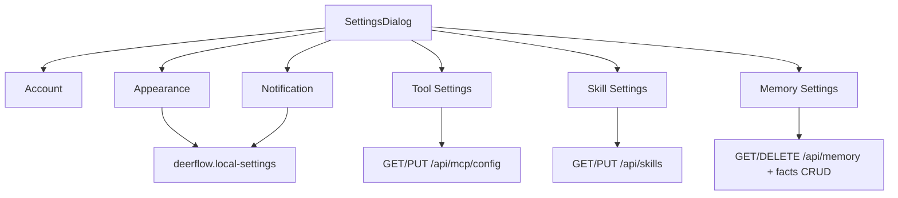
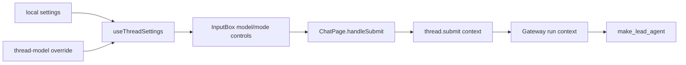
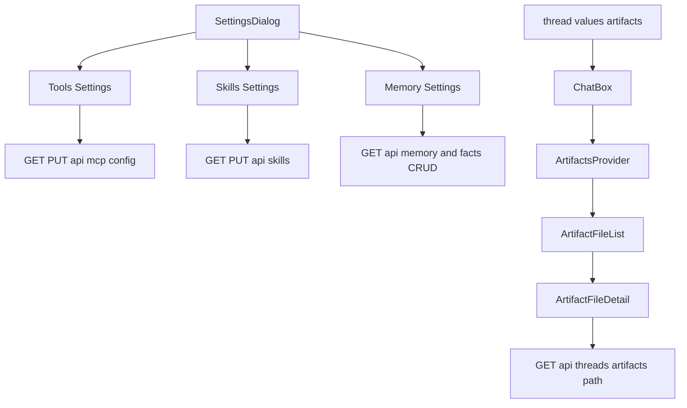
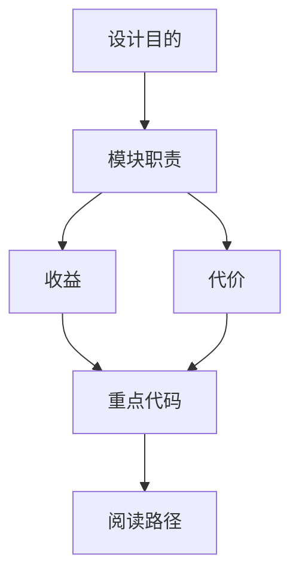

<title>07｜Frontend Settings、Models、Artifacts 数据流详解</title>

<callout emoji="✅">
**本章目标：** 讲清前端 Settings 如何管理后端配置，以及 Artifacts 如何从 thread state 变成右侧可预览文件。
</callout>

# 1. Settings 总入口

| 设置类型 | 存储/接口 | 读源码入口 |
|-|-|-|
| 本地 UI 偏好 | `localStorage` 的 `deerflow.local-settings` | `frontend/src/core/settings/local.ts` |
| 单 thread 模型覆盖 | `localStorage` 的 `deerflow.thread-model.{threadId}` | `frontend/src/core/settings/hooks.ts` |
| Models | `GET /api/models` | `frontend/src/core/models/*`、`backend/app/gateway/routers/models.py` |
| MCP tools | `GET/PUT /api/mcp/config` | `frontend/src/core/mcp/*`、`backend/app/gateway/routers/mcp.py` |
| Skills | `GET/PUT /api/skills` | `frontend/src/core/skills/*`、`backend/app/gateway/routers/skills.py` |
| Memory | `GET/DELETE /api/memory` 与 facts CRUD | `frontend/src/core/memory/*`、`backend/app/gateway/routers/memory.py` |

# 2. Models 与 thread context

<callout emoji="💡">
**关键点：**模型选择不是只存在 Settings 页。发送消息时，ChatPage/InputBox 会把当前 thread 的 model、thinking、plan mode、subagent、reasoning effort 等组合进 `thread.submit` 的 context，后端 `make_lead_agent` 再读取这些字段。
</callout>

# 3. Artifacts 面板

<callout emoji="💡">
**不要混淆三条路径：**上传文件、正式 artifact、`write-file:` 临时 artifact 不是同一件事。sandbox 里写了文件，不代表右侧 artifact 面板一定立刻出现。
</callout>

| 类型 | 来源 | UI 表现 | 调试入口 |
|-|-|-|-|
| 上传文件 | `InputBox` 上传到 Gateway uploads。 | 进入 human message metadata，后端 middleware 注入上下文。 | `frontend/src/core/uploads/*`、`backend/app/gateway/routers/uploads.py`。 |
| 正式 artifact | `ThreadState.artifacts`，通常由 present-files 类工具显式呈现。 | 右侧 artifact panel、下载/预览。 | `frontend/src/components/workspace/artifacts/*`、`frontend/src/core/artifacts/*`。 |
| 临时 `write-file:` | 当前工具调用/消息里正在写文件。 | 可临时预览，不一定已有稳定 artifact URL。 | `frontend/src/core/artifacts/loader.ts`、message/tool call 数据。 |

# 4. Settings 模块明细

| 模块 | 前端文件 | 后端 API/存储 |
|-|-|-|
| Models | `core/models/api.ts`、`input-box.tsx` | `GET /api/models` |
| MCP Tools | `settings/tool-settings-page.tsx`、`core/mcp/*` | `GET/PUT /api/mcp/config` |
| Skills | `settings/skill-settings-page.tsx`、`core/skills/*` | `GET /api/skills`、`PUT /api/skills/{name}` |
| Memory | `settings/memory-settings-page.tsx`、`core/memory/*` | `GET/DELETE /api/memory`、facts CRUD |
| Local Settings | `core/settings/*` | localStorage |

# 5. 调试建议

- Settings 页数据不更新：先看 React Query key 是否 invalidate。
- Artifact 预览失败：先检查 `thread.values.artifacts` 和 artifact URL 是否编码正确。
- 模型切换无效：检查 `thread.submit context.model_name` 是否传到后端。

## 补充：Settings 与 Artifacts 简化运行图

<callout emoji="💡">
本图用简化节点补充 Settings 与 Artifacts 的运行逻辑，便于新同学快速理解数据从 UI 到 Gateway API 的路径。
</callout>

---

# 补充：设计取舍、重点代码与阅读路径

<callout emoji="💡">
**设计目的：**Settings 和 Artifacts 独立成模块，是为了把配置管理和产物预览从聊天主流程里拆出去。
</callout>

| 维度 | 说明 |
|-|-|
| 收益 | 收益是 chat 页面不臃肿；代价是状态来源分散在 React Query、localStorage、thread.values。 |
| 代价 | 见收益说明中的代价部分；此章节采用收益与代价合并描述。 |
| 重点代码 | 重点代码：`frontend/src/components/workspace/settings/settings-dialog.tsx`、`frontend/src/components/workspace/artifacts/artifact-file-detail.tsx`、`frontend/src/core/settings/local.ts`、`frontend/src/core/artifacts/utils.ts`。 |
| 阅读路径 | 阅读路径：Settings 改配置，Artifacts 读 thread.values.artifacts。 |

