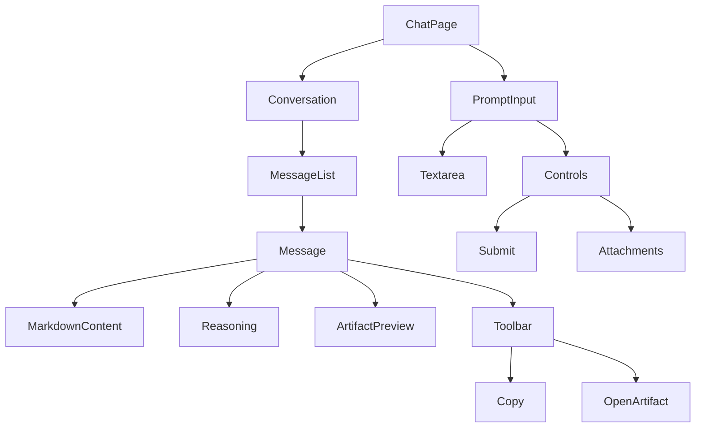
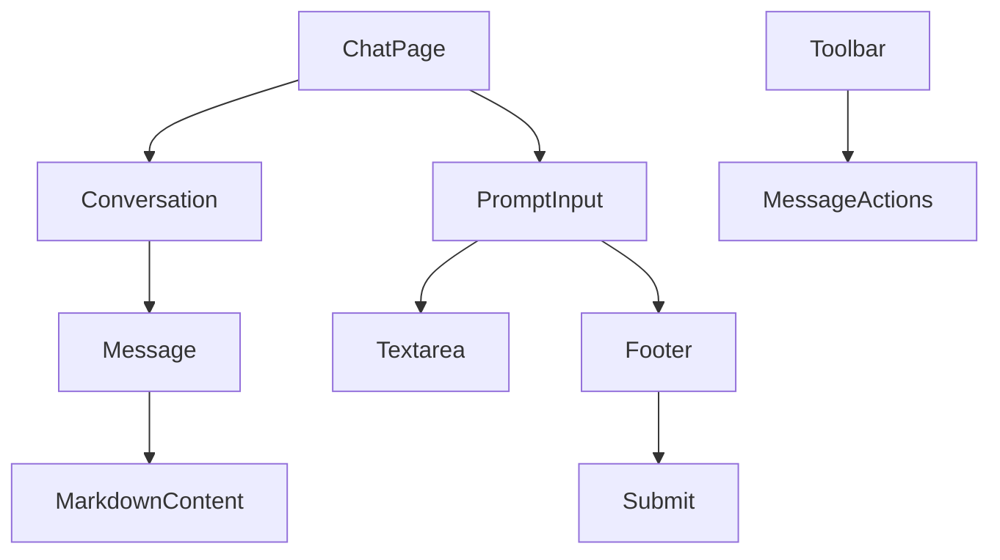
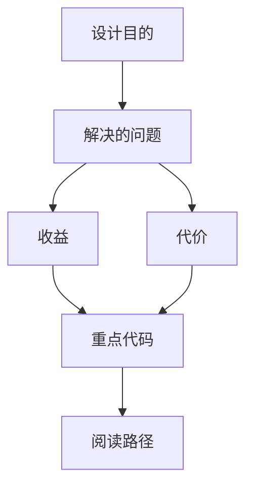

<title>100｜AI Elements Message、Conversation、PromptInput 详解</title>

<callout emoji="✅">
**本章目标：**单独讲解该模块职责、输入输出和运行逻辑。
</callout>

---

# 可视化增强：前端组件关系图

<callout emoji="💡">
**图解目标：**补充 AI Elements 组件如何支撑聊天输入、消息展示和操作控件。
</callout>

## 1. AI Elements 组件关系图

| 读图对象 | 图里怎么看 | 维护入口 |
|-|-|-|
| 模块职责 | Conversation 管容器，Message 管展示，PromptInput 管输入 | ai-elements components |
| 数据流 | ChatPage 状态向下传递，用户操作通过 controls 回调向上提交 | frontend components |
| 阅读路径 | 先看容器，再看消息，再看输入控件 | 100 章节 |

| 模块点 | 说明 |
|-|-|
| message.tsx | AI message primitive。 |
| conversation.tsx | 会话容器和滚动区域。 |
| prompt-input.tsx | 输入框、textarea、submit、footer。 |
| controls/toolbar | 输入和消息辅助控制。 |

---

# 补充：设计取舍、重点代码与阅读路径

<callout emoji="💡">
**设计目的：**前端按 route、core 数据层、业务组件、UI primitive 分层，是为了降低组件耦合。
</callout>

| 维度 | 说明 |
|-|-|
| 收益 | 收益是展示层和数据请求分离，组件更容易复用。 |
| 代价 | 代价是一次用户交互常跨页面、hook、缓存、上下文和组件。 |
| 重点代码 | 重点代码在 `frontend/src/app`、`frontend/src/core`、`frontend/src/components` 对应模块。 |
| 阅读路径 | 阅读路径：先找 route，再找 hook 数据源，最后看组件消费。 |

