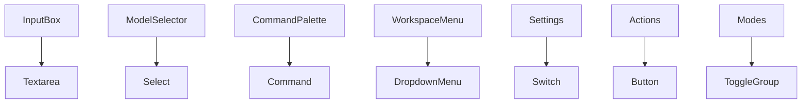

# 103｜UI Input、Command、Select、Dropdown Primitives 详解

<callout emoji="✅">
**本章目标：**单独讲解该模块职责、输入输出和运行逻辑。
</callout>

| 模块点 | 说明 |
|-|-|
| input/textarea | 表单输入。 |
| command.tsx | 命令面板和搜索。 |
| select.tsx | 模型选择/设置项选择。 |
| dropdown-menu.tsx | 菜单动作。 |
| button/toggle | 按钮和开关交互。 |

