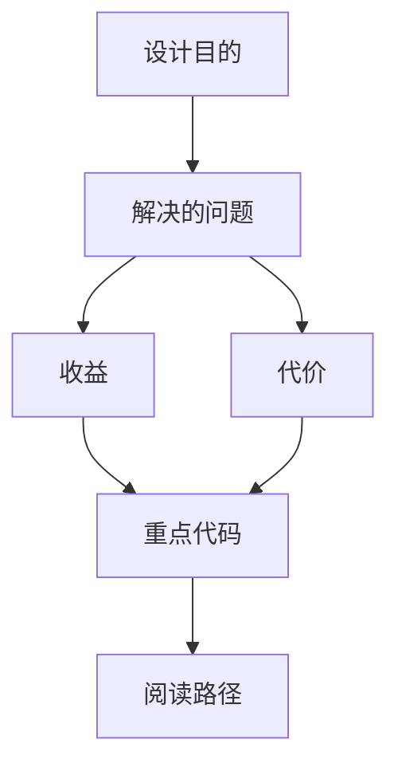

<title>105｜AI Elements ModelSelector、Loader、Suggestion、Sources 详解</title>

<callout emoji="✅">
**本章目标：**单独讲解该模块职责、输入输出和运行逻辑。
</callout>

| 模块点 | 说明 |
|-|-|
| model-selector.tsx | 模型选择 UI。 |
| loader.tsx | 加载状态。 |
| suggestion.tsx | 建议问题展示。 |
| sources.tsx | 来源列表展示。 |
| connection.tsx | React Flow 连线预览 primitive：按 from/to 坐标绘制 SVG Bezier 连接线。 |

---

# 补充：设计取舍、重点代码与阅读路径

<callout emoji="💡">
**设计目的：**前端按 route、core 数据层、业务组件、UI primitive 分层，是为了降低组件耦合。
</callout>

| 维度 | 说明 |
|-|-|
| 收益 | 收益是展示层和数据请求分离，组件更容易复用。 |
| 代价 | 代价是一次用户交互常跨页面、hook、缓存、上下文和组件。 |
| 重点代码 | 重点代码在 `frontend/src/app`、`frontend/src/core`、`frontend/src/components` 对应模块。 |
| 阅读路径 | 阅读路径：先找 route，再找 hook 数据源，最后看组件消费。 |

<callout emoji="💡">
`Connection` 不负责网关离线状态；网关探测与恢复提示在 `components/workspace/gateway-offline-banner.tsx`。
</callout>