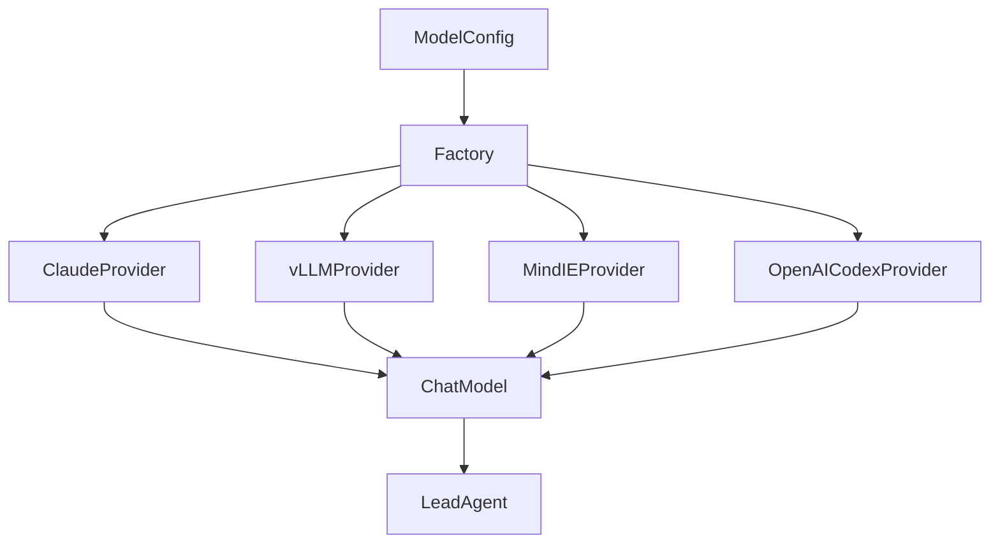

# 108｜Claude、vLLM、MindIE、OpenAI Codex Provider 详解

<callout emoji="✅">
**本章目标：**单独讲解该模块职责、输入输出和运行逻辑。
</callout>

| 模块点 | 说明 |
|-|-|
| claude_provider.py | Claude provider 封装。 |
| vllm_provider.py | vLLM OpenAI-compatible 或本地推理适配。 |
| mindie_provider.py | MindIE provider 适配。 |
| openai_codex_provider.py | Codex/OpenAI 特定 provider。 |
| factory.py | 按 use 字段解析这些 provider。 |

