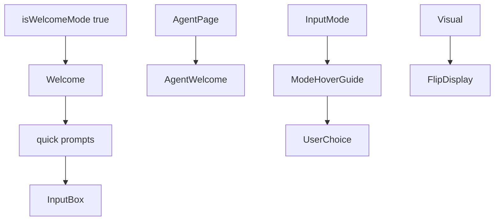

# 118｜Workspace Welcome 与 AgentWelcome 组件详解

<callout emoji="✅">
**本章目标：**继续按 workspace 业务组件讲解职责、输入输出和运行逻辑。
</callout>

| 组件/文件 | 说明 |
|-|-|
| welcome.tsx | 新会话欢迎态、快捷提示。 |
| agent-welcome.tsx | Agent 页面欢迎/引导。 |
| mode-hover-guide.tsx | 模式 hover 说明。 |
| flip-display.tsx | 动态展示效果。 |

