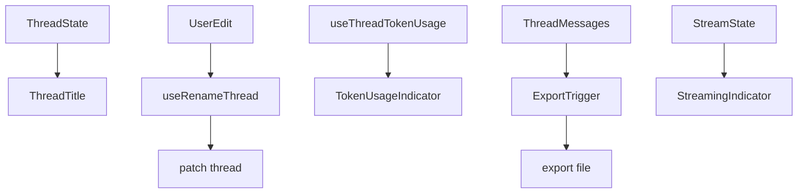

# 119｜ThreadTitle、TokenUsageIndicator、ExportTrigger 详解

<callout emoji="✅">
**本章目标：**继续按 workspace 业务组件讲解职责、输入输出和运行逻辑。
</callout>

| 组件/文件 | 说明 |
|-|-|
| thread-title.tsx | 展示/编辑当前 thread title。 |
| token-usage-indicator.tsx | 展示 thread token usage。 |
| export-trigger.tsx | 导出会话。 |
| streaming-indicator.tsx | 流式运行状态指示。 |

