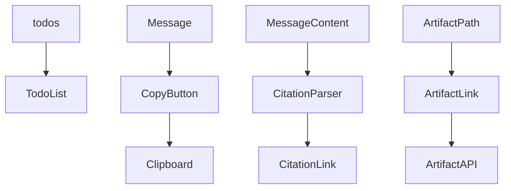

# 120｜TodoList、CopyButton、Citations 组件详解

<callout emoji="✅">
**本章目标：**继续按 workspace 业务组件讲解职责、输入输出和运行逻辑。
</callout>

| 组件/文件 | 说明 |
|-|-|
| todo-list.tsx | 展示 thread.values.todos。 |
| copy-button.tsx | 复制消息/代码内容。 |
| citations/citation-link.tsx | 渲染引用链接。 |
| citations/artifact-link.tsx | 把 artifact path 转成可点击链接。 |

