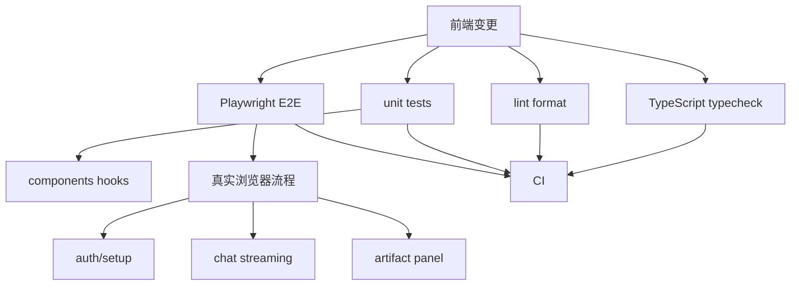
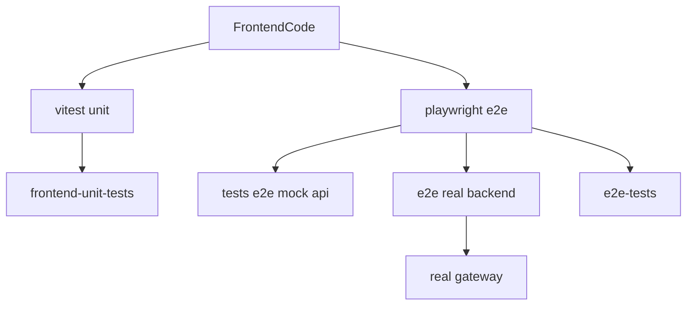
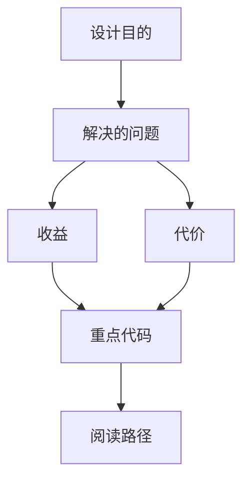

<title>133｜Frontend Tests 与 Playwright E2E 详解</title>

<callout emoji="✅">
**本章目标：**补齐测试、脚本、Docker、Skills 分类，解释运行逻辑。
</callout>

---

# 可视化增强：前端测试路径图

<callout emoji="💡">
**图解目标：**补充前端从组件到 E2E 的测试路径，帮助读者区分 lint/type/unit/e2e。
</callout>

## 1. Frontend 测试路径图

| 读图对象 | 图里怎么看 | 维护入口 |
|-|-|-|
| 模块职责 | 前端测试覆盖静态检查、组件行为和真实用户流 | frontend tests |
| 数据流 | 代码变更先过 type/lint，再按风险跑 unit/e2e | pnpm scripts、Playwright |
| 阅读路径 | 先看 package scripts，再看测试目录和关键 spec | 133 章节 |

| 模块点 | 说明 |
|-|-|
| unit tests | core clipboard/reasoning trigger 等单测。 |
| e2e mock | chat、sidebar、artifact、thread-history 等 mocked backend。 |
| e2e real backend | auth-disabled、multi-run-order、real-backend-render。 |
| record tests | record write/read file 流程。 |

---

# 补充：设计取舍、重点代码与阅读路径

<callout emoji="💡">
**设计目的：**该模块用于固化工程流程、质量门禁或设计背景，是为了让行为可复现、可审计。
</callout>

| 维度 | 说明 |
|-|-|
| 收益 | 收益是降低回归风险，帮助新人理解历史决策。 |
| 代价 | 代价是容易与代码实现漂移，需要持续维护。 |
| 重点代码 | 重点代码/资料是对应 tests、scripts、workflow、docs 文件及其调用的源码入口。 |
| 阅读路径 | 阅读路径：按输入、执行步骤、输出证据三段看。 |

