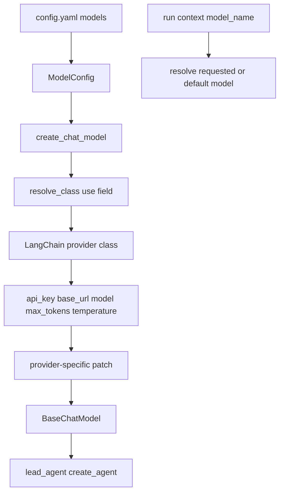
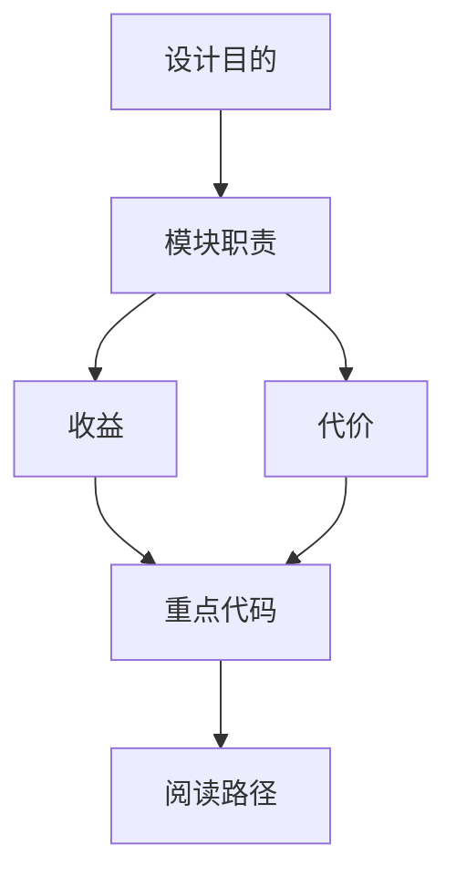

<title>17｜Model Provider Factory 与模型适配详解</title>

<callout emoji="✅">
**本章目标：**把模型配置如何解析为 LangChain ChatModel，以及各 provider patch 的职责讲清楚。
</callout>

# 1. 模型配置到实例

# 2. provider 类型

| 文件 | 用途 |
|-|-|
| `models/factory.py` | 统一 create_chat_model 入口。 |
| `models/credential_loader.py` | API key / credential 解析。 |
| `models/patched_openai.py` | OpenAI 兼容行为 patch。 |
| `models/patched_deepseek.py` | DeepSeek 特定适配。 |
| `models/patched_minimax.py` | MiniMax 特定适配。 |
| `models/claude_provider.py` | Claude provider 封装。 |
| `models/vllm_provider.py` | vLLM provider。 |

# 3. thinking / reasoning effort / vision

`ModelConfig` 中的 `supports_thinking`、`supports_reasoning_effort`、`supports_vision` 会影响前端选择能力和后端 middleware，例如 vision 模型才会启用 ViewImageMiddleware。

# 4. 常见问题

- 模型下拉没有显示：检查 `GET /api/models` 是否返回。
- thinking 开了但无效：检查模型配置 `supports_thinking`。
- provider 参数不生效：检查 `use` 类路径和 reflection resolver。

---

# 补充：设计取舍、重点代码与阅读路径

<callout emoji="💡">
**设计目的：**模型工厂用 class path 动态创建 provider，是为了支持多模型生态。
</callout>

| 维度 | 说明 |
|-|-|
| 收益 | 收益是 provider 可扩展；代价是配置错误会在运行时暴露。 |
| 代价 | 见收益说明中的代价部分；此章节采用收益与代价合并描述。 |
| 重点代码 | 重点代码：`backend/packages/harness/deerflow/models/factory.py`、`backend/packages/harness/deerflow/reflection/resolvers.py`。 |
| 阅读路径 | 阅读路径：ModelConfig.use 是字符串，resolver 把它变成类。 |

