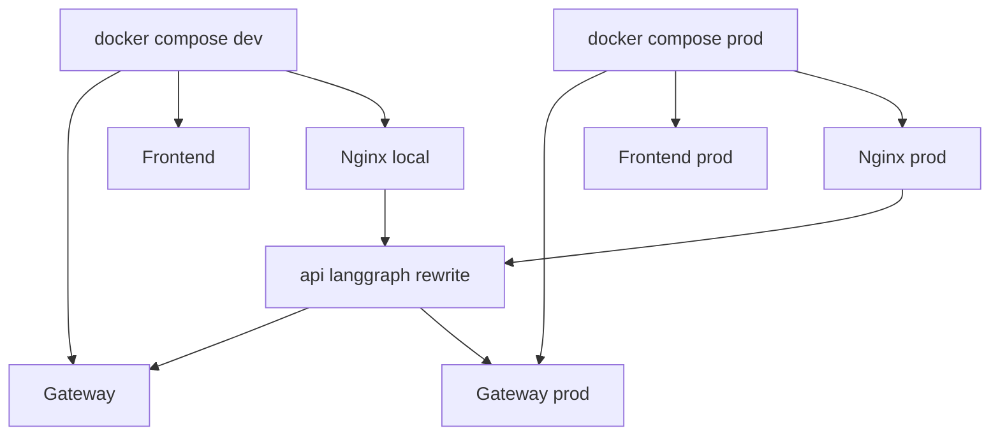

# 189｜docker-compose 与 nginx 配置单文件详解

<callout emoji="✅">
**本章目标：**继续拆 Docker、Provisioner、脚本和测试细模块。
</callout>

| 模块点 | 说明 |
|-|-|
| docker-compose-dev.yaml | 开发 compose，源码挂载和热更新。 |
| docker-compose.yaml | 生产 compose。 |
| nginx.local.conf | 本地 nginx 反代。 |
| nginx.conf | 生产 nginx 反代。 |
| dev-entrypoint.sh | 开发容器入口。 |

## 补充：Docker Compose 简化运行图

