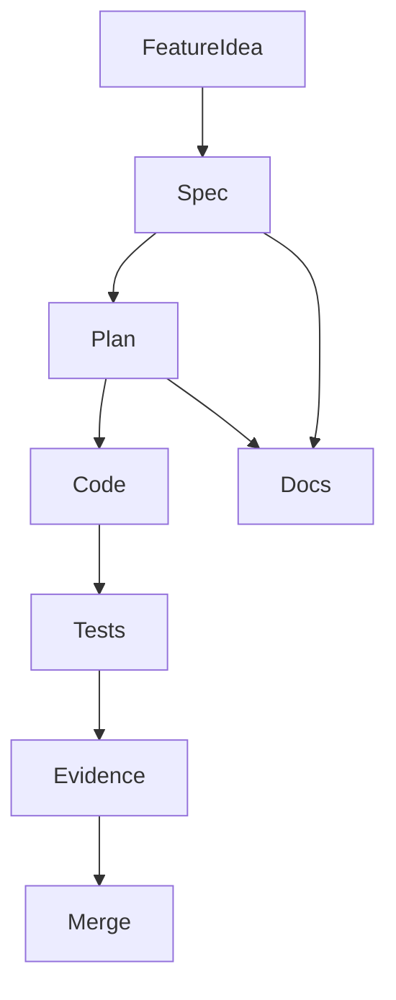
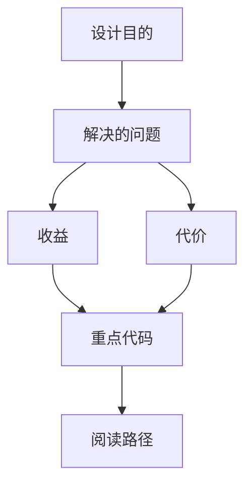
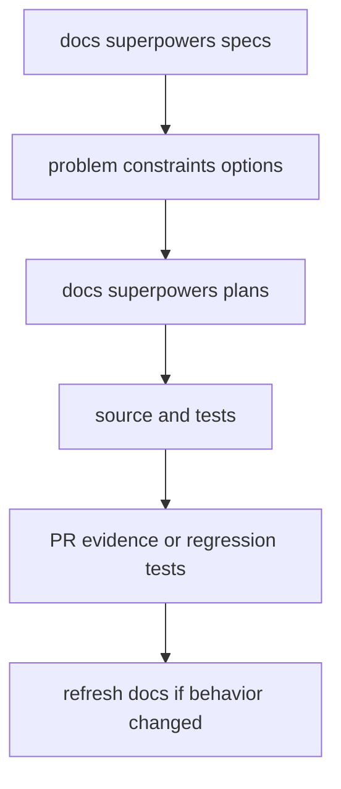

<title>226｜docs/superpowers 全部 Specs/Plans 总览详解</title>

<callout emoji="✅">
**本章目标：**继续拆剩余文档/content 模块，说明用途和关联运行逻辑。
</callout>

| 模块点 | 说明 |
|-|-|
| specs | 需求/设计。 |
| plans | 实施计划。 |
| MiniMax generation | 生成 provider。 |
| event store history | 历史和事件存储。 |
| summarize marker | 摘要标记。 |

---

# 补充：设计取舍、重点代码与阅读路径

<callout emoji="💡">
**设计目的：**`docs/superpowers/` 是 specs/plans 层，用来记录需求背景、方案取舍、实施步骤和验收风险，而不是前端组件分层说明。
</callout>

| 维度 | 说明 |
|-|-|
| 收益 | 先用 spec 固定问题和约束，再用 plan 追踪实现顺序，降低大功能跨前后端漂移。 |
| 代价 | specs/plans 很容易滞后于源码，需要定期和实际 provider、event store、middleware、frontend history 实现对照。 |
| 重点代码 | MiniMax 关联 generation provider/skills；event-store history 关联 RunJournal、RunEventStore、threads/messages API；summarize marker 关联 summarization middleware 与消息渲染。 |
| 阅读路径 | 先读 spec 的问题定义和 rejected options，再读 plan 的步骤，最后到对应源码/测试确认是否已落地。 |

