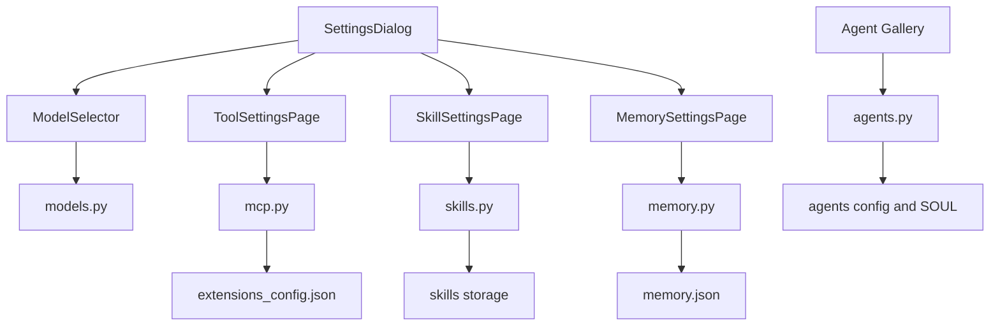
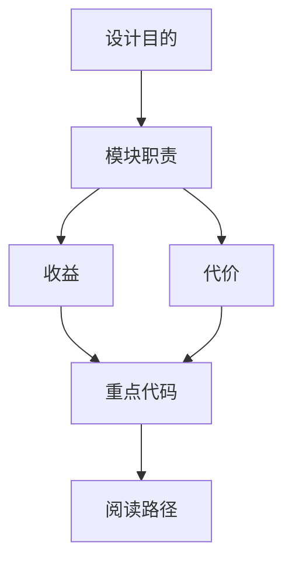

<title>22｜管理类 Router 文件级详解：Models、MCP、Skills、Memory、Agents</title>

<callout emoji="✅">
**本章目标：**聚焦 Settings 和管理页面背后的后端 router。
</callout>

# 1. 管理 API 总览

| Router | 接口 | 前端调用方 | 注意事项 |
|-|-|-|-|
| `models.py` | `GET /api/models` | InputBox ModelSelector | 不能返回 api_key。 |
| `mcp.py` | `GET/PUT /api/mcp/config` | Tools Settings | stdio command allowlist，secret mask。 |
| `skills.py` | `GET/PUT /api/skills`、custom CRUD | Skills Settings、Artifact .skill install | 写入 custom skill 前做安全扫描。 |
| `memory.py` | memory/facts/import/export | Memory Settings | per-user/per-agent memory。 |
| `agents.py` | custom agents CRUD | Agents gallery/new agent | 校验 agent name，读写 SOUL/config。 |

# 2. Settings 到 Router 数据流

# 3. 修改建议

- 新增 Settings 配置项：需要前端 core API、hook、页面，以及后端 router/schema。
- MCP 配置改动后要 reset tools cache/session pool。
- Skills custom 写入要保留 history，支持 rollback。

---

# 补充：设计取舍、重点代码与阅读路径

<callout emoji="💡">
**设计目的：**该文档用于把模块职责、运行逻辑、关键代码和阅读路径固定下来，帮助读者从源码验证行为。
</callout>

| 维度 | 说明 |
|-|-|
| 收益 | 读者可以按文档快速定位模块入口和上下游关系。 |
| 代价 | 文档需要随源码变更持续校准，避免模板化描述掩盖真实行为。 |
| 重点代码 | 标题对应的源码、测试或文档入口。 |
| 阅读路径 | 先看上游输入，再看核心函数，最后看下游输出和测试验证。 |

