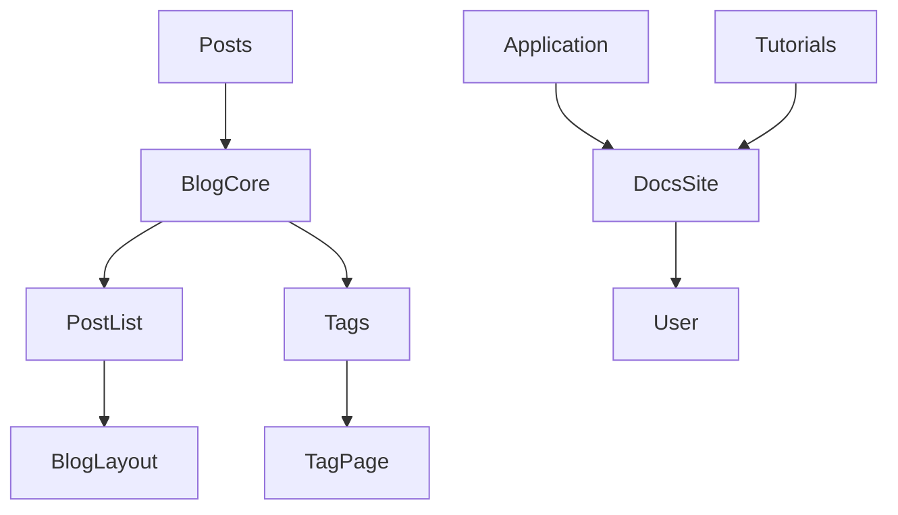
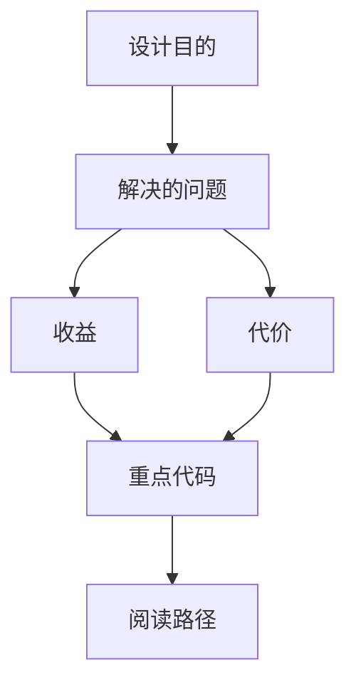
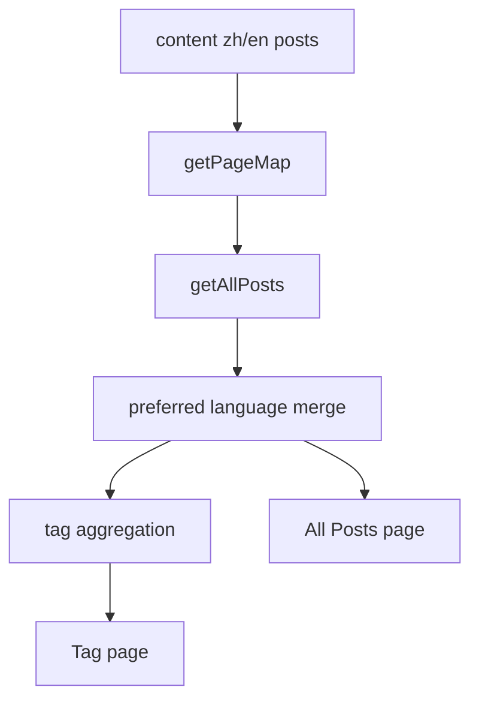

<title>232｜Frontend Content Application / Tutorials / Posts 详解</title>

<callout emoji="✅">
**本章目标：**继续细化 content/spec/docs 单模块，补充运行/维护逻辑图。
</callout>

| 模块点 | 说明 |
|-|-|
| application | 应用场景文档。 |
| tutorials | 教程。 |
| posts | 博客文章内容。 |
| blog core | getAllPosts / getBlogIndexData。 |
| tags | 按 tag 聚合。 |

---

# 补充：设计取舍、重点代码与阅读路径

<callout emoji="💡">
**设计目的：**该模块把 MDX 内容、博客文章、标签聚合和多语言偏好接到 Nextra/Next.js 页面上。
</callout>

| 维度 | 说明 |
|-|-|
| 收益 | 内容文件和页面逻辑分离，文章可以按语言、slug、tag 聚合展示。 |
| 代价 | route 归一化、语言回退和 tag slug 需要和页面路径保持一致。 |
| 重点代码 | `frontend/src/core/blog/index.ts`、`frontend/src/app/blog/posts/page.tsx`、`frontend/src/app/blog/tags/[tag]/page.tsx`、`frontend/src/content/*/posts`。 |
| 阅读路径 | 先看 content 目录，再看 `getAllPosts` 如何合并语言版本，最后看 posts/tags 页面如何消费 `getBlogIndexData`。 |

