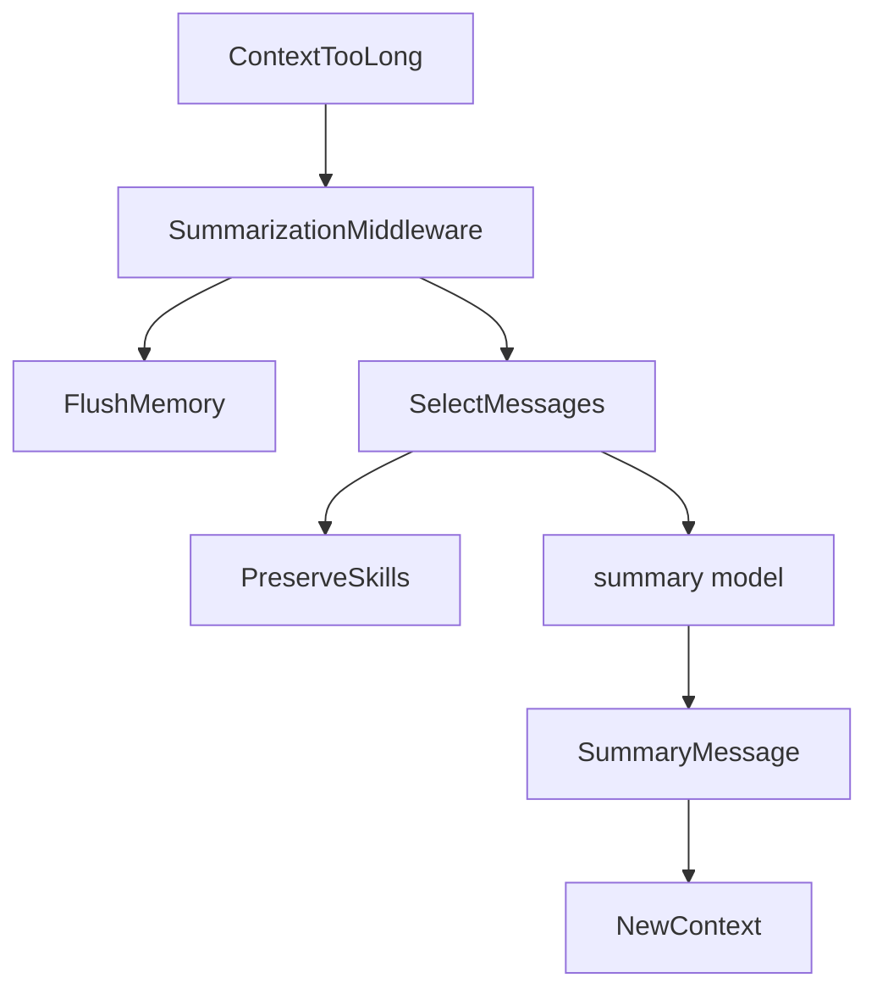
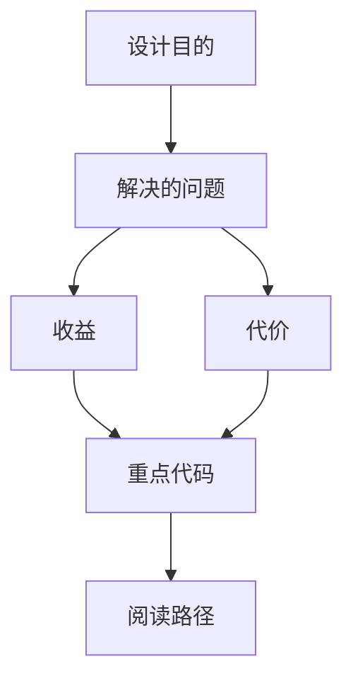
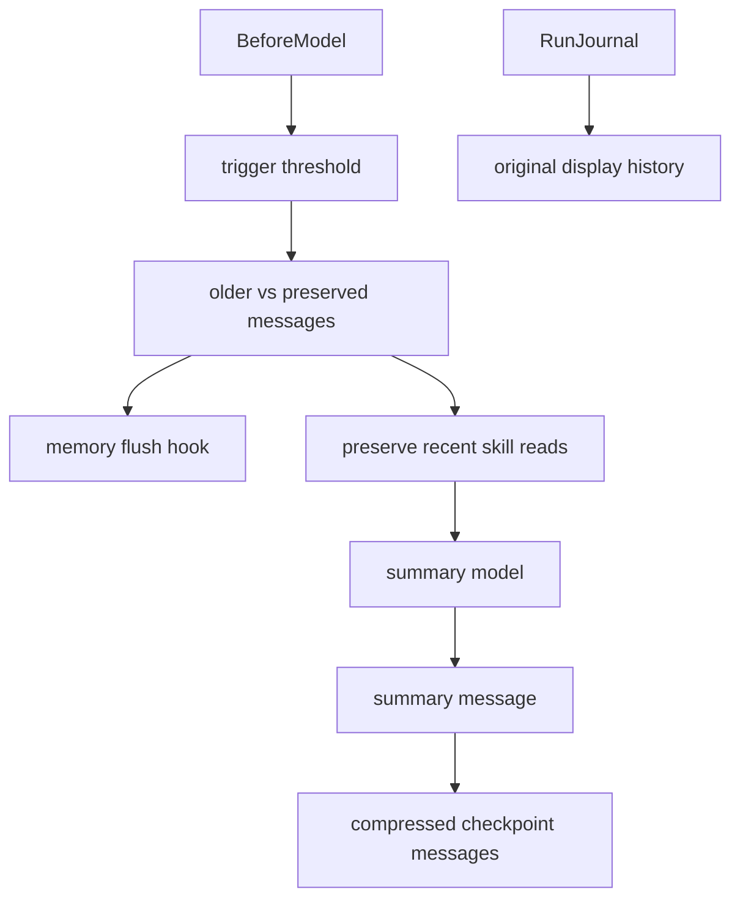

<title>236｜backend/docs/summarization.md 单文件详解</title>

<callout emoji="✅">
**本章目标：**继续细化 content/spec/docs 单模块，补充运行/维护逻辑图。
</callout>

| 模块点 | 说明 |
|-|-|
| summarization.md | 摘要机制说明。 |
| SummarizationMiddleware | 实现。 |
| memory_flush_hook | 摘要前 flush memory。 |
| skill preserve | 保留近期 skill 上下文。 |

---

# 补充：设计取舍、重点代码与阅读路径

<callout emoji="💡">
**设计目的：**summarization 在模型调用前压缩旧消息，同时保留最近上下文、AI/Tool 配对、memory flush 机会和最近 skill 读取结果。
</callout>

| 维度 | 说明 |
|-|-|
| 收益 | 长对话不容易超过上下文窗口，并能在压缩前把重要记忆和 skill 指令尽量保留下来。 |
| 代价 | 压缩会改变 checkpoint 中的 messages；如果 history 只读 checkpoint，可能丢失被压缩的原始消息。 |
| 重点代码 | `backend/docs/summarization.md`、`deerflow/agents/middlewares/summarization_middleware.py`、`deerflow/agents/memory/summarization_hook.py`、`deerflow/config/summarization_config.py`。 |
| 阅读路径 | 先读 config 的 trigger/keep/skill rescue，再看 middleware 如何 partition messages，最后看 RunEventStore/history 是否补足可见历史。 |

