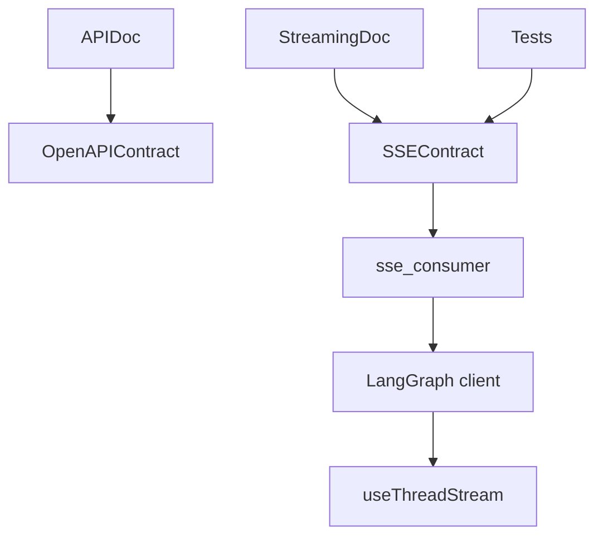
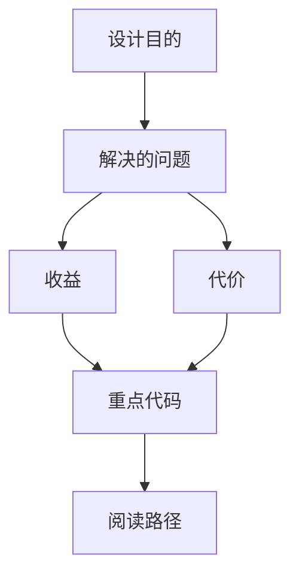
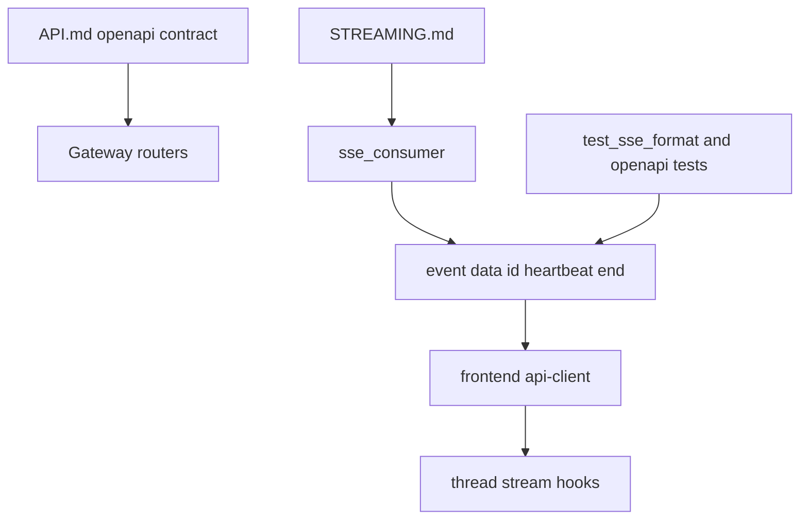

<title>239｜OpenAPI / SSE / Streaming Contract 文档详解</title>

<callout emoji="✅">
**本章目标：**继续细化 content/docs/evidence 模块并给出维护逻辑图。
</callout>

| 模块点 | 说明 |
|-|-|
| API.md | 接口契约。 |
| STREAMING.md | SSE 流式契约。 |
| test_sse_format.py | SSE 格式测试。 |
| api-client.ts | 前端 SDK 封装。 |

---

# 补充：设计取舍、重点代码与阅读路径

<callout emoji="💡">
**设计目的：**该模块固定 Gateway OpenAPI、SSE frame 格式、stream mode 兼容性和前端 SDK 消费契约。
</callout>

| 维度 | 说明 |
|-|-|
| 收益 | 后端改 router、stream event 或 schema 时，前端和测试能更早发现协议漂移。 |
| 代价 | SSE 既有 event/data/id/heartbeat/end 细节，又有 LangGraph SDK 兼容命名，文档必须和代码/测试同步。 |
| 重点代码 | `backend/docs/API.md`、`backend/docs/STREAMING.md`、`backend/app/gateway/services.py`、`backend/tests/test_sse_format.py`、`frontend/src/core/api/api-client.ts`。 |
| 阅读路径 | 先看 API.md 的公开路径和 stream_mode，再看 services.py 的 SSE 输出，最后看前端 SDK/hook 如何解析。 |

