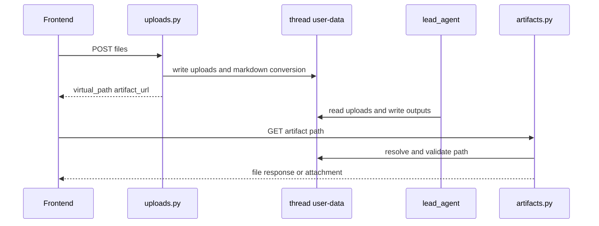
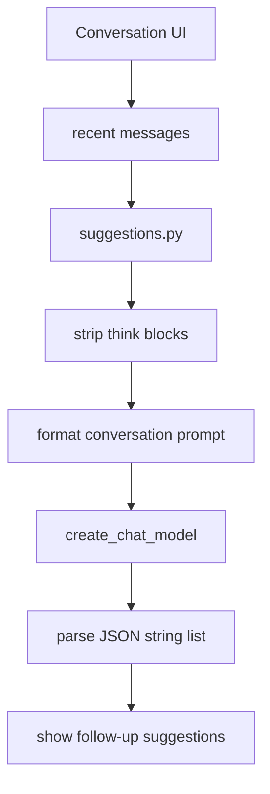
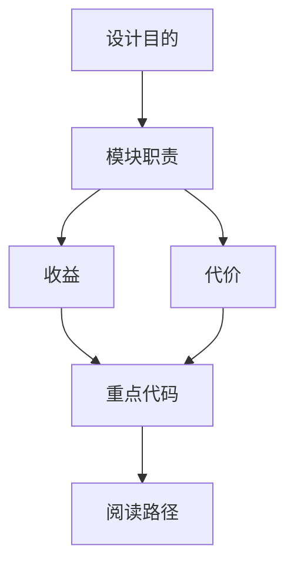

<title>23｜文件类 Router 详解：Uploads、Artifacts、Feedback、Suggestions</title>

<callout emoji="✅">
**本章目标：**讲清文件上传、产物读取、反馈、建议问题生成这些“辅助但关键”的 router。
</callout>

# 1. 文件与辅助 API

| Router | 职责 | 关键安全点 |
|-|-|-|
| `uploads.py` | 上传、列出、删除文件；自动转换文档为 Markdown | 文件数/大小限制、防路径穿越、防 symlink。 |
| `artifacts.py` | 服务 sandbox 产物、.skill 内部文件预览 | HTML/SVG/XHTML 强制下载，防同源主动内容执行。 |
| `feedback.py` | run feedback CRUD 和统计 | owner check，避免跨用户读取反馈。 |
| `suggestions.py` | 根据最近对话生成 follow-up suggestions | 剥离 think block，稳健 JSON list 解析。 |

# 2. Uploads 与 Artifacts 合流

# 3. Suggestions 运行图

# 4. 调试建议

- 上传成功但 agent 看不到：看 UploadsMiddleware 是否读到 uploads/list。
- artifact 404：检查 virtual path 是否以 /mnt/user-data 开头，thread_id 是否一致。
- suggestions 为空：检查模型输出是否 JSON list，是否被 think block 干扰。

---

# 补充：设计取舍、重点代码与阅读路径

<callout emoji="💡">
**设计目的：**这个模块采用 middleware 形态，是为了把横切能力从主 agent 逻辑里剥离出来，并按 LangChain/LangGraph 生命周期挂载。
</callout>

| 维度 | 说明 |
|-|-|
| 收益 | 收益是可插拔、可独立测试、能按 before/after/wrap 阶段控制行为。 |
| 代价 | 代价是执行顺序不直观，多个 middleware 同时改 messages/state 时调试成本较高。 |
| 重点代码 | 重点代码通常在 `backend/packages/harness/deerflow/agents/middlewares/`，先看 class 的 hook 方法。 |
| 阅读路径 | 阅读路径：先判断它在哪个 hook 生效，再看它读写 ThreadState 的哪些字段。 |

