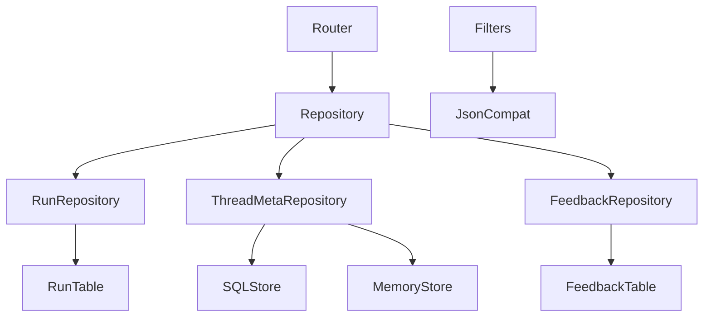

# 252｜Persistence Repository Implementations 详解

<callout emoji="✅">
**本章目标：**补齐 persistence/runtime/frontend 基础设施模块。
</callout>

| 模块点 | 说明 |
|-|-|
| run/sql.py | RunRepository。 |
| thread_meta/sql.py | ThreadMetaRepository。 |
| thread_meta/memory.py | MemoryThreadMetaStore。 |
| feedback/sql.py | FeedbackRepository。 |
| json_compat.py | 跨数据库 JSON 查询。 |

