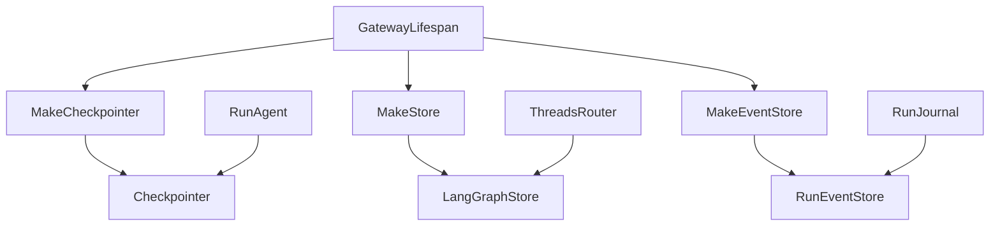
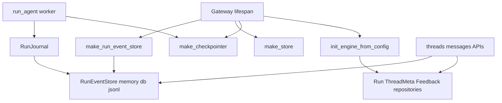

# 253｜Runtime Checkpointer / Store / Events Store 详解

<callout emoji="✅">
**本章目标：**补齐 persistence/runtime/frontend 基础设施模块。
</callout>

| 模块点 | 说明 |
|-|-|
| runtime/checkpointer/\* | make_checkpointer provider。 |
| runtime/store/\* | make_store provider。 |
| runtime/events/store | run event store。 |
| runtime/store/\_sqlite_utils.py | SQLite 工具。 |
| async_provider.py | 异步上下文 provider。 |

<callout emoji="💡">
**运行时持久化边界：**checkpointer、LangGraph store、RunStore/ThreadMeta/Feedback repositories、RunEventStore 是四条相关但不完全相同的持久化链路。
</callout>

| 链路 | 当前来源 |
|-|-|
| Checkpointer | `make_checkpointer()` 优先 legacy `checkpointer:`，其次 unified `database:` 非 memory，最后 `InMemorySaver`。 |
| LangGraph Store | `make_store()` 当前只跟 legacy `checkpointer:`；没有该段时回退 `InMemoryStore`。 |
| Run/Thread/Feedback repositories | Gateway lifespan 先 `init_engine_from_config(config.database)`，有 session factory 时使用 SQL repositories，否则 memory store/空 feedback。 |
| RunEventStore | `make_run_event_store(config.run_events)` 单独选择 `memory`、`db` 或 `jsonl`；`db` 复用 SQLAlchemy session factory，失败时回退 memory。 |

