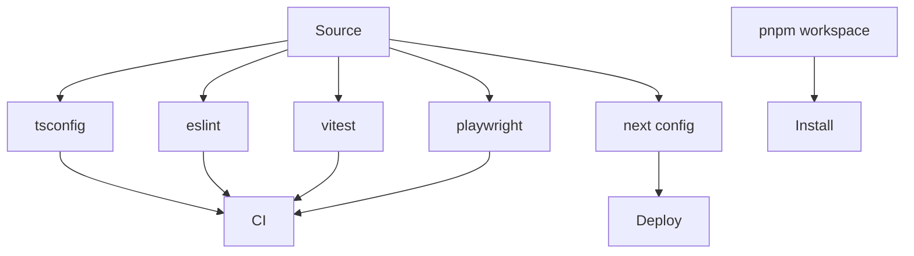

# 256｜Frontend Build/Test Configs 详解

<callout emoji="✅">
**本章目标：**补齐 persistence/runtime/frontend 基础设施模块。
</callout>

| 模块点 | 说明 |
|-|-|
| next.config.js | Next.js 配置。 |
| tsconfig.json | TS 编译配置。 |
| eslint.config.js | Lint 配置。 |
| vitest.config.ts | 单测配置。 |
| playwright.config.ts | E2E 配置。 |
| pnpm-workspace.yaml | workspace。 |

