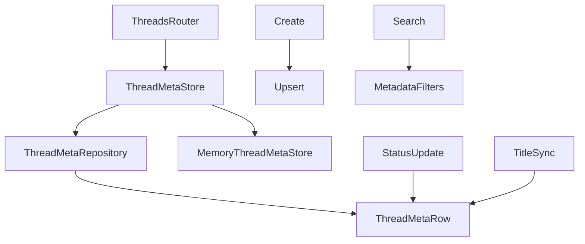

# 260｜ThreadMetaRow / ThreadMetaRepository 详解

<callout emoji="✅">
**本章目标：**继续拆 persistence/runtime 单文件，说明模型、仓储、provider 的调用关系。
</callout>

| 模块点 | 说明 |
|-|-|
| thread_meta/model.py | ThreadMetaRow。 |
| thread_meta/sql.py | SQL ThreadMetaRepository。 |
| thread_meta/memory.py | 内存实现。 |
| thread_meta/base.py | 抽象接口。 |
| make_thread_store | 根据 session factory 选择实现。 |

