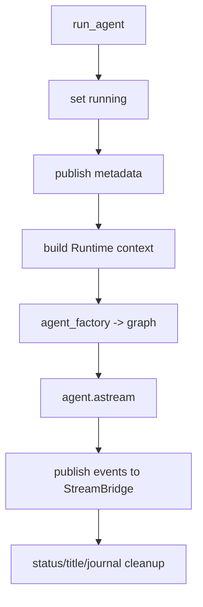
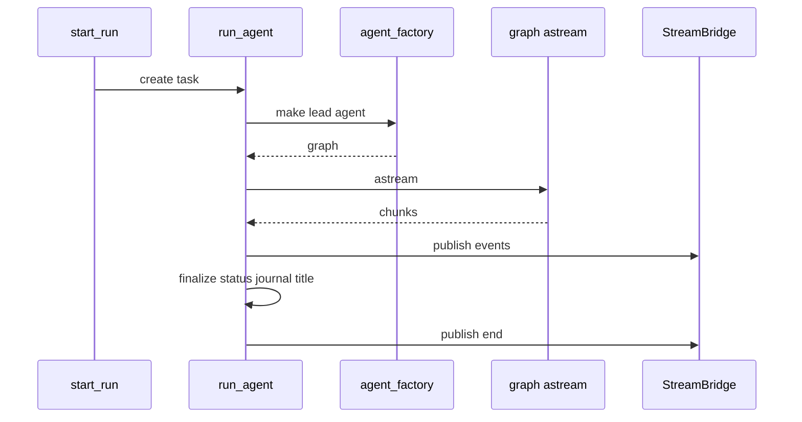

# 265｜runtime/runs/worker.py 单文件详解

<callout emoji="✅">
**本章目标：**继续拆 runtime、subagents、tools builtins 单文件模块。
</callout>

## 本轮源码校准补充：run_agent worker

| 步骤 | 说明 |
|-|-|
| runtime context | 总是包含 `thread_id`、`run_id`，并合并 caller context 和 app_config。 |
| stream mode | `events` 目前不通过 Gateway 支持；values/messages/custom 等会被映射。 |
| rollback | 运行前会尽力捕获 checkpoint，便于 rollback 策略恢复。 |
| cleanup | 完成后 flush journal、更新状态/标题，并调度 stream bridge cleanup。 |

| 模块点 | 说明 |
|-|-|
| run_agent | 后台执行 agent graph。 |
| Runtime context | 注入 run_id/thread_id/store/checkpointer。 |
| astream | 消费 LangGraph stream chunks。 |
| rollback | 支持 pre-run checkpoint rollback。 |
| finalize | flush journal、更新 run/thread status、publish_end。 |

