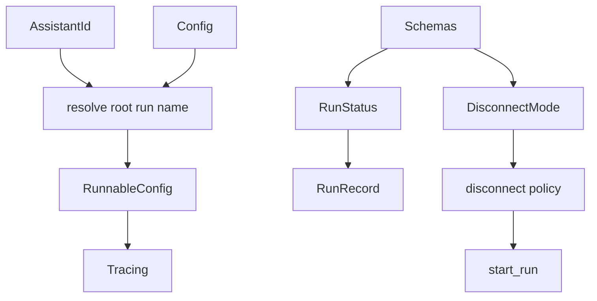

# 267｜runtime/runs/naming.py 与 schemas.py 详解

<callout emoji="✅">
**本章目标：**继续拆 runtime、subagents、tools builtins 单文件模块。
</callout>

| 模块点 | 说明 |
|-|-|
| naming.py | resolve_root_run_name。 |
| schemas.py | RunStatus、DisconnectMode。 |
| run_name | tracing/journal 中用于识别 root run。 |
| status enum | `pending`、`running`、`success`、`error`、`timeout`、`interrupted`。注意没有 `cancelled`，取消后 run 状态是 `interrupted`。 |
| disconnect enum | `cancel`、`continue` 是 SSE 断开后的处理策略，不是 RunStatus。 |

