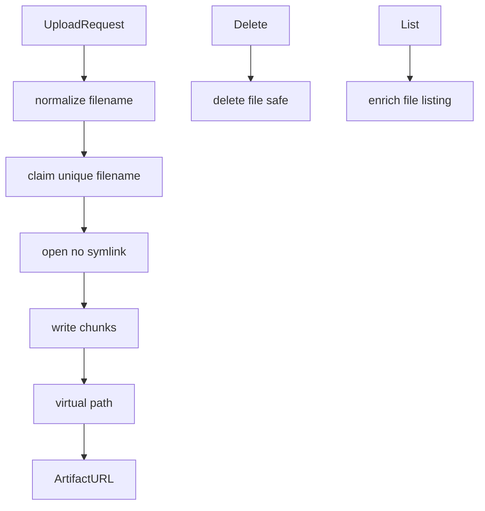

# 277｜uploads/manager.py 单文件详解

<callout emoji="✅">
**本章目标：**继续拆 tools/reflection/utils 等基础模块。
</callout>

| 模块点 | 说明 |
|-|-|
| normalize_filename | 文件名归一化。 |
| claim_unique_filename | 同批次重名处理。 |
| open_upload_file_no_symlink | 防 symlink 写入。 |
| delete_file_safe | 安全删除。 |
| upload_virtual_path/artifact_url | 生成虚拟路径和 artifact URL。 |

