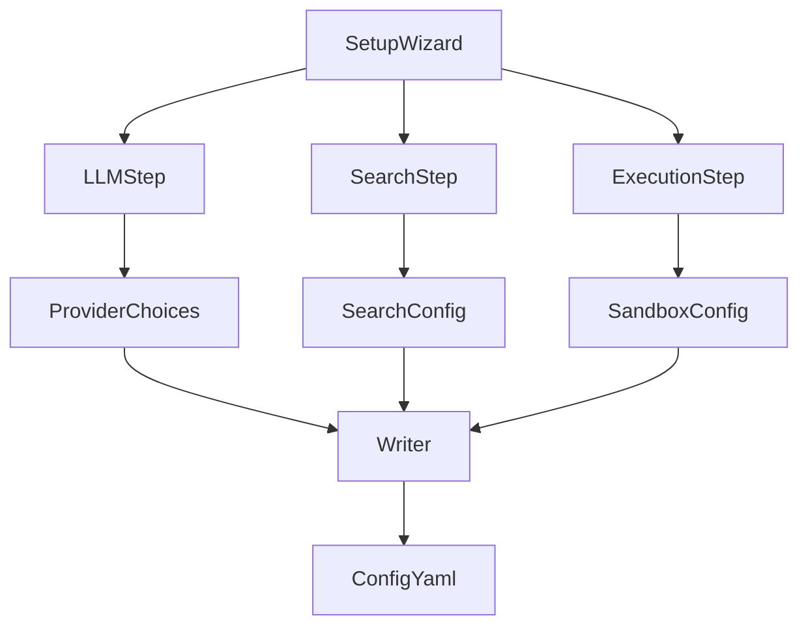
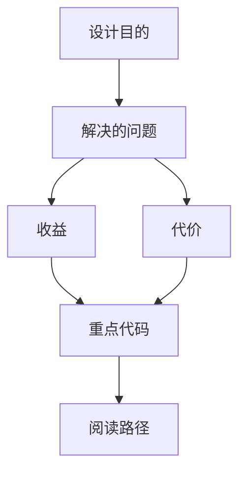
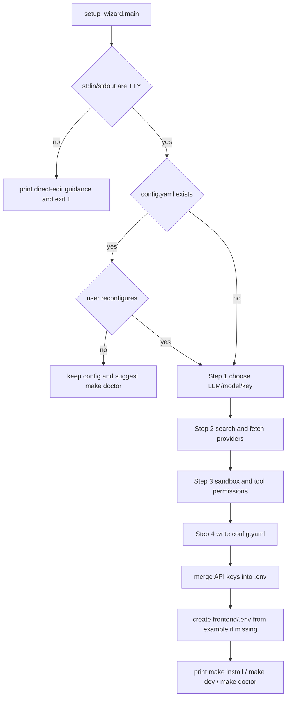

<title>326｜Wizard Steps LLM/Search/Execution 深拆</title>

<callout emoji="✅">
**本章目标：**继续拆 backend tests、frontend pages、docker/provisioner、wizard step 模块。
</callout>

| 模块点 | 说明 |
|-|-|
| steps/llm.py | LLM provider/API key 配置步骤。 |
| steps/search.py | 搜索工具配置。 |
| steps/execution.py | 执行/sandbox 配置。 |
| providers.py | provider 候选项。 |
| writer.py | 写入 config.yaml。 |

---

# 补充：设计取舍、重点代码与阅读路径

<callout emoji="💡">
**设计目的：**Setup Wizard 是终端交互式配置生成器，输入是用户选择的 LLM/search/fetch/execution 选项，输出是最小可运行的 `config.yaml`、`.env` 和必要的 `frontend/.env`。
</callout>

| 维度 | 说明 |
|-|-|
| 收益 | 首次启动不用手写完整 YAML，并能把 API key、provider、sandbox 权限按固定顺序落盘。 |
| 代价 | 它只覆盖最小配置；高级配置仍要读 `config.example.yaml` 或手动编辑。 |
| 重点代码 | `scripts/setup_wizard.py`、`scripts/wizard/steps/llm.py`、`scripts/wizard/steps/search.py`、`scripts/wizard/steps/execution.py`、`scripts/wizard/writer.py`。 |
| 阅读路径 | 先看 `setup_wizard.main()` 的 4 步编排，再分别读三个 step 的返回值，最后看 `writer.py` 如何合并并写入配置。 |

