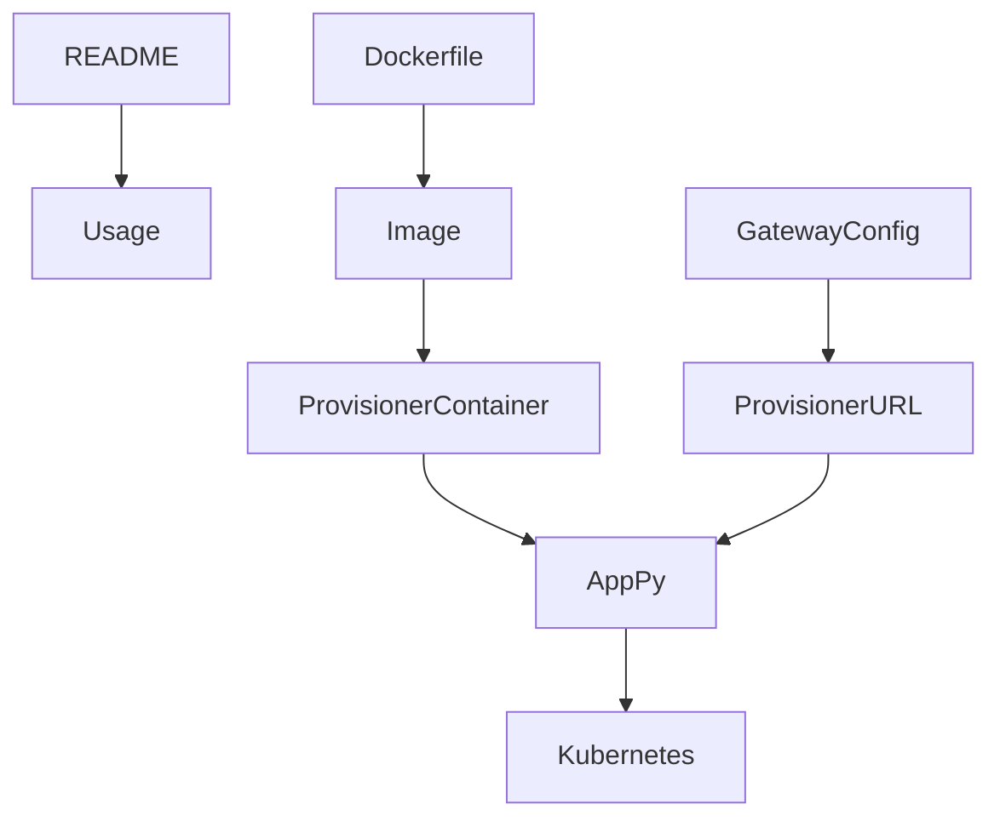

# 332｜Docker Provisioner README/Dockerfile 深拆

<callout emoji="✅">
**本章目标：**继续拆 remaining route/content/docker/script 内部模块。
</callout>

| 模块点 | 说明 |
|-|-|
| docker/provisioner/README.md | provisioner 使用说明。 |
| Dockerfile | provisioner 镜像构建。 |
| app.py | FastAPI 服务。 |
| docker-compose | 如何接入 provisioner。 |
| K8s runtime | Pod/Service 创建。 |

