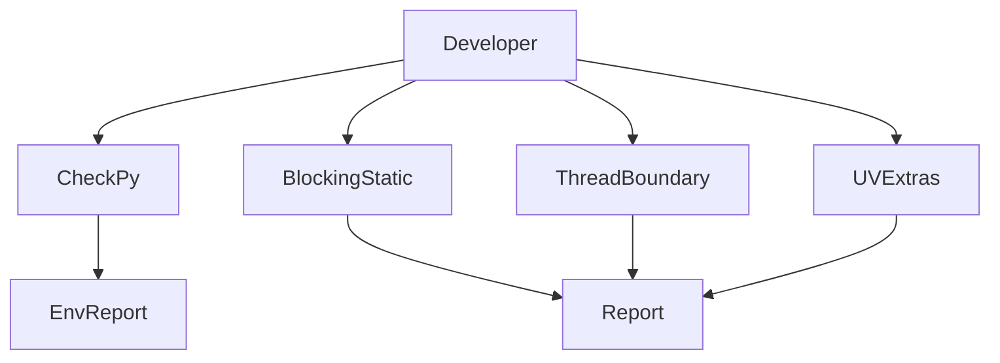

# 336｜static detection scripts 深拆

<callout emoji="✅">
**本章目标：**补齐 remaining scripts/tests/routes/package docs 模块。
</callout>

| 模块点 | 说明 |
|-|-|
| detect_blocking_io_static.py | 静态阻塞 IO 检测。 |
| detect_thread_boundaries.py | 线程边界检测。 |
| detect_uv_extras.py | uv extras 检测。 |
| check.py | 基础环境检测。 |

