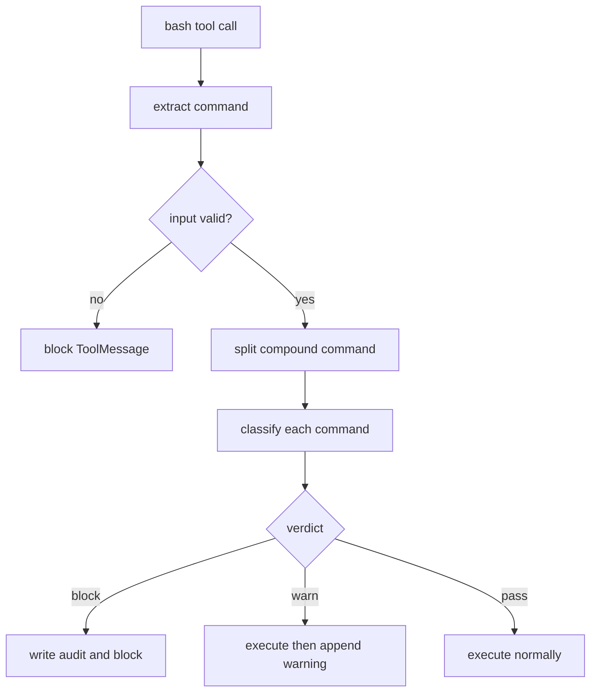
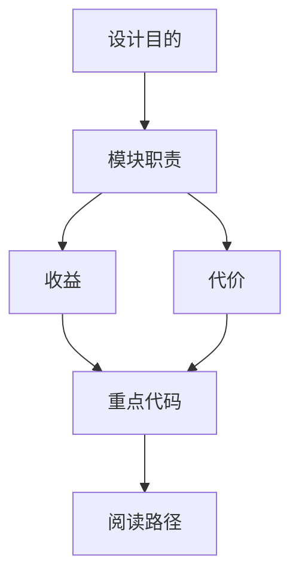

<title>33｜SandboxAuditMiddleware 单文件详解</title>

<callout emoji="✅">
**本章目标：**讲清 bash 命令在真正执行前如何被审计、阻断或追加警告。
</callout>

| 阶段 | 说明 |
|-|-|
| 输入校验 | 空命令、超长命令、null byte 会被拒绝。 |
| 命令拆分 | 复合命令按 shell 分隔符拆分，失败时 fail-closed。 |
| 分类 | pass/warn/block 三档。 |
| 审计 | 写 audit 日志，block 时返回 ToolMessage。 |

---

# 补充：设计取舍、重点代码与阅读路径

<callout emoji="💡">
**设计目的：**这个模块采用 middleware 形态，是为了把横切能力从主 agent 逻辑里剥离出来，并按 LangChain/LangGraph 生命周期挂载。
</callout>

| 维度 | 说明 |
|-|-|
| 收益 | 收益是可插拔、可独立测试、能按 before/after/wrap 阶段控制行为。 |
| 代价 | 代价是执行顺序不直观，多个 middleware 同时改 messages/state 时调试成本较高。 |
| 重点代码 | 重点代码通常在 `backend/packages/harness/deerflow/agents/middlewares/`，先看 class 的 hook 方法。 |
| 阅读路径 | 阅读路径：先判断它在哪个 hook 生效，再看它读写 ThreadState 的哪些字段。 |

