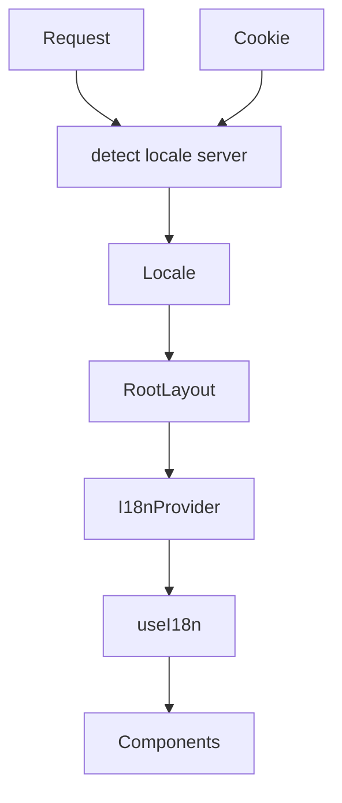
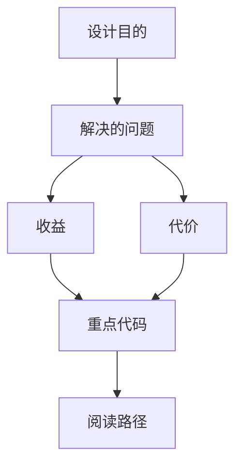
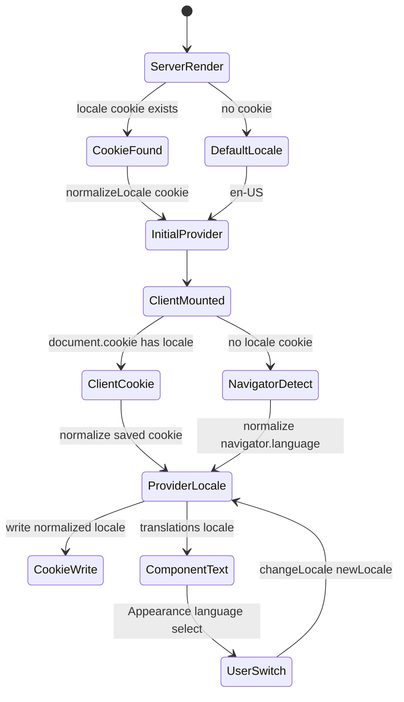

<title>346｜I18n Locale Detection 与 Provider 详解</title>

<callout emoji="✅">
**本章目标：**继续细化前端 UI/Landing/I18n 模块。
</callout>

| 模块点 | 说明 |
|-|-|
| locale.ts | locale 定义/映射。 |
| server.ts | 服务端语言检测。 |
| context.tsx | I18nProvider。 |
| hooks.ts | useI18n。 |
| cookies.ts | locale cookie。 |

---

# 补充：设计取舍、重点代码与阅读路径

<callout emoji="💡">
**设计目的：**Locale Detection 与 Provider 把服务端 cookie 初值、客户端 navigator fallback、用户切换和 translations 选择串成同一套 i18n 状态流。
</callout>

| 维度 | 说明 |
|-|-|
| 收益 | SSR 和客户端都能得到稳定 locale，用户切换后通过 cookie/context 影响后续渲染。 |
| 代价 | 服务端和客户端检测顺序不同，调试语言问题时必须同时看 cookie、navigator、Provider state 和 Appearance 设置页。 |
| 重点代码 | `frontend/src/core/i18n/server.ts`、`locale.ts`、`context.tsx`、`hooks.ts`、`frontend/src/app/layout.tsx`、`appearance-settings-page.tsx`。 |
| 阅读路径 | 先看服务端如何从 cookie 给初值，再看客户端 effect 如何 fallback 到 navigator，最后看 `changeLocale()` 如何写 cookie/context。 |

## Locale 状态流转补充

| 阶段 | 源码 | 行为 |
|-|-|-|
| SSR 初始值 | `frontend/src/app/layout.tsx`、`frontend/src/core/i18n/server.ts` | 只从 `locale` cookie 读取并 `normalizeLocale`，没有 cookie 时默认 `en-US`。 |
| Client 初始化 | `frontend/src/core/i18n/hooks.ts` | mount 后先读 `document.cookie`，没有 cookie 才用 `navigator.language` 检测，并写回 cookie。 |
| 用户切换 | `appearance-settings-page.tsx` | Select 调 `changeLocale()`，更新 React context 并写 cookie。 |

